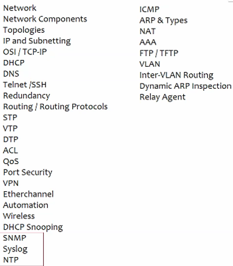
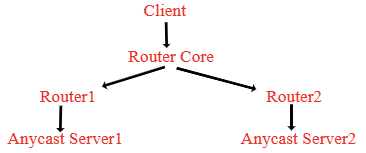
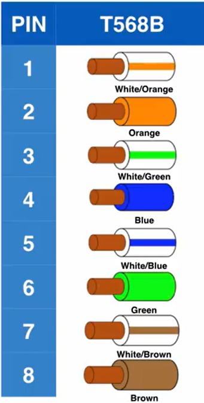
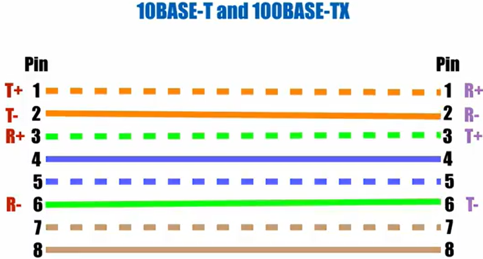
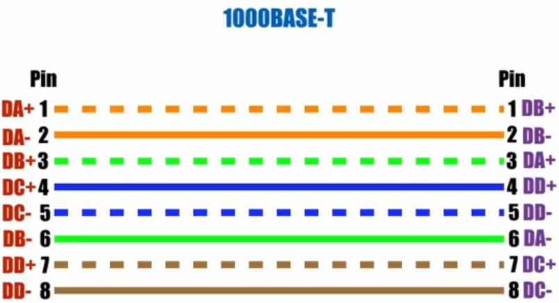
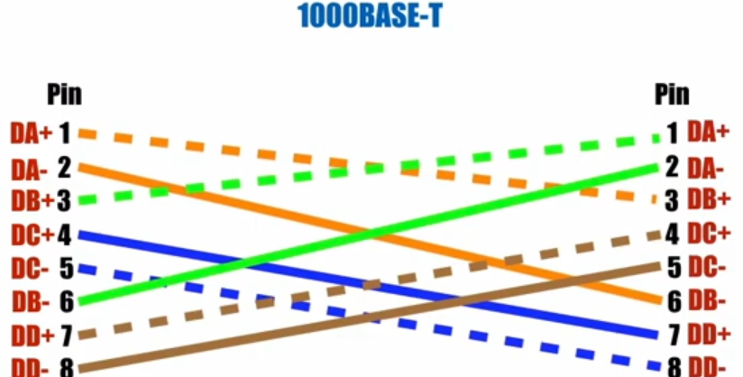

## <ins>**Network**</ins>

- <ins>**Group of interconnected nodes/links/devices that exchange data and share resources via a media.**</ins>
    
- Topics- 
    

### **Types of communication modes-** depends on Device NIC, Cable type, Config

- **Simplex** One-way only Sender → Receiver only
    
    - Eg- Radio, Keyboard, mouse, mic, <ins>Coaxial cable used for TV broadcast</ins>
- **Half**\-**Duplex** Two-way, but not at the same time Sender ↔ Receiver (one at a time)
    
    - Eg- Walkie Talkie, <ins>Hub,</ins> Coaxial cable(10BASE-2,5, <ins>10BaseT Ethernet (CMSA/CD & CA, Wi-Fi (99.9%))</ins>
- **Full**\-**Duplex** Two-way, simultaneously Sender ⇄ Receiver (both ways at the same time)
    
    - Eg- Ethernet NIC, Telephone call, Mobile call, <ins>100BaseTX</ins>

* * *

### **Types of Networks**

- PAN
    
- LAN
    
- MAN
    
- WAN
    
- CAN
    
- Other
    
    - Wireless LAN (WLAN)
        
    - Storage Area Network (SAN)
        
    - System Area Network (SAN)
        
    - Passive Optical LAN (POLAN)
        
    - Enterprise Private Network (EPN)
        
    - Virtual Private Network (VPN)
        
    - Virtual LAN (VLAN)
        

* * *

### **Types Transmission media**

1.  ### **Guided media (wired)**
    
    - **Coaxial**\- *(electric signals)* consists of a conductor (usually copper), an insulating layer, a metallic shield (protection against interference), and an outer insulating layer.
        
        - eg- RG6 (TV cable max-300m-500m)
            
        - From your wall outlet to a cable modem or TV set-top box
            
        - *Connector*: F-type connector
            
    - **Twisted** **Pair**\- *(electric signals)* pairs of insulated copper wires twisted together (twisting reduces EMI)
        
        - eg- Cat5, Cat5e, Cat6 Ethernet cables (LAN) <ins>\[max 100m</ins>\]
            
        - Types
            
            - **UTP** (Unshielded Twisted Pair)- eg- Cat1,.., Cat5, Cat5e, Cat6
                
            - **STP** (Shielded Twisted Pair) - reduces interference eg- Cat5e, Cat6, Cat6a, Cat7, Cat8(40gbps, 2GHz)
                
        - From a PC to a Wi-Fi router or network switch
            
        - *Connector*: RJ45 connector
            
    - **Fiber** **Optics**\- *(light signals)* uses total internal reflection (by optical transmitter)
        
        - eg- Optical Fiber Cable (OFC)
            
            - *Single-mode fiber (OS2)-* single light path | max 100km & more without amplification (100 Gbps & more) (uses- Lasers)
                
                - eg- 10GBASE-LR (10km), 10GBASE-E (30km)
            - *Multi-Mode Fiber (OM1, OM4)-* multiple angle \[max 2km-400Gbps\] (uses- LEDs/ VCSELs(Vertical-Cavity Surface-Emitting Lasers))
                
                - eg-10GBASE-S (400m), 10GBASE-LX4 (300m)
        - From an ISP's fiber terminal to a fiber modem or optical network terminal (ONT)
            
        - *Connector*: SFP/SFP+ transceiver- LC/ SC/ RJ45 connector
            
2.  ### **Unguided** (do not physically guide the signal along fixed path) <ins>form</ins>\- \[electromagnetic waves\]
    
    - **Radio Wave-** eg- Wifi 6E, 4g, 5g, Bluetooth
        
    - **Microwave-** DishTV (requires antenna alignment- uses geostationary satellites)
        
    - **Infrared-** *uses light waves* eg- TV remote, Wireless mouse/keyboard, Motion Detection Cameras
        

* * *

### **Communication Methods**

- **Unicast**\- eg- video call btw 2 people (one-to-one data transmission) (unicast address- single LAN int)
    
- **Multicast**\- eg- live stream to subscribers (one-to-many= net comm method were 1 sender sends data packet to grp of recipients simultaneously)
    
- **Broadcast**\- eg- wifi routers sending signal
    
- **Anycast-** same single IP is assigned to multiple devices(nodes) & packet sent to that address is routed to nearest node int in grp based on RProtocol (note- multiple devices must be reachable via different routing paths) 
    
    - eg- 8.8.8.8- DNS- directs traffic to nearest server, DDOS mitigation
        
    - 
        
        - **Path 1: Client → R-Core → R1 → S1** | **Path 2: Client → R-Core → R2 → S2**
            

* * *

### **Types of Twisted Pair Cable Connectors**

- **RJ11** - (Registered Jack) 6 positions | 4 or 2 contacts
- **RJ45** - 8 positions | 8 contacts

* * *

### **Color Coding standards (Cabling)**

- **T568 A**
- **T568 B**
    - ****
- 

* * *

### **Ethernet port configurations**

- **MDI (Medium Dependent Interface)-** pinout/port config on a device to connect diff device with MDI-X int (switch, hub)
    
    - devices use **pins 1 & 2**\- <ins>transmit</ins> data | **pins 3 & 6-** <ins>receive</ins> data.
        
    - eg MDI devices- Routers, PC NICs(Ethernet ports), Servers, WAP, IP phone
        
- **MDI-X (Medium Dependent Interface Crossover)**\- pinout/port config on a device to connect another MDI-X device (switch-switch, router-router)
    
    - devices use **pins 1 & 2**\- <ins>receive</ins> data | **pins 3 & 6**\- <ins>transmit</ins> data.
        
    - eg MDI-X devices- Switches, Hub
        

* * *

### **Network Cabling**

- **Straight through cable**\- unlike port configurations (==MDI-MDIX==) (Both side T568A or T568B)
    - MDI to MDI-X device (100Mbps)-
        - 10BASE-T, 100BASE-TX :- 100= 100Mbps | BASE= Ethernet transmission | T- twisted pair cable
        - PoE(802.3af/at)- Power over Ethernet can be done with 4,5,7,8 pins (not sure- or 7,8- POE | 4,5- Earthing)
    - 1Gbps-  
        - All 4 pairs are used for data transmission (DA- Data A)
    - ==eg Straight cable- (PC connected to Switch/Hub), (Router-Switch/Hub), (Server-Switch/Hub)==
- **Crossover cable**\- (like devices)same port config (==MDI-MDI & MDIX-MDIX==) (One side T568A, other side T568B)
    - MDI-MDI/ MDIX to MDIX devices (100Mbps)- 
    - 1Gbps- 
    - ==**eg Cross-Over cable(MDI-MDI/MDIX-MDIX) - (PC-Router), (Router-WAP), (Router-Server), (Router-Router), (PC-PC), (Switch/Hub- Switch/Hub)**==
- **Rollover cable**\- console cable
- Now a days ==**Auto MDIX**==\- electrical pulses to sense cable pinout(switches/redirect e-signals btw T to R auto) is present in all network devices (so we use straight through cables for all)
    - if switch- need to enable it on switch int \[1 side or both\] - `mdix auto` | verify- `sh int <int> transceiver properties`

* * *

### **Topology-** physical & logical arrangement of nodes/devices & how data flows btw them

- **Bus-** protocol used - Carrier Sense Multiple Access with Collision Detection (CSMA/CD- built into Ethernet NICs)
    
    - Each device listens to the Ethernet before transmitting
        
    - Transmission- If the bus is idle
        
    - Collision detection while transmission
        
    - If collision detected, send jam signals to inform, choose random wait time and retry
        
- **Ring-** A token is a special data packet/ frame that circulates around the ring, allowing only the device holding it to transmit. This ensures only one device sends data at a time, preventing collisions.
    
- **Star-** All devices connected to central device(switch/router). used now-a-days
    
- **Mesh-** All devices connected to all (eg- <ins>Internet</ins>)
    
- **Tree-** Bus + Star
    
- **Hybrid-** multiple topologies
    

* * *

### **Networking Devices**

- **Hub-** *(L1)* receives data(electrical/light signals) from 1 port transmits/broadcasts to all ports except sender port (at a time)
    
    - \[No Frames, MAC, memory\] | Hub is Half-Duplex- looses signals if sent at same time (<ins>single collision & broadcast domain</ins>) (CSMA/CD Algo)
    - ==**Inside similar to Bus Topology**\- hub doesn’t have separate lanes for each device’s traffic, 2 devices' signals can collide, even if they’re using separate wire pairs in the cable==
- **Repeater-** *(L1)* boosts(or regenerates) signals without analyzing it (to extend Travelling distance)
    
- **Bridge-** *(L2)* filters and forwards data based on MAC (reduces collision- <ins>separate collision domains</ins> for each port)
    
- **Switch-** *(L2/L3)* forwards data using MAC Table, error detection(FCS), QoS, VLAN (==separate collision domain for each port & same broadcast domain==\- learns device connected to which port via MAC)(available ports- 5, 8, 10, 16, 24, 28, 48/52) \[==**separate collision domain**\- each port can send & receive at the same time(each port fabric to all ports) working independently (collision is rare- eg- faulty cable, hub connected to switch)==\]
    
    - Unmanaged
        
    - Managed
        
    - L3 switch
        
    - POE (Power over Ethernet)- IEEE 802.3af (& at,bt) | eg- camera
        
- **Router-** *(L3)* routes data btw diff networks/ subnets and assigns IP
    
- **Firewall-** *(<ins>L2-7</ins>)* monitors and controls incoming and outgoing network traffic based on predefined security rules
    
    - L2- MAC filter | L3- IP/subnet filter | L4- TCP/UDP port filter | L5- Statefull firewalls checks session | L6- Ensure its SSL/TLS | L7- Block protocols(HTTP), websites
- **Server-** (L7) system/ machine that provides services, resources, or data to other devices (clients)
    
- **IP Phone-** *(L7)* phone that uses Voice over IP (VoIP) technology to make voice calls
    
- **WAP (Wireless Access Point)-** *(L1,2)* device that allows(bridge btw) wireless devices(WLAN) to connect to a wired network(Ethernet), extending wireless coverage.
    
- **WLC (Wireless LAN Controller)**\- *(L1,7)* device that centrally manages WAP, controlling settings like security(block HTTPs), roaming, and load balancing. (no DHCP, NAT, IP assign)
    
- **NIC (Network Interface Card)**\- *(L1,2)* provides hardware int that allows devices to connect to a network for comm (send & receive data), either wired (Ethernet) or wireless (Wifi-Card/ Adapter).
    
    - creation & management of network frames, MAC, error detection
    - convert data signals into a format suitable for network transmission and receive incoming signals

* * *

### Definitions

- **WiFi**\- *(L1,L2)* wireless networking technology that allows devices to connect to the internet and communicate with each other using radio waves
- **MAC address**\- 6B L2 address globally unique, required for every device that connects to LAN (burnt-in NIC) `getmac`

* * *

### Difference

- | L2 Switch | L3 Switch |
    | --- | --- |
    | L2 (forwards frames based on MAC) | L3 with L2 support (routes packets based on IP + switching) |
    | single broadcast domain, same net comm | multiple broadcast domain, multi net comm |
    | Faster (only switching, no routing overhead) | Slower (examine L3 data packets too) |
    | VLAN tagging (ACL, QOS) | Inter-VLAN routinig (ACL, QOS) |
    | Cheap | Costly |
    
- | Router | L3 Switch |
    | --- | --- |
    | L3 (high cost) | L3 with L2 support (data transfer with multi-devices across- LANs, VLANs, subnet), more ports |
    | Slow speed- additional processing overhead (software & hardware based routing) | Faster- optimized for inter-VLAN routing (hardware based switching- high traffic speed) ASICs |
    | Large RT to support multiple route entire | Smaller routing table compared to router |
    | Supports NAT, VPN, Firewall, QoS, etc. | Limited/no support for WAN, NAT/VPN |