**Ethernet-** networking technology that includes protocol, port, cables and chips needed to plug into LAN for transmission (using 3/4 cable pinouts)

- family of LAN standards that together define physical & data-link layers of world’s most popular wired LAN technology (cabling, connectors, protocols, devices) (10Mbps-400Gbps) \[==UTP cable- suffix T | Fiber cable- suffix X==\]
    
- | Speed | Common Name | IEEE Standard ==L1== Name | IEEE Standard ==L2== Name | Maximum Length |
    | --- | --- | --- | --- | --- |
    | 10 Mbps | Ethernet | 10BASE-T | 802.3i | 100m |
    | 100 Mbps | Fast Ethernet | 100BASE-T | 802.3u | 100m |
    | 1Gbps | Gigabit Ethernet | 1000BASE-LX | 802.3z | upto 5km (SMF) |
    | 1Gbps | Gigabit Ethernet | 1000BASE-T | 802.3ab | 100m (Cat6a) |
    | 10 Gbps | 10 Gig Ethernet | 10GBASE-T | 802.3an | 100 m |
    | 10 Gbps | 10 Gig Ethernet | 10GBASE-CX4 or 10GBASE-SR, LR, ER | 802.3ae | 300m(OM3) 10km(SMF) |
    
- **==Ethernet- includes many physical layer standards(above) | same data-link layer standard\[802.3\] (over all types of Ethernet physical links) (acts like single LAN technology)==**
    
- **Ethernet LAN**\- net that connects user devices, LAN switches, cables(diff speeds) to transmit Ethernet frames btw devices on LAN
    
- **Crosstalk**\- EMI btw wire pairs in same cable.
    
    - Avoid crosstalk- When electrical current passes over any wire, it creates EMI that interferes with electrical signals in nearby wires (including wires in same cable). So copper wires are twisted to cancel most EMI
- **Ethernet Links**\- any physical cable btw 2 Ethernet nodes
    

* * *

### Protocols

- **TLS(Transport Layer Security)(4-7)**\- to auth by encrypting data. ciphers- AES, SHA256 | HMAC | fast | alerts are encrypted
- **SSL(Secure Socket Layer)(L4 -7)**\- (old) to auth encrypting data. ciphers- RC4, DES, SHA-1 | MD5 | slow | alerts are unencrypted
- **SMB(Server Message Block)(L6,7)-** for sharing files, printers & resources btw computers over TCP. encryption, formatting (SMB3+ secure) (139/445)
- **NetBIOS(L5 also 4-7)**\- old API that lets applications on diff computers talk over LAN for file/printer sharing by session management over TCP/UDP, name resolution (no encryption, replaced by DNS, SMB)
- **RPC(Remote Procedure Call)(L5-7)-** manages sessions, Dialogue Control btw client-server, use sync points when failure to recover session. L7- requests service from program on other PC
- **SOCKS(Socket Secure)(L5)-** acting as proxy that routes net packets btw clients & servers by creating tunnel(session) (bypass firewalls) (TCP-<ins>1080</ins>), SOCKS5- UDP, auth
- **VXLAN-** network virtualization standard that creates logical L2 networks over existing L3 IP network, enabling isolated virtual net for cloud. UDP (adv- overcome VLAN limits)
- **ESP-** core IPsec protocol that secures data in transit by providing CIA, anti-replay protection. part of VPNs
- <ins>confusion of Layer- VXLAN, RPC, SOCKS, ESP, NDP</ins>

* * *

## **OSI(Open Systems Interconnection) Model**

- **Application(data) -** (HTTP, FTP, TFTP, DHCP, DNS, Telnet, SSH, RDP,IMAP, POP3, SMTP, SNMP, NTP, BOOTP, SMB(L4-7))
    
    - comm btw applications on diff hosts. How applications use network not how applications work (sometimes L7 has headers- HTTP header)
    - interface btw app(running of PC) & network itself (eg- HTTP- how browsers can pull contents of web page from server, email)
- **Presentation(data)-** (L4-7= TLS, SSL)
    
    - Encryption(plaintext-cyphertext, reversible), encoding(changing format-ASCII), compression(zip), format change(JPEG) & reverse
- **Session(data)-** (NetBIOS, RPC(L5-7), SOCKS(L5-7)) establishing, managing, terminating comm sessions btw app, dialogue control
    
    - **AAA-** Authentication, Authorization, Accounting
- **Transport(segment/datagram)-** (TCP, UDP, VXLAN(L2-4))
    
    - Segmentation(reliable data delivery), Datagram, Reassembly, Flow Control, Multiplexing(Use port no. to track sessions (TCP, UDP)), Error Recovery(TCP)
        
    - OS implements protocols (TCP, UDP). creates & maintains conversations btw application processes on hosts.
        
- **Network(packet)-** (IP, ICMP, RIP, OSPF, HSRP, VRRP, GLBP, IPSEC, ESP)
    
    - OS implements protocols (IP, ICMP). Routes data packets across diff net using IP & routing protocols
    - <ins>Fragmentation</ins>(slows packet delivery)- dividing large net packet(segment/datagram) if greater than MTU into smaller pieces(fragments)
- 2.5 (MPLS)
    
- **Data-Link(frame)-** (Ethernet, Wifi(802.11), VLAN, ARP, CDP, LLDP, PAgP, LACP, PPP, PPTP, L2TP, DTP, VTP, STP NDP(L2-3)) NIC implements std Ethernet responsible for delivery of frames on LAN(delivery within subnet)
    
    - **LLC (Logical Link Control) sublayer-** bridge between L3 and MAC | <ins>multiplexing</ins> (multiple protocols- VoIP, VLANs-L3S), <ins>error detection</ins> (like CRC checks)
        
    - **MAC sublayer-** <ins>physical medium access</ins>(eg- CSMA/CD in Ethernet, CSMA/CA in Wi-Fi)), <ins>frame delimiting</ins>(define start & end of frame), <ins>addressing</ins> (MAC), <ins>encapsulation</ins> (process of putting headers-trailers around data- packets into frame)
        
- **Physical(bits)-** (Ethernet-10BASE-T, 100BASE-T, Wifi(802.11))(electric signals/light/electromagnetic waves). Cables & NIC implements standards
    
    - ==**Data as Electrical Signals over cables**\- With an encoding scheme, transmitting node changes electrical signal over time, while receiver node, using same rules, interprets those changes as either 0s/ 1s==
        
        - eg 10BASE-T uses encoding scheme that encodes binary 0 as transition from higher voltage to lower voltage (1/10,000,000th-of sec)

* * *

### **TCP/IP**

- Upper layers(Application & Transport) work same way regardless of whether endpoint host computers are on same LAN or Internet
- Network Layer responsible for IP packet routing (==each layer provides services to layers above it==)
- Lower layers(Data-Link & Physical) define protocols & hardware required to deliver data across physical net

* * *

## OSI vs TCP/IP

- 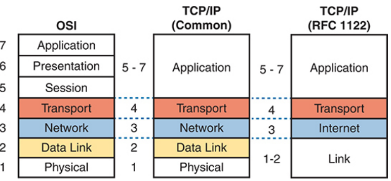
- 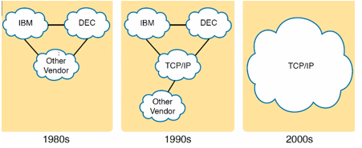
- ISO created Open Systems Interconnection(<ins>**OSI**</ins>) to standardize net protocols-allow comm with all computers, but DOD(Department of Defense) created TCP/IP- followed since 2000s
    
    - **==OSI failed due to- standard-first-code-second approach (slow) | TCP/IP adopted- code-first-standardize-second approach (popular)==** (code first- protocol)
- TCP/IP model avoids repeating work. It refers to standards/ protocols (eg- IEEE- Ethernet LANs)
    
- ==Still we refer to OSI because many vendors & protocols documents used terminologies from OSI model (so OSI= Reference model), for Troubleshooting, Teaching model==
    
    - ==<ins>**eg- browsing https://example.com- <ins>Encryption-TLS by browser</ins>, <ins>Sessions- HTTP cookies/tokens</ins>\- handled by browser(application layer), session & presentation layer have no real protocols in modern systems**</ins>==

* * *

### **TCP (Transmission Control Protocol)- <ins>*P-6*</ins>**

- Eg- HTTP(80), HTTPs(443), FTP(20,21), TELNET(23), SSH(22), SMTP(25), POP3(110), IMAP(143), LDAP(389), BGP(179), SMB(445)
    
- <ins>Establishing Connection</ins> below flags(c-s = client to server | s-c = server to client)
    
    - **SYN** (c-s)
        
    - **SYN-ACK** (s-c)
        
    - **ACK** (c-s)
        
- <ins>Terminating Connection</ins> (server/client any device can terminate\[here we assume client\])
    
    - **FIN**  (c-s its terminating)
        
    - **ACK** (s-c aware of termination) (c- fin_wait_2 state)
        
    - **FIN**  (s-c its terminating)
        
    - **ACK**  (c-s lets terminate) (c- time wait state(resend if ACK lost)- 30s-2min)
        
- <ins>**Client Side**</ins>
    
    - 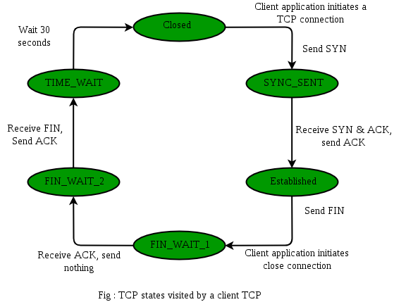
- <ins>**Server Side**</ins>
    
    - **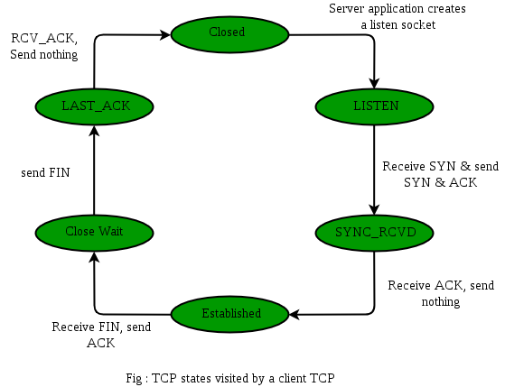**
- If servers ISN (Initial Sequence no.) randomly assigned = 100
    
    - | Step | Client → Server (Flags) | Server → Client (Flags) |
        | --- | --- | --- |
        | **Packet 1** | **SYN** (`Seq = 1`) |     |
        | **P2** |     | **SYN, ACK** (`Seq = 100`, `Ack = 2`) |
        | **P3- Handshake done** | **ACK** (`Seq = 2`, `Ack = 101`) |     |
        | **P4-Data Transfer** | **PSH,ACK** (`Seq = 2`, `Ack = 101`) |     |
        | **P5-Data Transfer** |     | **PSH,ACK** (`Seq = 101`, `Ack = 18`) |
        
        - Client sends seq no.=1 by SYN.
        - Server sends its seq no.=100 via SYN, ACK no.=2 as it tells seq no.=1 segment received and it expects seq no.=2 segment
        - Client sends ACK with seq no.=2 as segment with seq=1 reached. Then it sends ACK no.=101 telling it received segment with seq no.=100 from server and expects 101 segment
        - DATA Transfer-

* * *

### **TCP Header (20-60 bytes)**

- **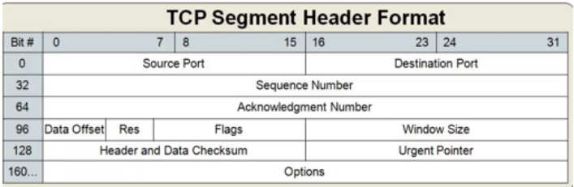**
    
- **Source Port(16b) & Destination port(16b)**
    
- **Sequence no.(32b)-** to initiate connection by synchronizing initiating no. & ==for reassembly of segments==
    
- **ACK no.(32b)-** (eg ACK=2001- received all data up to byte 2000 & expecting byte 2001 next.)
    
- **Data Offset(4b)**\- Header Length | helps determine where data begins | multiples of 4
    
    - If Data Offset = 5 (i.e. 20 bytes), maximum = 15 (i.e. 60 bytes), TCP header is 5 × 4 = 20 bytes & data starts at byte 21.
- **Flags(12b)**\- Hex no.
    
    - | **Flag** | **Description** |
        | --- | --- |
        | **Reserved (3b)** | 3bits Reserved for future use. Should be set to zero. |
        | **Accurate ECN (1b)** | allocates Nounce Sum, allows receiver to report no. of packets with Congestion-Experienced in period |
        | **CWR(Congestion Window Reduced) (1b)** | Informs receiver that sender has reduced its congestion window in response to net congestion notification (adjusted window size) |
        | **ECE(Explicit Congestion Notification Echo) (1b)** | Notifies sender that packet received with single congestion-experienced signal (set in IP header by routers) |
        | **URG** (Urgent) **(1b)** | If set- signals that accompanying urgent pointer is valid & data is urgent. |
        | **ACK** (Acknowledgment) **(1b)** | Used mostly after SYN segment to tell it received SYN & use next expected seq no. (3-way-handshake) |
        | **PSH** (Push) **(1b)** | Tells receiver to push the data to receiving application immediately. eg- live stream |
        | **RST** (Reset) **(1b)** | used to abort connection abruptly due to errors. (tells other side stop comm) |
        | **SYN** (Synchronize) **(1b)** | Synchronize seq no. (tell other side which seq no. to accept). Used in connection initiation (3-w-h). |
        | **FIN** (Finish) **(1b)** | free reserved resources & connection termination (tells sender has finished sending data) (4-w-h). |
        
    - 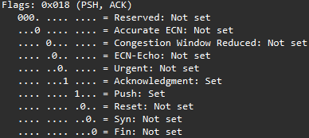
        
    - 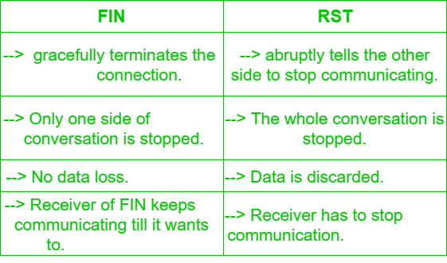
    - 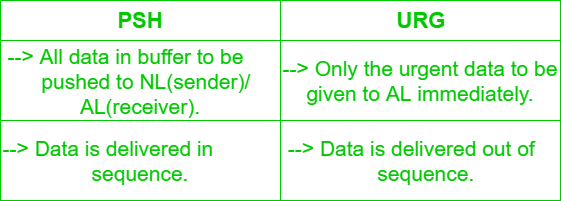
- **Windows size(16b)-** (buffer size/<ins>flow control</ins>) unacknowledged data(in bytes) that can be in transit, receiver is currently able to accept | max- (16b)65,535bytes (Modern- 1GB(2^14)- with window scaling in SYN flag)
    
- **Header & Data Checksum(16b)-** checksum computed over segment(==TCP header+data+pseudo header==) | use error detection (data not corrupted/tampered) eg- Parity, CRC,
    
- **Urgent Pointer(16b)**\- specifies length of urgent data, points last urgent byte(seq no. + urg pointer -1), valid only if urg-flag (which bytes in segment are to be processed first by receiver)
    
- **Options(40B)**\- additional config
    
    - ==MSS(Maximum Segment Size)(4B)- max TCP data excluding TCP header (while TCP handshake)==
    - Timestamp(10B)- used for RTT measure, protecting against duplicate segments
    - Selective Acknowledgment (SACK)(2B varies)- inform sender specific seg received. not all window is retransmitted
    - End of Option List (EOL)(1B)
    - TCP CWR, ECN-Echo
    - Padding- if header length is not multiple of 4B, adds zero-bits (eg- 22B converted to 24B)
- **TOTAL = 20 - 60 bytes (options = 40 bytes) (9-10 fields)**
    
- ### <ins>**MSS(Maximum Segment Size)(1460B)** *L4*</ins>
    
    - largest amount of TCP ==data==(payload) that a device can receive in a single TCP segment, without fragmentation | default MSS when not negotiated= <ins>536bytes</ins>
        
    - MSS is negotiated/ exhchanged only in SYN, SYN-ACK packets | if <ins>Client MSS=1460 & Server MSS=1380</ins> then <ins>Client→Server: max payload=1380 & Server→Client: max payload=1460</ins>
        
    - fragmentation = slower
        
    - 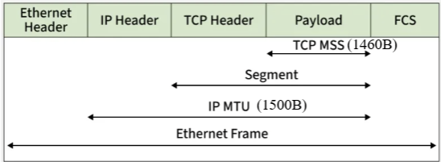

* * *

### **UDP(User Datagram Protocol)- <ins>*P-17*</ins>**

- 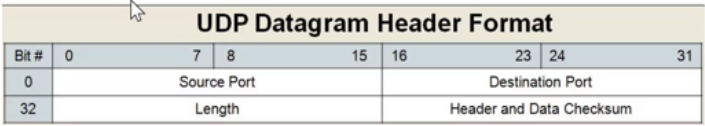
- Header size- **8 bytes**
    
- Source & destination port= 16 bits each
    
- Length= 16bits | Data Checksum= 16 bits (integrity verification-if corrupted drop) (Checksum made from- UDP Header+Data+IP Pseudo-Header)
    
- Eg- DNS(53), mDNS(5353) DHCP(67,68), BOOTP(67,68), TFTP(69), NTP(123), SNMP(161,162), Syslog(514), RIP(520), NetBIOS(137,138), IKE(500), RADIUS(1812,1813), TACACS+(49)
    

* * *

### **IPv4 header (20 - 60 bytes)**

- 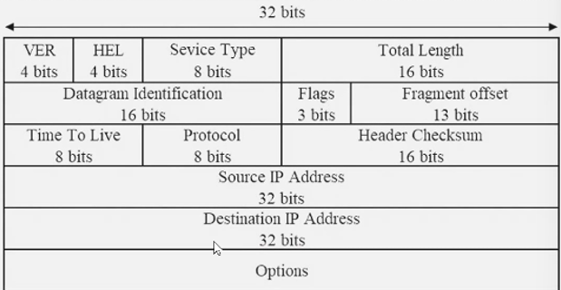
    
- **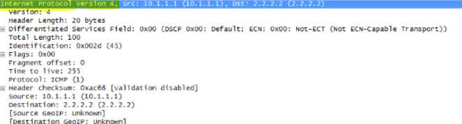**
    
- ICMP(1), TCP(6), UDP(17), EIGRP(88), OSPF(89), VRRP(112), GRE(47), ESP(50), AH(51)
    
    1.  **Version(4b)-** IPv4(0100- \[0+4+0+0\])/ IPv6(0110- \[0+4+2+0\])
    2.  **Header Length(4b)**\- size of IP header only- to tell where data starts from. (min size is 5(0101- (5\*32)/8=20B) | max 15(60B including options)
    3.  **Differentiated Service Field(8b)**\- used for packet classification & handling by routers. (previously Type of Service)
        1.  <ins>DSCP(Differentiated Services Code Point)(6b)</ins>\- defines how routers should handle/queue packets, including- priority(high priority packets go faster-VoIP), scheduling, drop probability
        2.  <ins>ECN(2b)</ins>\- allows end-to-end notification of net congestion without dropping packets.
    4.  **Total Length(16b)**\- total length of IP packet header+payload (max-65,535B \[0xFFFF\]) (if greater than MTU will be fragmented)
    5.  **Identification(16b)**\- unique-ID ==for packet reassembly== (same-ID to all fragments of packet)
        - eg- if ICMP IP packet of 3000B is sent, divided into 3 Fragments removing header(1480+1480+40) then each attached with header(1500+1500+60)- <ins>each fragment with same identification no.</ins>
    6.  **Flags(3b)**\- indicates how packet should be fragmented/ whether fragmentation is allowed
        1.  Bit 0- <ins>Reserved</ins> (set to 0)
        2.  Bit 1- <ins>Don't Fragment(DF)</ins>\- If set to 1- packet should not be fragmented (packet dropped if > MTU)
        3.  Bit 2- <ins>More Fragments(MF)</ins>\- If set to 1- more fragments are to follow | if set to 0- its last fragment
    7.  **Fragment offset(13b)**\- specifies position of fragments data(sequence no.) within original packet (==for fragment reassembly==)
        - in above eg- fragment1=<ins>0</ins> | fragment2=1480/8=<ins>135</ins> | fragment3=2960/8=<ins>370</ins>
    8.  **Time to Live(8b)-** (Max hop count. no.) max times packet can be forwarded by L3 device before discarded(TTL = 0).  It decreases by 1 every time packet forwarded by L3 device. prevents packet from routing loop. set by sender-
        - TTL for Windows- 128
        - TTL for Linux- 64
        - TTL cisco IOS- 255
    9.  **Protocol(8b)**\- specifies upper layer protocol encapsulated in IP packet (eg- 6-TCP, 17-UDP, 1-ICMP)
    10. **Header Checksum(16b)**\- Error-checking. ==Calculated from only IP header== ensuring integrity (==recalculated at each router hop as TTL reduces==)
    11. **Source IP(32b)**\- essential for routing packet back to sender if needed
    12. **Dest IP(32b)**\- routers use to determine next hop
    
    - **Options(variable length max-320b)**\- used for additional features + Padding(if header+packet+options is not multiple of 4B) (security, timestamping, routing control)
    - **TOTAL = 20 - 60 bytes (options = 40 bytes)**

* * *

- 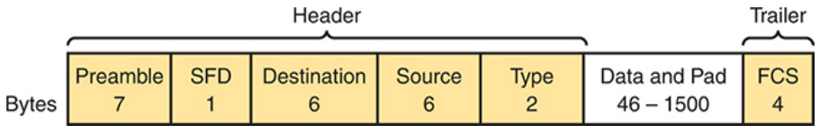
- **Physical Layer- Not included in Frame(coupled together)- <ins>8bytes</ins>**
    - **Preamble(alternating 1s & 0s) -** <ins>7bytes</ins> - synchronize receivers clock with senders (to lock)
        
    - **Start Frame Delimiter(10101011)** - <ins>1byte</ins> Signifies end of preamble & start of frame i.e. from dest MAC (Wake-Up or receiver)
        

### **Ethernet Header (14 bytes)**

- **Destination MAC -** 48b / <ins>6bytes</ins> recipient address
    
    - address in frame compared to MAC in device, if match- device accepts. can be unicast/multicast/broadcast
- **Source MAC-** 48b / 6<ins>bytes</ins> (identify sender- originating NIC/ int of frame)
    
- **Ether Type/ Length-** <ins>2bytes</ins>
    
    - identify upper layer protocol encapsulated in E-frame (eg- ARP- 0x0806, used for routers to process- IPv4- 0x0800/ IPv6- 0x86DD )
- ==**Data/Payload-** 46-1500bytes (L3 data. All frames must be min 64bytes(i.e. min data-46B), if not- pad\[extra bits\] added)==
    
    - **<ins>MTU(1500B) *L2*</ins> = IP header(20B) + TCP header(20B) + MSS(1460B)** (if greater than MTU L3 fragments packets). max L3 packet allowed over Ethernet

### **Trailer- 4 bytes**

- **FCS (Frame Check Sequence)** (not part of header) - <ins>4bytes</ins> (not performs Error Recovery/Correction like TCP)
    - ==used by **NIC** to detect errors==(electric interference, bad NIC) in frame by CRC \[matching generated CRC at receiver with senders CRC. If FCS not match, frame dropped.
- ==**MAX size of Ethernet frame - 1518B (1522B or more if VLAN tag)**==

* * *

## **MAC**(Media Access Control) 802.3

- Hardware address / Physical address/ Universal Address/ Unicast address/ LAN address/ Ethernet address/ NIC Address/ Burned-in address
    
- unicast Ethernet address (address represents 1 int of LAN) on NIC
    
- ==48bits/ 6B== hex no. (eg- <span style="color: rgb(53, 152, 219);">00:1A:2B</span>:<span style="color: rgb(185, 106, 217);">3C:4D:5E</span>)
    
    - (first 3B) <span style="color: rgb(53, 152, 219);">24b</span>\- **OUI**(Organizationally Unique Identifier)- assigned to manufacturer by IEEE RA
        
    - (last 3B) <span style="color: rgb(185, 106, 217);">24b</span>\- **Vendor Assigned**\- assigned by manufacturers/ org
        
- Change MAC (Burned in Address- ROM chip in NIC) in routers
    
    - NIC MAC in PC, router cannot be changed but its on OS to assign temporary MAC for communication (Temp MAC- can be NIC MAC or manually assigned MAC- decided by OS)
        
    - ```bash
                  int g0/0
                  mac-address 0000.0000.1111
                  do show interface g0/0
        ```
        
        - <span>`do show interface g0/0` - (to check)</span>
- **MAC Address**
    
    - **Windows -** 00-A5-8A-CT-39-E7
        
    - **Linux -** 00:A5:8A:CT:39:E7
        
    - **Cisco -** 00A5.8ACT.39E7
        
- **MAC table**\- CAM/forwarding table. <ins>mapping of MACs to ports</ins> `sh mac address-table`
    - 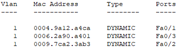

* * *

&nbsp;