- **Ethernet-** networking technology that includes protocol, port, cables and chips needed to plug into LAN for transmission (using 3/4 cables)
    
    - **Standard (IEEE 802.3) -** 10 Mbps
        
    - **Fast (IEEE 802.3u) -** 100 Mbps
        
    - **Gigabit (IEEE 802.3z) -** 1 Gbps
        
    - **10 Gigabit (IEEE 802.3ae) -** 10 Gbp
        
    - **Ethernet over Fiber (eg- 100BASE-FX, 1000BASE-SX)**
        

* * *

## **OSI Model**

- **PDU - Protocol Datagram Unit**
    
    - **Application -** data (HTTP, DNS, Telnet)
        
    - **Presentation-** data
        
        - Encryption(plaintext-cyphertext, reversible), encoding(changing format-ASCII), compression(zip), format change(JPEG) & reverse
    - **Session-** data (eg- NetBIOS, RPC)
        
        - **AAA-** Authentication, Authorization, Accounting
    - **Transport-** segmentation/ Datagram (Error Correction)
        
    - **Network-** packet
        
    - **Data-Link-** frame (Error Detection)
        
        - **LLC (Logical Link Control) sublayer-** bridge between L3 and MAC | multiplexing (multiple protocols- VoIP, VLANs-L3S), <ins>error detection</ins> (like CRC checks)
            
        - **MAC sublayer-** <ins>physical medium access</ins>(eg- CSMA/CD in Ethernet, CSMA/CA in Wi-Fi)), <ins>frame delimiting</ins>(define start & end of frame), <ins>addressing</ins> (MAC), <ins>encapsulation</ins> (packets to frame)
            
    - **Physical-** bits (electric signals/light/electromagnetic waves)
        

* * *

## TCP/IP model

- ### Application Layer
    
    - comm btw applications on 2 hosts. How applications use network not how applications work. (SSH, RDP, HTTP, POP3, SMTP)
    - interface btw software running on computer & network itself (eg- HTTP- how browsers can pull contents of web page from server)
- ### Transport Layer
    
    - OS implements protocols (TCP, UDP). creates & maintains conversations btw application processes on hosts. Use port no. to track sessions (TCP, UDP)
    - eg of apps- ftp, telent, ssh, SNMP, SMTP, HTTP, BGP, MPLS
- ### Network/ Internet Layer
    
    - OS implements protocols (IP, ICMP)
- ### Data Link Layer
    
    - NIC implements standards (Ethernet, 802.11). responsible for delivery of traffic on single network segment or LAN (delivery within single subnet) (eg Protocols- Ethernet, Point to Point)
- ### Physical Layer
    
    - Cables & NIC implements standards (Ethernet, 802.11)
- Tim Berners-Lee created first web browser & web server (early 1990s)
    

* * *

## OSI vs TCP/IP

- 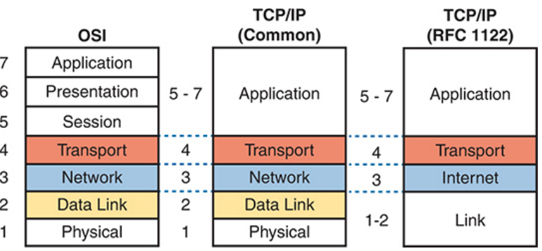
- 
- ISO created Open Systems Interconnection(<ins>**OSI**</ins>) to standardize net protocols-allow comm with all computers, but DOD(Department of Defense) created TCP/IP- followed since 2000s
    
    - **==ISO failed due to- standard-first-code-second approach (slow) | TCP/IP adopted- code-first-standardize-second approach (popular)==**
- TCP/IP model avoids repeating work. It refers to standards/ protocols (eg- IEEE- Ethernet LANs)
    
- ==Still we refer to OSI because many vendors & protocols documents used terminologies from OSI model (so OSI= Reference model)==
    

* * *

### **TCP (Transmission Control Protocol)- <ins>*P-6*</ins>**

- Eg- HTTP, HTTPs, TELNET, SMTP
    
- <ins>Establishing Connection</ins> (c-s = client to server | s-c = server to client)
    
    - **SYN** (c-s)
        
    - **SYN-ACK** (s-c)
        
    - **ACK** (c-s)
        
- <ins>Terminating Connection</ins> (server/client any device can terminate\[here we assume client\])
    
    - **FIN**  (c-s its terminating)
        
    - **ACK** (s-c aware of termination) (c- fin_wait_2 state)
        
    - **FIN**  (s-c its terminating)
        
    - **ACK**  (c-s lets terminate) (c- time wait state(resend if ACK lost)- 30s-2min)
        
- <ins>**Client Side**</ins>
    
    - 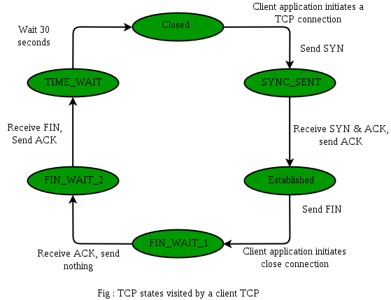
- <ins>**Server Side**</ins>
    
    - **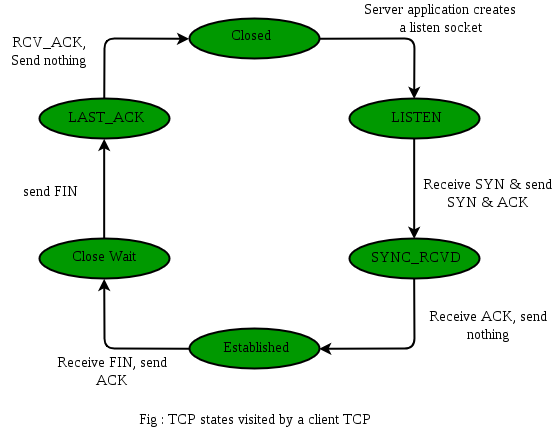**
- If servers ISN (Initial Sequence no.) randomly assigned = 100
    
    - | Step | Client → Server | Server → Client |
        | --- | --- | --- |
        | **Packet 1** | **SYN** (`Seq = 1`) |     |
        | **P2** |     | **SYN, ACK** (`Seq = 100`, `Ack = 2`) |
        | **P3- Handshake done** | **ACK** (`Seq = 2`, `Ack = 101`) |     |
        | **P4-Data Transfer not sure** | **PSH,ACK** (`Seq = 2`, `Ack = 101`) |     |
        | **P5-Data Transfer not sure** |     | **PSH,ACK** (`Seq = 101`, `Ack = 18`) |
        
        - Client sends seq no.=1 by SYN.
        - Server sends its seq no.=100 via SYN, ACK no.=2 as it tells seq no.=1 segment received and it expects seq no.=2 segment
        - Client sends ACK with seq no.=2 as segment with seq=1 reached. Then it sends ACK no.=101 telling it received segment with seq no.=100 from server and expects 101 segment
        - DATA Transfer-

* * *

### **TCP Header (20-60 bytes)**

- **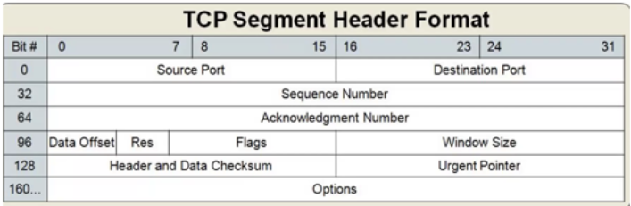**
    
- **Source Port(16b) & Destination port(16b)**
    
- **Sequence no.(32b)-** to initiate connection by synchronizing initiating no.
    
- **ACK no.(32b)-** (eg ACK=2001- received all data up to byte 2000 & expecting byte 2001 next.)
    
- **Data Offset(4b)**\- Header Length | helps determine where data begins | multiples of 4
    
    - If Data Offset = 5 (i.e. 20 bytes), maximum = 15 (i.e. 60 bytes), TCP header is 5 × 4 = 20 bytes & data starts at byte 21.
- **Flags(12b)**\- Hex no.
    
    - | **Flag** | **Description** |
        | --- | --- |
        | **Reserved (3b)** | 3bits Reserved for future use. Should be set to zero. |
        | **Accurate ECN (1b)** | allocates Nounce Sum, allows receiver to report no. of packets with Congestion-Experienced in period |
        | **CWR(Congestion Window Reduced) (1b)** | Informs receiver that sender has reduced its congestion window in response to net congestion notification (adjusted window size) |
        | **ECE(Explicit Congestion Notification Echo) (1b)** | Notifies sender that packet received with single congestion-experienced signal (set in IP header by routers) |
        | **URG** (Urgent) **(1b)** | If set- signals that accompanying urgent pointer is valid & data is urgent. |
        | **ACK** (Acknowledgment) **(1b)** | Used mostly after SYN segment to tell it received SYN & use next expected seq no. (3-way-handshake) |
        | **PSH** (Push) **(1b)** | Tells receiver to push the data to receiving application immediately. eg- live stream |
        | **RST** (Reset) **(1b)** | Resets the connection. Used to abort  connection due to errors. (tells other side stop comm) |
        | **SYN** (Synchronize) **(1b)** | Synchronize seq no. (tell other side which seq no. to accept). Used in connection initiation (3-w-h). |
        | **FIN** (Finish) **(1b)** | free reserved resources & connection termination (tells sender has finished sending data) (4-w-h). |
        
    - 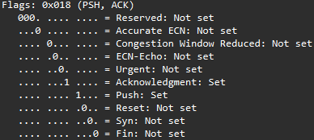
        
    - 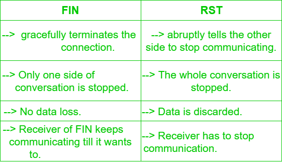
    - 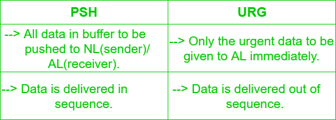
- **Windows size(16b)-** (buffer size)unacknowledged data (in bytes) that can be in transit, receiver is currently able to accept(<ins>flow control</ins>) | max- (16b) 65,535 bytes
    
- **Data Checksum(16b)-** use error detection (data not corrupted or tampered) eg- Parity, CRC, checksum
    
    - computed over segment(header+data) recalculated at each hop along network path
- **Urgent Pointer(16b)**\- specifies length of urgent data, points last urgent byte, valid only if urg-flag (which bytes in segment are to be processed first by receiver)
    
- **Options(40B)**\- additional config
    
    - Maximum Segment Size(4B)- max TCP data excluding TCP header (while TCP handshake)
    - Timestamp(10B)- used for RTT measure, protecting against duplicate segments
    - Selective Acknowledgment (SACK)(2B varies)- inform sender specific seg received. not all window is retransmitted
    - End of Option List (EOL)(1B)
    - TCP CWR, ECN-Echo
- **TOTAL = 20 - 60 bytes (options = 40 bytes)**
    

* * *

### **UDP(User Datagram Protocol)- <ins>*P-17*</ins>**

- 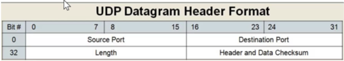
- Header size - **8 bytes**
    
- Source & destination port = 16 bit each = 32 bits
    
- Length = 16 bits | Data Checksum = 16 bits (32 bits)
    
- Eg- DHCP, RIP, SNMP
    

* * *

### **IPv4 header (20 - 60 bytes)**

- 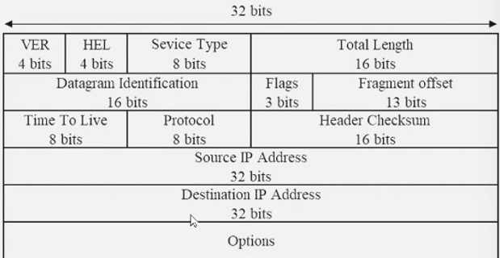
    
    - **Version(4b)-** IPv4/ IPv6
    - **Header Length(4b)**\- size of IP header only- to tell where data starts from (min size is 5(0101) words(5\*32=20B) | max 60B including options)
    - **Service Type(8b)**\- defines QOS-eg VoIP (now replaced by DS(Differentiated Services), ECN)
        - <ins>Precedence(3b)</ins>\- indicates priority of packet (0-7 levels)
            - not sure- 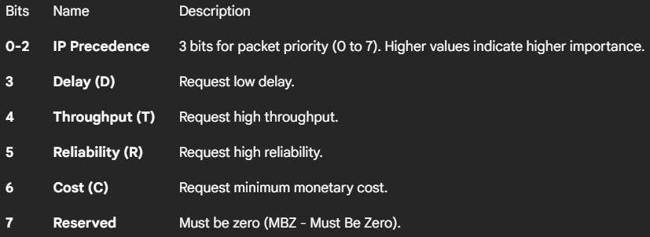
        - <ins>TOS(Type of Service)(5b)</ins>\- handling of packet while delay
    - **Total Length(16b)**\- total length of IP packet with payload/data (max-65,535 \[0xFFFF\])
    - **Identification(16b)**\- unique ID to all fragments from same original packet, helps to reassemble
    - **Flags(3b)**\- indicates how packet should be fragmented/ whether fragmentation is allowed
        - Bit 0- Reserved (set to 0)
        - Bit 1- Don't Fragment(DF)- If set to 1- packet should not be fragmented
        - Bit 2- More Fragments(MF)- If set to 1- more fragments are to follow | if set to 0- its last fragment
    - **Fragment offset(13b)**\- specifies position of fragments data(sequence no.) within original packet (for reassembly)
    - **Time to Live(8b)-** (Max hop count. no.) max times packet can be forwarded by L3 device before discarded(TTL = 0). It decreases by 1 every time packet forwarded by L3 device. prevents packet from routing loop.
        - TTL for Windows- 128
        - TTL for Linux- 64
        - TTL cisco IOS- 255
    - **Protocol(8b)**\- specifies protocol used in data portion of IP packet (eg- 6-TCP, 17-UDP, 1-ICMP)
    - **Checksum(16b)**\- Error-checking of IP header ensuring integrity (calculate over entire header, validated at each hop)
    - **Source IP(32b)**\- essential for routing packet back to sender if needed
    - **Dest IP(32b)**\- routers use to determine next hop
    - **Options(variable length max-320b)**\- used for additional features (security, timestamping, routing control)
    - **TOTAL = 20 - 60 bytes (options = 40 bytes)**

* * *

- 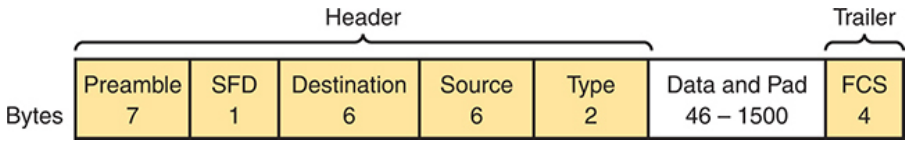
- **Physical Layer- Not included in Frame(coupled together)- <ins>8bytes</ins>**
    - **Preamble(alternating 1s & 0s) -** <ins>7bytes</ins> - synchronize receivers clock with senders (to lock)
        
    - **Start Frame Delimiter(10101011)** - <ins>1byte</ins> Signifies end of preamble & start of frame i.e. from dest MAC (Wake-Up or receiver)
        

### **Ethernet Header (14 bytes)**

- **Destination MAC -** 48b / <ins>6bytes</ins> recipient address
    
    - address in frame compared to MAC in device, if match- device accepts. can be unicast/multicast/broadcast
- **Source MAC-** 48b / 6<ins>bytes</ins> (identify sender- originating NIC/ int of frame)
    
- **Ether Type/ Length-** <ins>2bytes</ins>
    
    - identify upper layer protocol encapsulated in E-frame (eg- ARP- 0x0806, used for routers to process- IPv4- 0x0800/ IPv6- 0x86DD )
- ==**Data/Payload-** 46-1500bytes (L3 data. All frames must be min 64bytes(i.e. min data-46B), if not- pad\[extra bits\] added)== <ins>**(MTU=1500B)**</ins>
    

### **Trailer- 4 bytes**

- **FCS (Frame Check Sequence)** (not part of header) - <ins>4bytes</ins> (Not does Error Recovery/Correction like TCP)
    - ==used by **NIC** to detect errors== in frame by CRC \[matching generated CRC at receiver with senders CRC. If FCS not match frame dropped.
- ==**MAX size of Ethernet frame - 1518B (1522B or more if VLAN tag)**==
- **MAC(Media Access Control) 802.3 =** unicast Ethernet address (address represents 1 int of LAN) on NIC
- IANA assigns manufacturer unique First 3B MAC- OUI(organizationally unique identifier). Manufacturer assigns(Vendor Specific)- Last 3B MAC to NIC (eg- <ins>00:50:3F</ins>:<ins>3A:98:HB</ins>)