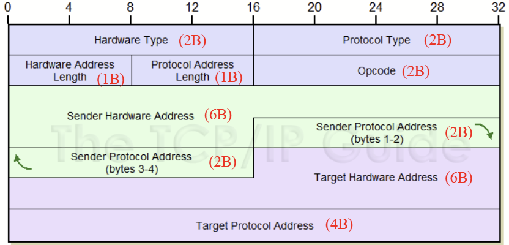
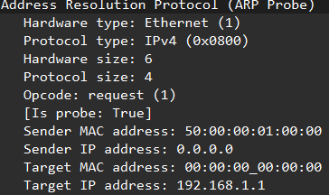
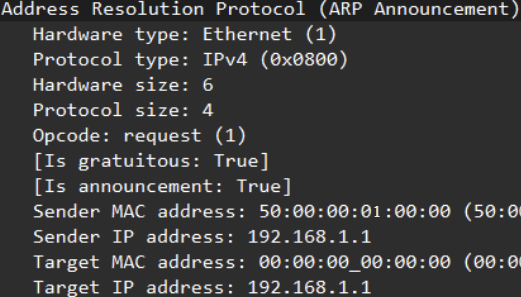
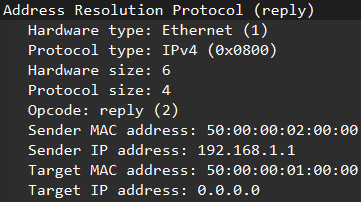
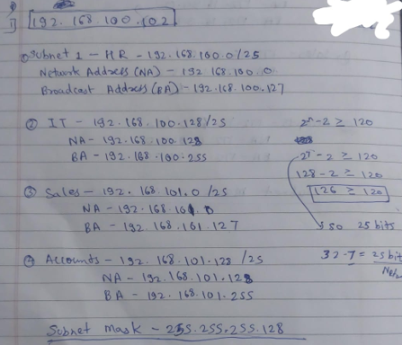
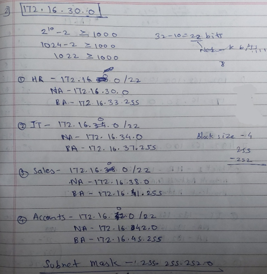

### **ARP- *L2*** - resolve MAC for a known IP and vice versa. Operates within same LAN/ broadcast domain.

- ==**Why L2- Its encapsulated in Ethernet(IEEE 802.3) frame**==
    
- *When dest IP is in different network*
    
    - <ins>*PC will generate ARP for Default Gateway*</ins>
    - <ins>*and use MAC of Default Gateway as dest MAC*</ins>
- **Types** (types are identified by ==opcode==)
    
    1.  **Standard ARP-** resolve MAC for a known IP address
        - **Request ARP-** broadcast msg to ask MAC of known IP **(Opcode- 1)**
        - **Reply ARP-** unicast response to requesting device **(Opcode- 2)**
        - ==**Dest/ Target MAC(ARP) – 00-00-00-00-00-00**==
            - ==**Dest MAC (in Ethernet Frame)- FF-FF-FF-FF-FF-FF**==  
                \-
        - <ins>***ARP Header (28B)***</ins>
            - **HTYPE (2B)**\- eg Ethernet  |  **PTYPE (2B)**\- L3 protocol eg IPv4(0x800), ICMP(0x800H)
            - **HLEN (1B)**\- 6 for Ethernet  |  **PLEN (1B)**\- 4 for IPv4
    2.  **Reverse ARP-** resolve IP for a known MAC (replaced by DHCP & BootP) **(Opcode- 3**(request)**, 4**(reply)**)**
        - Src MAC, Dest MAC | Src IP & Dest IP (empty)
    3.  **Inverse ARP-** resolve IP for a known MAC (used in Frame Relay networks) (replaced by MPLS) **(Opcode- 7,8)**
        - eg- Router A is connected to Router B via a Frame Relay circuit. Router A sends an **InARP request** over the Frame Relay link to ask Router B for its IP address. Router B replies with its IP address, and Router A then knows how to reach Router B via the Frame Relay connection.
    4.  **Proxy ARP-** router responds to ARP requests on behalf of other devices
        - when 2 PCs in different Network no proxy ARP. **==Proxy ARP is present in directly connected static route==**.
            - By default enabled in Cisco (disabled manually for security)
    5.  **Gratuitous ARP-** checks duplication, announce IP to MAC mapping to network (below situations) ==Switch updates MAC table due to GARP==
        - GARP generated below cases
            
            - Static IP assignment
                
            - DHCP IP assignment
                
            - APIPA IP assignment
                
            - Device/Link Failure (Redundancy configured)
                
        - * * *
            
            If no Duplication
            
            - PC1 Broadcast msg1,2,3 (ARP Probe)- Sender IP is 0.0.0.0 to avoid corrupting ARP caches
                - 
            - PC1 Broadcast msg4 (ARP Announcement)
                - 
        - If Duplication
            
            - PC1 Broadcast msg1 (ARP Probe) (same as above)
            - PC2 Unicast msg2 to PC1 (duplication found- GARP waits for approx 3s to check duplication before assigning IP)
                - 
            - PC1 Broadcast msg3,4,5 with APIPA IP (ARP Probe)- 169.254.133.238 (similar format to msg1)
            - PC1 Broadcast msg6 (ARP Announcement) IP- 169.254.133.238

* * *

## **ICMP (Internet Control Message Protocol)- *P-1 | L3***

- **ICMP Header (8B)**
    - 
- **<ins>Type (1B)</ins>\-** type of ICMP msg
    - **Type 0**: Echo Reply (Response to an Echo Request)
        - **Code 0**\- verify connectivity
    - **Type 3:** Destination Unreachable
        - code (Reason of error)
            - **0:** Network unreachable
            - **1:** Host unreachable
            - **2:** Protocol unreachable
            - **3:** Port unreachable
            - **4:** Fragmentation needed and DF set (Don’t Fragment)
            - **5:** Source route failed
    - **Type 5**: Redirect (inform host about a better route for reaching dest)
        - **Code 0-** Redirect datagram for Network
        - **Code 1-** Redirect datagram for Host
    - **Type 8**: Echo Request (to request Echo Reply)
        - **Code** **0**\- check network connectivity (used by ping)
    - **Type 11:** Time Exceeded (TTL expired) (eg- traceroute tools)
        - **Code 0**: TTL expired in transit
        - **Code 1**: Fragment reassembly time exceeded
    - **Type 9, 10, 12-18 are also there**
- **<ins>Code (1B)</ins>\-** further classifies ICMP msg type
- **<ins>Cheksum (2B)</ins>\-** verify integrity
- **<ins>Identifier (2B)</ins>\-** match requests with replies
- **<ins>Sequence No. (2B)</ins>\-** track msg order

* * *

### **APIPA (Automatic Private IP addressing)**

- when DHCP IP assignment fails ==only windows OS== automatically assigns itself APIPA IP *(169.254.0.1- 169.254.255.254)*

* * *

## **MAC**

- 48 bits hex no. (eg- <span style="color: rgb(53, 152, 219);">00:1A:2B</span>:<span style="color: rgb(185, 106, 217);">3C:4D:5E</span>)
    
    - <span style="color: rgb(53, 152, 219);">24b</span>\- **OUI**(Organizationally Unique Identifier)- assigned to manufacturer by IEEE
    - <span style="color: rgb(185, 106, 217);">24b</span>\- **Vendor Specific**\- assigned by manufacturers/ org
- Change MAC (Burned in Address- in NIC) in routers
    
    - NIC MAC in PC, router cannot be changed but its on OS to assign temporary MAC for communication (Temp MAC- can be NIC MAC or manually assigned MAC- decided by OS)
        
    - ```bash
          int g0/0
          mac-address 0000.0000.1111
          do show interface g0/0
        ```
        
        - <span>`do show interface g0/0` - (to check)</span>
- **MAC Address**
    
    - **Windows -** 00-A5-8A-CT-39-E7
        
    - **Linux -** 00:A5:8A:CT:39:E7
        
    - **Cisco -** 00A5.8ACT.39E7
        

* * *

## **IP and Subnetting**

- | **IPv4** | **IPv6** |
    | --- | --- |
    | 32bit | 128bit (CIDR- /48, /64) |
    | Decimal octets (X.X.X.X) | Hexadecimal Hextets (X.X.X.X.X.X.X.X) |
    | 2^32 address | 2^128 address |
    | Supports broadcast | No broadcast |
    | No Native IPSec support | Native IPSec support |
    | 20B-60B (header size) | 40B (header size) |
    
- **Solutions to IPv4 exhaustion**
    
    - **CIDR**– 1993 (removed the **class-based limitations** allowing VLSM)
    - **DHCP**– 1993 (helped optimize IP address usage)
    - **NAT**– 1994
    - **Private Address Space (RFC 1918)** – 1996 (class A,B,C private IPv4)
    - **IPv6** – 1998
    - **IPv4 Address Reclamation**– 2005+ (IANA redistribute unused/ inefficient IPv4)
- **/31** is used in Point to Point networks (2 IPs)
    
    - uses= connection 2 routers
        - ISPs to assign IP to customer links
    - <ins>255.255.255.254</ins> <ins>|</ins> eg= 192.168.1.0/31- 1.0 & 1.1
- **/32** is used if single host
    
    - uses
        
        - **Host Route**
            
        - **BGP**\- announcing(adv) routes- `network 192.168.1.5 mask 255.255.255.255`
            
        - **ACL**\- Firewall rule (allow traffic only to/from 1 host) -
            
            `access-list 100 permit ip host 192.168.1.5 any`
            
        - **Loopback int-** `int l0` & `ip address 192.168.1.1 255.255.255.255`
            
- **IPv5 (Internet Stream Protocol)-** Protocol no.- 5
    
    - Experimental protocol to prioritize real-time data transmission(voice, video)
    - ==Not intended to replace IPv4==

* * *

- **IP-** unique numerical assigned to each device connected to a network
    
    - **Non-routable IP-**
        
        - <ins>Private IP -</ins> <ins>class A</ins>\- 10.0.0.0 - 10.255.255.255 (10.0.0.0/==**8**) **\[255.0.0.0\]**==
            
            - Possible hosts- <ins>2^24 - 2 = 16,777,214</ins>
                
            - <ins>class B</ins>\- 172.16.0.0 - 172.31.255.255 (172.16.0.0/==**12**) **\[255.240.0.0\]**==
                
                - Possible hosts- <ins>2^20 - 2 = 1,048,574</ins>
            - <ins>class C</ins>\- 192.168.0.0 - 192.168.255.255 (192.168.0.0/==**16**) **\[255.255.0.0\]**== (but max /24 & 255.255.255.0)
                
                - Possible hosts- <ins>2^8 - 2 = 254</ins>
            - <ins>eg-</ins> 2 PCs with 192.168.1.1 & 192.168.2.1 will not ping if subnet is 255.255.255.0 but will ping if 255.255.0.0
                
        - <ins>Loopback -</ins> 127.0.0.0 - 127.255.255.255
            
        - <ins>APIPA -</ins> 169.254.0.0 - 169.254.255.255
            
        - <ins>Multicast -</ins> 224.0.0.0 - 239.255.255.255 (class D)
            
        - <ins>Reserved</ins>
            
            - 0.0.0.0 - 0.255.255.255 (0.0.0.0- used for unknown ip as route)
                
            - 240.0.0.0 - 255.255.255.255 (class E)
                
    - **Routable** (used between different networks) **IP-** <ins>Public IP</ins>
        
- **IPv4 -** 32 bits
    
    - Total no. of IP - 2^32 = 4.3 billion
        
    - **Classes**
        
        - **A-** 0.0.0.0 - 127.255.255.255 **/8 255.0.0.0**
            
            - <ins>1st bit off</ins>\- therefore 127 max (127 = 01111111) \[Class designing strategy\]
                
            - **Possible hosts**\- <ins>2^24 - 2 = 16,777,214</ins> (24 = host bits)
                
        - **B-** 128.0.0.0 - 191.255.255.255 **/16 255.255.0.0**
            
            - <ins>2nd bit off</ins>\- i.e. 191 max (128- 10000000 | 191- 10111111) \[X= variable - 10XXXXXX\]
                
            - <ins>Possible hosts</ins> **\-** <ins>2^16 -- 2 = 65,534</ins>
                
        - **C-** 192.0.0.0 - 223.255.255.255 **/24 255.255.255.0**
            
            - <ins>3rd bit off</ins>\- i.e. 223 max (223- 11011111)
                
            - <ins>Possible hosts</ins> **\--** <ins>2^8 -- 2 = 254</ins>
                
        - **D-** 224.0.0.0 - 239.255.255.255 (4<sup>th</sup> bit off i.e. 239 max \[11101111\])
            
        - **E-** 240.0.0.0 - 255.255.255.255
            
- **IPv6 -** 128 bits
    
    - Total no. of IP - 2^128 = 340 undecillion
- **Subnet Mask** - 32-bit | divides IP in network & host portion (size of network) | helps routers
    
- **Subnetting-** dividing network into smaller subnets ==**(2^n - 2>= Required devices)**==
    
    - **FLSM (Fixed Length Subnet Mask) -** all subnets same length
        
    - **VLSM (Variable Length Subnet Mask) -** variable length subnets
        
- **HW**
    
    - **192.168.100.102** (divide into 4 networks each of 120 devices)
        
        - 
    - **172.16.30.0** (divide into 4 networks each of 1000 devices)
        
        - 

* * *

- **Classful Subnetting**
    
    - old method of dividing IP address space based on classes (A, B, C) before CIDR
        
    - IP and subnet mask belongs to same class | VLSM not supported
        
- **Classless Subnetting (CIDR)**
    
    - allocate IP more efficiently & precisely | No fixed classes | helps routers to direct packets based on subnet / CIDR suffix.
- **FLSM**
    
    - Eg- Divide network into 4 departments of 70,000 devices each
        
        - 2^17 - 2 >= 70,000
            
        - 32 - 17 = 15 (network bits)
            
            - Subnet mask = 255.254.0.0
        - Block size = 256 -- 254 = 2
            
        - N1 - 10.0.0.0 -- 10.1.255.255 (network & broadcast address given)
            
        - N2 - 10.2.0.0 -- 10.3.255.255 (usable host IPs- 10.2.0.1-10.3.255.254)
            
        - N3 - 10.4.0.0 -- 10.5.255.255
            
        - N4 - 10.6.0.0 -- 10.7.255.255
            
- **VLSM**
    
    - 1
        
        - 
    - 2
        
        - 
- **ICMP Type 8**: Echo Request
    
- **ICMP Type 0**: Echo Reply
    

* * *

### Modes in Network CLI (below given cisco) \[==**?** -- to know commands==\]

- **User EXEC Mode (>) -** <ins>Router></ins>
    
    - Limited mode. can run basic commands (like show, ping, telnet) but cannot make configuration changes.
        
    - Eg- `show version`, `ping 192.168.1.1`, `show ip int brief`, `show ip route`
        
    - **`end`** - to return to exec mode
        
- **Privileged EXEC Mode (#) -** <ins>Router#</ins>
    
    - access to advanced commands (monitoring config & troubleshooting)
        
    - Entering command- <ins>**enable**</ins>
        
    - Eg- `show running-config`, `reload` (restart device), `copy start run`, `debug`
        
- **Global Configuration Mode (config) -** <ins>Router(config)#</ins>
    
    - make configuration changes to the router/ switch.
        
    - <ins>We can monitor config in this mode by prefix ==do== (eg- do show version)</ins>
        
    - Entering command- <ins>**configure terminal**</ins>
        
    - Eg- `hostname Router2`, `interface gigabitEthernet 0/0`, ip address 192.168.1.1 255.255.255.0
        
- **Interface Configuration Mode (config-if)-** <ins>Router(config-if)#</ins>
    
    - configure individual network interfaces (FastEthernet/ GigabitEthernet)
        
    - Entering command- <ins>**interface &lt;interface_name&gt;**</ins>
        
    - Eg- `ip address 192.168.1.2 255.255.255.0`, `no shutdown`
        
- **Router Configuration Mode (config-router)-** <ins>Router(config-router)#</ins>
    
    - configuring routing protocols (e.g., OSPF, EIGRP, BGP).
        
    - Entering command- <ins>**router &lt;protocol&gt;**</ins>
        
    - Eg- `network 192.168.1.0 0.0.0.255 area 0`, `router bgp 65001`, `redistribute`
        
- **Line Configuration Mode (config-line)-** <ins>Router(config-line)#</ins>
    
    - configure fomatting/settings for specific terminal lines (e.g., console, vty).
        
    - Entering command (g)- <ins>**line &lt;line_number&gt;**</ins>
        
    - Eg- `password cisco`, `login`
        
    - `line con 0`\- <ins>line</ins>\- comm channel used to access device | <ins>con</ins>\- console cable used | <ins>0</ins>\- console port no. (mostly only 1 port i.e. 0)
        
    - `line vty 0 4`\- vty- virtual terminal for remote access (telnet/ssh) | <ins>0 4</ins>\- config max 5 users at a time (0 to 4) vterminal lines
        
- **ROMMON Mode (ROM Monitor)-** <ins>rommon></ins>
    
    - low-level recovery mode for troubleshooting & recovering devices/ password. used when device fails to boot (Ctrl + Break)
        
    - Eg- boot, confreg, reset
        
- **Shutdown Mode**
    
- **`exit`\-** return to parent mode