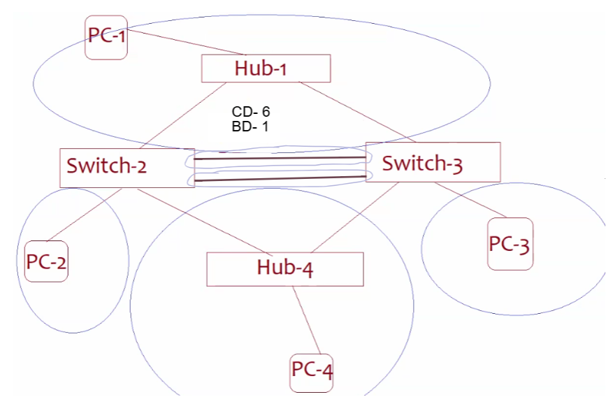
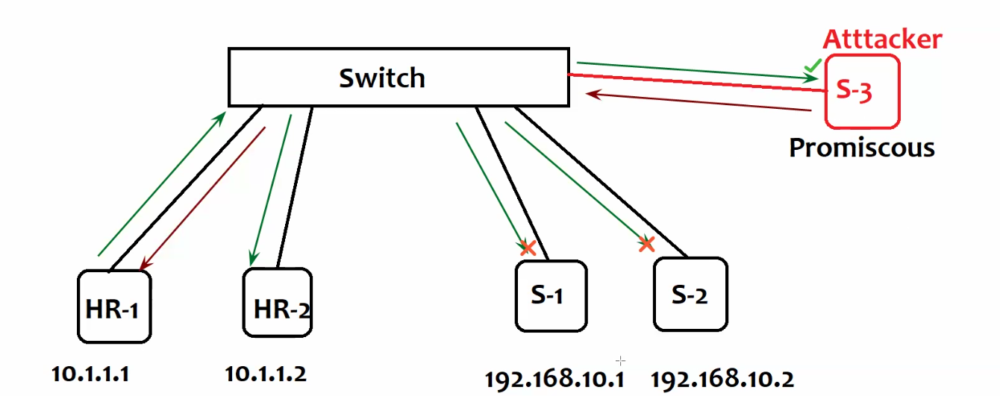
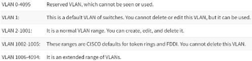
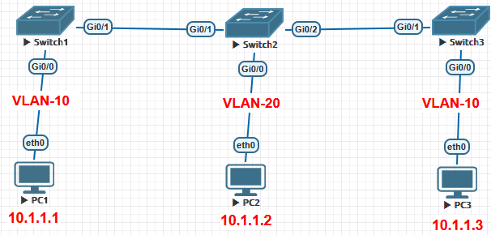
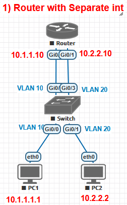

### **Switching -** process of forwarding data btw devices in same network/ VLAN based on MAC (L2) or btw different networks/ VLANs based on IP (L3)

- **Collision Domain(CD)**\- <ins>network segment(domain)</ins> where there's <ins>possibility of collision</ins> when 2/more nodes tries to comm simultaneously
    - \- <ins>Collision Domain=1 & Broadcast domain=1</ins>
    - \- <ins>CD=4 & BD=1</ins> (Switch- per port CD, single BD)
    - \- <ins>CD=6 & 1 BD=1</ins>
- **Broadcast Domain(BD)**\- <ins>network segment(logical area in net)</ins> where all devices can receive broadcast packet sent by any device within same domain
- **Unknown unicast flooding-** <ins>event</ins> when a network switch forwards a unicast frame to all ports in VLAN (except the one it was received on) because no entry for packet dest-MAC in switchs MAC table (eg- full MAC table of switch(2960- max 8k MAC enteries)) `sh mac-address-table count`
- **CSMA/CD & CA**\- to check media/channel is free/ not. If free transmit else wait. if collision random wait time & retry
- **ASIC(Application-Specific Integrated Circuit**)- custom-designed chip for a particular function (eg- Multi-Layer Switch uses Hardware for routing(faster than older software routers) and switching)
- **CAM (Content Addressable Memory)**\- hardware part of switches, stores mapping MAC to physical ports for fast, accurate Ethernet frame forwarding  ==default aging time= 300s== (CAM hardware contains MAC table)
- <ins>How switch populate MAC</ins>
    - Eg- 1 switch- 2 PCs (PC1 pings PC2)
        - PC1 sends ARP (SM=M1, DM=12F, SIP, DIP) to switch
        - Switch maps M1 to port G0/0 in CAM & broadcasts it
        - PC2 upon receiving PC1 ping accepts it as its MAC matches, saves M1 to its ARP Cache
        - PC2 sends SM=M2, DM=M1, SIP, DIP to switch
        - Switch maps M2 to port G0/1 in CAM & unicasts it to PC1
        - PC1 upon receiving PC2 ARP, saves M2 to its ARP Cache

* * *

## **VLAN**

- Logical grouping of devices within net. Segments larger physical network (single broadcast domain) into smaller multiple isolated broadcast domains (to reduce BD)
    
- each VLAN - single broadcast domain (By default- 2 VLANs do not comm)
    
- ==**VLAN need**\- to reduce broadcast domain size, lower bandwidth(avoiding Broadcast msgs), lower CPU Overhead (additional benefit- security from below attacks)==
    
    - </img>
        - 10.1.1.0/24 cannot comm with 192.168.10.0/24 then why do we use VLAN
        - Attacker
            - can set NIC to Promiscous Mode(NIC accepts & processes all traffic on net) to get src-MAC & dest-MAC
            - It acts as dest-MAC by changing MAC to dest (uses GARP flooding\[changes ARP cache, CAM\] to act as dest)
            - Now senders ARP cache has Attacker in it. All data goes to attacker
            - DAI (Dynamic ARP Inspection) can be avoided by IP & MAC spoofing
            - ARP spoof (changes victims ARP cache- pretends to be IP with diff MAC)eg- `arpspoof -i  eth0 -t <victim-ips>` or 2-way spoofing `arpspoof -i  eth0 -t <target-ip> <pretend_ip>`, now start wireshark & browse http website
    - NAT need- give time to company to implement IPv6, Hide private IP
- ==By default Switch is single broadcast domain- By default all ports of witch are member of VLAN1==
    
- **Total VLANs= 4096 (0-4095) (Check Dot1Q for details)**
    
    - Ethernet frame structure with VLLAN Tag- Type field is btw VLAN-ID & Dest-IP
        
        - 
    - VLAN ID- 12bits (VLAN size 2^12= 4096 (Switch max VLANs- 255-4096))
        
    - 
    - **Standard VLAN range- 2 to 1001** (when created auto-saved in VLAN.DAT file into switch flash memory)
        
        - 7 Reserved (==By default 5 VLANs in all Switch- VLAN1, VLAN1002-1005==)
            
            - **0**\- Reserved by IEEE 802.1Q for **tagging priority** (no VLAN)
                
            - **1**\- **Default VLAN** on Cisco switches; all ports are in VLAN 1 by default (==most switches its VLAN1 but can be changed==)
                
            - **1002-1005**\- Reserved for legacy **Token Ring and FDDI** VLANs on Cisco switches
                
            - **4095**\- Reserved by IEEE 802.1Q for **implementation use** (e.g., internal use)
                
    - **Extended VLAN range- 1006 to 4094** (need to save info manually into switch memory) (==only be created in transparent mode of VTP if switch supports VTP v3==)
        
- **Commands**
    
    - creating VLAN- `vlan <vlan-id>`, `name <vlan_name>`
    - removing VLAN- `no vlan <vlan-id`
- **Most common types of VLAN**
    
    1.  **Data/ User VLAN-** isolating diff grps of users into separate VLANs
        
    2.  **Voice VLAN-** carrying Voice over IP (VoIP) traffic with high priority `switchport voice vlan <vlan>`\- do with encapsulation dot1q & router sub-int
        
    3.  **Management VLAN-** ensures that administrative & management traffic is kept separate from regular user data traffic. (access & manage config secure)
        
    4.  **Default VLAN-** All access ports are part of this VLAN (generally VLAN1) by-default. Used for untagged traffic.
        
    5.  **Native VLAN-** carry untagged traffic over trunk links. when untagged traffic is received, it is assigned to the Native VLAN (mostly by-default VLAN1)
        

* * *

### **Switch Port-** physical interface where devices are connected to network via cables (twisted pair/ Fibre optics)

- **2 Modes of behaviour**
    
    - **Access port-** forward <ins>untagged</ins> traffic for only <ins>one VLAN</ins> (<ins>member of single VLAN only</ins>)
        
        - generally used to connect end hosts (eg- PC)
        - not sure- tagged frame conditions- if tag matches port's assigned VLAN ID/ for specific config like voice VLAN
        - not sure- function of an access port is to strip the VLAN tag from an incoming frame and assign it to the port's specific VLAN, or to add the tag when sending data to a trunk port or another switch
    - **Trunk port-** forward traffic for <ins>multiple VLANs</ins> by <ins>tagging</ins> frames with VLAN identifiers (<ins>member of ALL VLANs by default</ins>)
        
        - generally used to connect switch-switch, switch-router, switch-server)
- Config Access port- `int <int>`, `switchport mode access`
    
- Config Trunk port- `int <int>`, `switchport trunk encapsulation dot1q`, `switchport mode trunk` - if encapsulation not set(i.e.-dynamic auto) & mode cannot set to trunk (we can use Native-VLAN in dot1q only)
    
- <ins>**2 Modes**</ins> `sh int <int> switchport`
    
    - **Administrative mode**\- manually or default config of port *(Access/ Trunk/ Dynamic Auto/ Dynamic Desirable)*
    - **Operational mode**\- current state of port dynamically determined by link behaviour *(Access/ Trunk)*

* * *

### **VLAN Tagging**

- VLAN tags are added to Ethernet frames to distinguish/segregate traffic belonging to different VLANs as it moves across a trunk link.
    
- **Trunking**
    
    - Trunk links allow multiple VLANs to be carried over a single physical link btw switches
        
    - Tagging & Trunking- extending same VLAN across multiple physical locations.
        
- **Commands**
    
    - ```bash
                en
                conf t
                !
                vlan 10
                hostname HR
                ex
                !
                vlan 20
                hostname IT
                ex
                !
                interface range fastEthernet 0/1-2
                switchport mode access
                switchport access vlan 10 !(ports fa0/1, fa0/2 are in same vlan)
                !
                interface range fastEthernet 0/5 !(used on both switches)
                switchport mode trunk
                !
                show running-config
                show interface trunk
        ```
        

* * *

### **Native VLAN(NV)**

- concept in IEEE 802.1Q that allows trunk port to forward & accept untagged traffic (if trunk port receives untagged frame, considers it for Native VLAN)
    
- If trunk port has to forward traffic for Native-VLAN, it will not tag the frame
    
- \[**By default its VLAN 1**\] should be changed for security
    
- ==Each trunk <ins>port</ins> can have only 1 Native VLAN== (i.e. 2 switches must have same Native VLAN- else leakage of traffic)
    
- **Purpose**
    
    - Backward compatibility with Legacy devices, devices that not support VLAN tagging
        
    - Managing control traffic- CDP, STP
        
    - eg- Problem- Multiple departments (multiple VLANs) only 1 printer
        
        - Sol- Keep Printer in VLAN-x with access port and config VLAN-x as Native-VLAN (not sure- in all trunk ports)
- **Configuration Example**
    
    - Scenario- 2 switches are connected via a trunk port.
        
    - Default native VLAN is changed from VLAN 1 to VLAN 100.
        
        - Configuration on Switch 1:
            
            - `int g0/1`, `switchport mode trunk`, `switchport trunk native vlan 100`
        - Switch 2:
            
            - `int g0/1`, `switchport mode trunk`, `switchport trunk native vlan 100`
    - Verification-  `show vlan brief`, `sh int status`, `sh int trunk`
        
- **Problem1- Comm btw PC1 & PC2 (not config & implemented- only to test knowledge)**
    
    - 
    - **Method1**\-Make Switch1 g0/0, g0/1- access port with VLAN-10 & Switch2 g0/0, g0/1 as access port with VLAN-20 (Native VLAN mismatch will be shown)
        - S1- `int range g0/0-1`, `switchport access vlan 10` (Native-VLAN for g0/1= 10)
        - S2- `int range g0/0-1`, `switchport access vlan 20` (Native-VLAN for g0/1= 20)
    - **Method2**\- S1 g0/1- `switchport trunk native vlan 10`\- STP blocks port, `spanning-tree portfast trunk`, `spanning-tree bpdufilter enable` - now STP unblocks port
        - S2 g0/1-`switchport trunk native vlan 20`, `spanning-tree portfast trunk`, `spanning-tree bpdufilter enable`\- now STP unblocks port, `sh spanning-tree`
    - To comm btw PC1 & PC3 (if PC1-PC2-PC3 all trunk ports)- create vlan 10 in S2 `vlan 10`
- **Problem2**\- PC1 & PC2 are not comm. Troubleshoot? (PC1 & PC2 ports config to vlan10, trunk ports btw switches) (same above figure)
    
    - Ans- Allowed/Blocked VLANs (reason for no comm)
    - `int g0/1`, `switchport trunk allowed vlan 1,2,5` (or  1-5), `sh int trunk`

* * *

### Allowed/Blocked VLANS

- ==By default trunk ports allow all VLANs==. we can control which VLAN traffic can pass through trunk ports
- `int g0/1`, `switchport trunk allowed vlan 1-10`
- allowed VLANs overwrite so add them- `switchport trunk allowed vlan add 12,15`
- to remove- `switchport trunk allowed vlan remove 15`
- except it allow all others- `switchport trunk allowed vlan except 10`
- To allow all- `switchport trunk allowed vlan all`

* * *

# **Inter-VLAN routing**

- process of enabling comm btw devices in diff VLANs
    
- <ins>**Methods**</ins>
    
    1.  **Router with Separate Interfaces (Legacy Method)**
        - router interfaces will be assigned for each VLAN (using multiple cables)
        - 
        - Switch- `int r g0/0,g0/2`, `switchport mode access`, `switchport access vlan 10`
        - Switch- `int r g0/1,g0/3`, `switchport mode access`, `switchport access vlan 20`
    2.  **Router on a Stick (sub interfaces)**
        - 
        - Switch- `int r g0/0, g0/1`, `switchport mode access`, `switchport access vlan <10/20>`  & `int g0/2`, `switchport trunk encapsulation dot1q`, `switchport mode trunk`
        - Router- `int g0/0`, `no sh`, `ex` (ip routing on LAN subint only allowed if encapsulation)
            - `int g0/0.10`, `encapsulation dot1q 10` (10 here is vlan no.), `ip address 10.1.1.10 255.255.255.0`
            - `int g0/0.20`, `encapsulation dot1q 20` (20= vlan no.), `ip address 10.2.2.10 255.255.255.0`
    3.  **L3 Switch (SVI(Switch Virtual Interface))**
        - 
        - L3 switch can have IP on VLAN int not physical int after ip routing command
        - L3 Switch- `ip routing`, `int e0/0`, `switchport mode access`, `switchport access vlan 10`
            - `int e0/1`, `switchport mode access`, `switchport access vlan 20`
        - creating SVI- `int vlan 10`, `ip address 10.1.1.10 255.255.255.0`, `no sh`
            - `int vlan 20`, `ip address 10.2.2.10 255.255.255.0`, `no sh`

* * *

## Protocols used to manage <ins>VLAN traffic across trunk links</ins> btw switches

- ### <span style="color: rgb(53, 152, 219);">**ISL (Inter-Switch Link) (30B)-**</span> not used (now not even used by Cisco)
    
    - encapsulates entire Ethernet frame with additional 26-byte header (includes VLAN ID) & 4 bytes Trailer, creating larger frame
        
    - <ins>All frames are tagged</ins>
        
    - <ins>No Native VLAN</ins>
        
    - supports **<ins>VLAN range</ins>\- <ins>2-1001</ins>**
        
    - <ins>ISL header (26 bytes)</ins> -
        
        - Src MAC(6B), Dest MAC(6B), Type(2B)- \[eg- 0x8100 for ISL\], Tagging info(12B)- \[VLAN ID(12b), priority(3b), info of encapsulation of Ethernet frame\], Ether type(2B)- \[IPv4, IPv6\]-  not sure
            
        - Dest MAC(6B), Src MAC(6B), Ether Type(2B) \[0x8901 for ISL\], VLAN ID(2B), Priority(3b)\[for QOS\], Res(5b), Control Info(1B)-  not sure chatgpt
            
    - <ins>ISL Trailer (4 bytes)</ins>\- added after Ethernet payload
        
        - FCS(Frame Check Sequence) performs error check for frame integrity
    - **Total Frame = (Ethernet H)14B + (ISL H)26B + (Payload)46-1500B + (ISL T- FCS)4B = <ins>90 - 1544B</ins>**
        
- ### **Dot1Q (IEEE 802.1Q) (4B tag)**
    
    - adds a 4B tag in middle of Ethernet frame (btw Src MAC & EtherType/length)
        
    - <ins>Native VLAN frames are not tagged</ins>
        
    - supports <ins>**VLAN range**</ins>**\- <ins>1-4095</ins>**
        
    - 
    - **<ins>TABLE</ins>\- 802.1Q VLAN tag Format**
        
        - | Field | Size | Description |
            | --- | --- | --- |
            | **Tag Protocol Identifier (TPID)** | 16 bits | Identifies frame as being 802.1q-tagged (value 0x8100). |
            | **Priority Code Point (PCP)** | 3 bits | Specifies the frame's priority level (Quality of Service)(8 levels 0-7). |
            | **Drop Eligible Indicator (DEI)** | 1 bit | Indicates whether the frame can be dropped under congestion (if 0= not drop eligible, 1= can be dropped in congestion) . |
            | **VLAN Identifier (VID)** | 12 bits | Specifies the VLAN ID frame belongs to (0-4095). |
            
    - `int <int>` & use after encapsulation if rejected-`switchport mode trunk` & `switchport trunk encapsulation <isl/dot1q/no negotiate>` | verify `sh int g0/1 trunk`