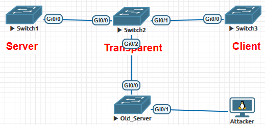
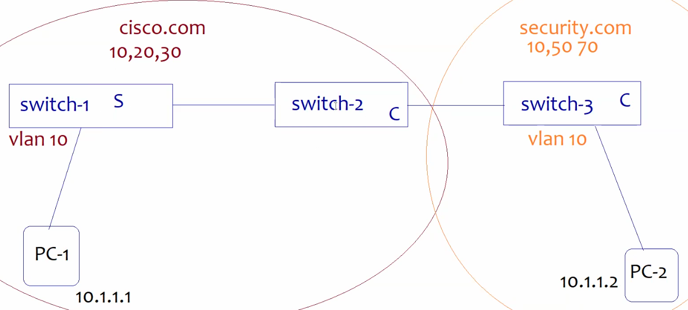

# **DTP (Dynamic Trunking Protocol) *L2***

- negotiate trunking on a link btw 2 cisco switches & automatically form a trunk if both ends support it.
    
- allows switches to dynamically detect & config trunking mode on link (either 802.1Q or ISL) without manual intervention
    
- DTP ==by default enabled==, frames are multicast CDP/VTP/DTP/PAgP/UDLD- (==0100.0CCC.CCCC==) **by default every ==<ins>30s</ins>==**
    
- **New-Switch(2960,3560,3750,3650,3850)**\- <ins>**default mode=DA**</ins>, NV=1, AccesV=1, trunk encapsulation=auto(if ISL&dot1q support, else dot1q) (Solves security issue as any new device not allowed in trunking)
    
- **Old-Switch(2950,3550)**\- <ins>**default mode=DD**</ins>
    
- **2 Modes**
    
    1.  **Dynamic Auto(DA)**\- port waits for trunk negotiation request from neigh switch
        - If neigh sends trunk negotiation request (neigh-DD/Trunk), then ports <ins>operational mode=trunk</ins> (else access)
    2.  **Dynamic Desirable(DD)**\- port sends trunk negotiation request to neigh (actively tries to form trunk)
        - if neigh is DA/DD/Trunk, then <ins>operational mode=trunk</ins> `switchport mode dynamic desirable`
    
    - **Others**
        
        1.  **Access**\- ports into access mode | *no DTP*
        2.  **Trunk**\- port forced into trunking mode regardless of other switch | *doesn't negotiate with other switch*
        3.  **No-negotiate-** Disables DTP negotiation on port | No DTP frames sent or processed (eg- unused ports) `int <int>`, `switchport mode access`, `switchport nonegotiate`
    - | **Sw1 Administrative Mode** | **Sw2 Administrative Mode** | **Result= Operational Mode** |
        | --- | --- | --- |
        | Dynamic Auto | Dynamic Auto | Access |
        | Dynamic Auto | Dynamic Desirable | Trunk |
        | Dynamic Auto | Trunk | Trunk |
        | Dynamic Auto | Access | Access |
        | Dynamic Desirable | Dynamic Desirable | Trunk |
        | Dynamic Desirable | Trunk | Trunk |
        | Dynamic Desirable | Access | Access |
        | Trunk | Trunk | Trunk |
        | Trunk | Access | Wrong Configuration |
        | Access | Access | Access |
        
        - **Operational Mode= Access** when- (1) If both sides DA (2) If either side Access `sh int <int> switchport`
- **NOTE**\- config both ends of a link as a fixed port type (`switchport mode <access/trunk>`) to remove any uncertainty about port's operations
    
- Commands
    
    - Check interface trunking status- `sh int trunk`
    - Show DTP status- `sh dtp int <int>`
- **<ins>DTP not used</ins>\- Security issues (by default DA port can be made trunk link), other vendors don't support dtp**
    
    - `yersinia -I`, press g- select DTP, press x- select enable trunking (wait)

* * *

# **VTP (VLAN Trunking Protocol) *L2***

- used to synchronize VLAN database btw switches in same VTP domain (==By default VTP domain name is null/ blank==)
    
- used to share VLAN config with multiple switches connected in network | add, del, rename VLAN in net centrally
    
- Multi-Vendor Alternative- <ins>Multiple VLAN Registration Protocol (MVRP) (IEEE 802.1ak), GARP, GVRP</ins>
    
- ### VTP versions
    
    - **Version1 (default)**\- not support FDDI, Token Rings, Extended VLANs
    - **Version2**\- supports FDDI, Token Rings | not support Extended VLANs
    - **Version3**\- supports FDDI, Token Rings, Extended VLANs, Private VLANs, requires domain name(null not used)
- ### **Conditions**
    
    - Domain name must match/ same (Case Sensitive)
    - Password (if config) & Version must match
    - One of the Switch must be VTP Server
- ### **VTP Modes (4)**
    
    - **Server Mode (default mode)**
        - create, modify, del, rename VLANs within VTP domain
        - sends & forwards advertisements of its VLAN dB (to other switches in VTP domain)
        - SYNC and saves VLAN config
    - **Client Mode**
        - cannot create, modify, delete VLANs
        - forwards received advertisements after SYNC VLAN dB
        - SYNC VLAN config, not store it (updates VLAN dB from server adv everytime it boots up)
    - **Transparent Mode** (extended VLAN possible)
        - modify, del, rename VLAN | <ins>VLANs config only locally (not adv to other switches)</ins> Revision No. is always 0
        - forwards received server advertisements to others (switches in domain) but not modify its local VLAN dB
        - no SYNC & not saves VLAN config of server (not share its own dB, forwards adv dB)
        - **==Switch VTP mode should be always changed to VTP transparent mode before config switch in production environment==**
    - **Off Mode**
        - switch that not participate in VTP adv. VLANs config locally
- **Revision No.**\- each time server mode makes changes to VLAN dB R no. increments to sync it by adv. Other switch compare R no. from VTP adv. if switch receives higher R no. it updates VLAN dB (R no. sync to client)
    
- ### **Steps to config VTP**
    
    1.  Enable Trunking (eg- one of the int port `switchport mode dynamic desirable`)
    2.  Configure Version- (optional as v1 in all) `vtp version <v1/v2/v3>`
    3.  Configure VTP domain name- `vtp domain <domain_name>` - once config on server, configs on all client
    4.  Configure VTP mode - `vtp mode <server/client/transparent>`
    5.  Configure Password- `vtp password <pass>`
    6.  Configure VLANs on Server switch- (eg- `vlan 10`)
- ### **VTP Communication**
    
    - advertises updates using <ins>Dest Multicast MAC</ins>\- **CDP/VTP/DTP/PAgP/UDLD**\- (==0100.0CCC.CCCC==)
    - Types
        - <ins>**Summary**</ins>\- advertisement occurs every ==<ins>300s</ins>== or change(add, remove) in VLAN dB.
            - includes- VTP version, domain, config Revision No., Time stamp
        - <ins>**Subset**</ins>\- adv occurs after VLAN config changes. includes- relevant info to make changes in VLAN dB
        - <ins>**Client Requests**</ins>\- this adv is request by client to receive more detailed subset adv
            - occurs when switch with low Rno. joins VTP domain & observes summary adv with high Rno.
- ### <ins>**VTP is not used**</ins>
    
    - **Cisco proprietary, Assigning port membership to VLAN is not possible (only VLAN dB sync)**
    - **Slight mistake can wipe-out entire org VLAN**
    - **If 1 Switch is down, we change switch which is config with server mode all VLAN dB is wiped**
    - **Practical/ Attack**
        - 
        - Increase Revision no. on Old_Server(Switch) by adding and removing multiple vlans eg- `vlan <2-9>`, `no vlan <2-9>`
            - 
        - On old server create vlans (assuming its preconfig and admin not checked it before adding it to production when 1 switch down)- `vlan 999`, `name <a>`
        - Connect old_server. You will see vlans from old server in all servers and client wiping out old vlans (This can be done by increasing Rno. of client too)
        - VLAN delete attack- `yersinia vtp -attack 1 -interface eth0`
- **Question** (Will PC1 comm with PC2- Yes(2 diff domain switches with common VLAN- comm))
    
    - 
- <ins>**HW**</ins>\- similar to above, only VLAN10 & S2-transparent mode
    
    - *s1-* `vlan 10`, `name VLAN10`, `do show vlan`\- (optional)
        
        - `int range fa0/1`, `switchport mode access`(optional), `switchport access vlan 10`, `vtp mode server`
    - *s2-* `vtp mode transparent`, `int range fa0/1, fa0/2`, `switchport mode <trunk/dynamic desirable>`, `vlan 10` optional- `switchport trunk allowed vlan 10`
        
    - *s3-* `vtp mode client`, `show vtp status`, `do show ip int brief`
        
    - *s1, s2, s3*
        
        - `vtp domain cisco`, optional- `vtp version 1`, `vtp password <password>`
    - *ping from PC1 to PC2*
        

* * *

