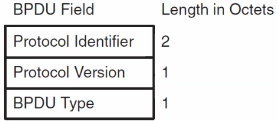
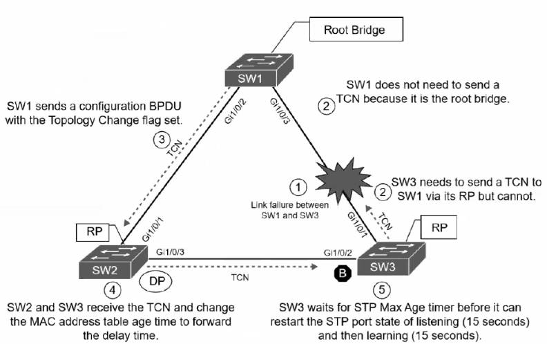
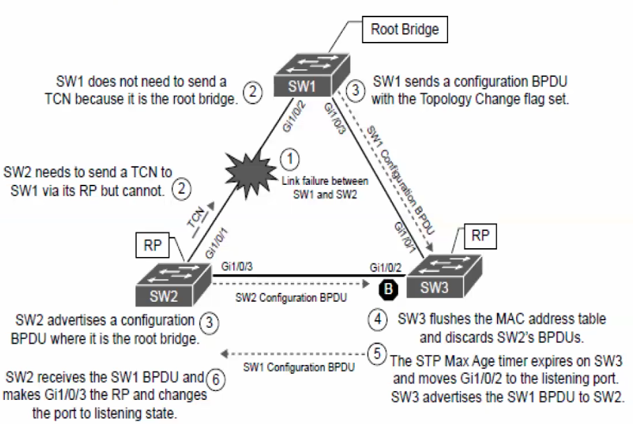
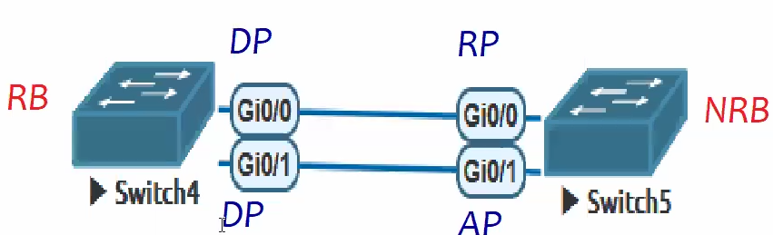
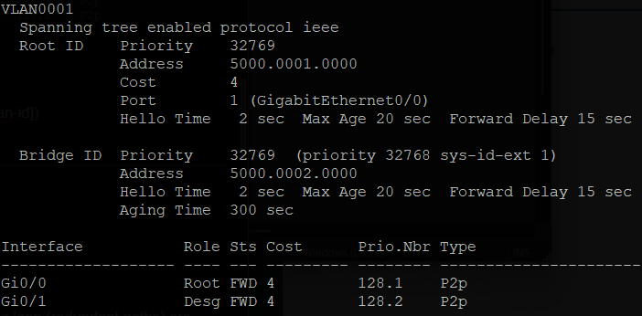
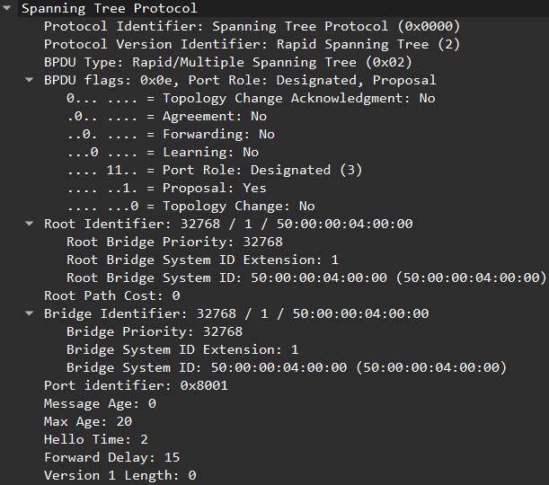
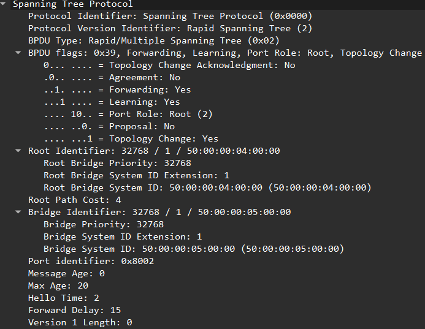
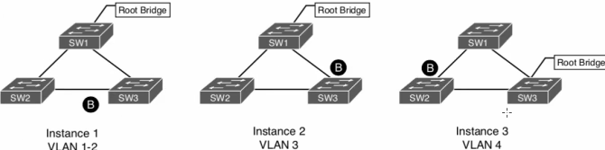
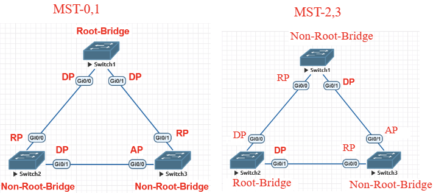

# **Spanning Tree Protocol *L2***

- used to <ins>prevent L2 loops</ins> (that cause broadcast storms\[clockwise & anticlockwise\] & network crashes). uses msgs(BPDU) btw switches to stabilize net into logical loop-free topology (eg- <ins>Switch failures)</ins>
    
- avoids L2 loops by making some int/ports in Blocking state & others into Forwarding state (every part of Ethernet net)
    
- **RB (Root Bridge)**\- IMP Switch in which all ports are designated ports & are in forwarding state. (central ref point of net)
    
- L2 forwarding loops reasons
    
    - STP is disabled
    - Load Balancer is misconfig & sends traffic out multiple ports with same MAC
    - Virtual Switch that bridges 2 physical ports
    - End users using unmanaged switch/ hub
- **BPDU(Bridge Protocol Data Unit) Exchange** (adv)
    
    - Switches continuously send BPDUs to each other to ensure topology remains stable. If RB/ network topology changes, BPDUs allow net to reconverge by recalculating paths. (2 secs for Config BPDU)

* * *

- ### **<ins>BPDU types</ins>**\- BPDU used to identify a hierarchy & notify changes in topology
    
    - **Config** **BPDU(35B)**\- used to identify Root Bridge, Sender Port ID/Port identifier (root/designated/blocked ports), ...
        
        - ==Config BPDU- travels from Root Bridge to all other/edge Switches to build STP Topology==
        - 
            - Initially <ins>RBID(Root Bridge ID) & Sender Bridge are same</ins> as Switch considers itself as Root-Bridge
            - **Flag(1B)**\- uses 2b- topology change events: Topology change ACK flag & Topology Change flag
            - **Bridge ID** (combination of ==**Priority\[2B\] (priority value\[4b\] +VLAN/system ID\[12b\]) & MAC \[6B\]**==)
            - **Root Path Cost(4B)**\- combined int cost for a specific path toward Root Bridge
    - **TCN BPDU** (Topology change Notification)**(4B)-** inform other switches in net about **L2 topology changes** (switch failure, link failure due to port, new switch added/removed to network)
        
        - ==TCN BPDU- sent/travels from non-Root switch to Root Bridge==
            
        - SW that detects link status change sends TCN BPDU towards RB out of its RP
            
        - If upstream SW receives TCN, sends ACK & forwards TCN to RB out of RP
            
        - Upon receipt of TCN, RB creates new Config BPDU with Topology Change flag set (then flooded to all SW)
            
        - When SW receives TCN, they set MAC table age timer to 15s. Then flushes MAC table if not heard from device in interval
            
        - TCNs- generated on VLAN basis, TCN directly correlates to no. of hosts in VLAN
            
        - \- length of octet in bytes
            

* * *

### Direct Link Failure

- </img>
    - 52s- convergence time (20s-max age + 15s-listening + 15s-learning + 2s-BPDU)
        - step 4- SW2 & SW3 receive config BPDU(with TC flag) from SW1, set MAC table time to 15s(forward delay)
        - step5- SW3 waits for 20s then flushes MAC restarts STP states listening-15s, learning-15s on Blocked Port the marked it as RP
-  - 52s convergence for SW2 (15s-step6 + 15s+20s- step5 + 2s-BPDU)

### Indirect Link Failures- comm btw SW is filtered, link up

- \- 52s convergence for SW3

* * *

- ### STP States for Ports(6)
    
    - **Disabled:** port is administratively shut down.
        
    - **Blocking(tmp-20s or permanent):** port is enabled but not forwarding traffic (<ins>listens & receives BPDUs</ins>) ==(AP)==
        
    - **Listening(15s):** port is transitioned from Blocking State, can <ins>send/receive only BPDU</ins>, learning topology
        
    - **Learning(15s):** port can <ins>modify its MAC table</ins> by learning src MAC, <ins>send/receive BPDU</ins>
        
    - **Forwarding(stable):** port can <ins>forward all traffic</ins>, <ins>send/receive BPDU</ins> & can <ins>update MAC table</ins>. ==(RP & DP)==
        
    - **Broken:** Switch detected problem on port then port discards packets
        
- ### Port Roles
    
    - <ins>**RP (Root Port)**</ins>\- Present in only NRB(NRB max RP=1 per VLAN) | <ins>only receives BPDU</ins> | **int with shortest path/ lowest cost to RB |** ==RP always Forwarding State==
        
        - port that connects to RB/ upstream switch in ST topology.
    - <ins>**DP (Designated Port)**</ins> - Present in RB & NRB | <ins>only sends BPDU</ins> | **ports directly conn to RP are DP, all ports of RB are DP, each link has only 1 DP |** ==DP always Forwarding State==
        
        - port that receives & BPDU frames to other SW. connectivity to downstream SW/devices
    - **<ins>AP (Designated Port)</ins>**\- port provides alternate path toward RB, remains in ==Blocking state==, ready to take over if RP fails. Ports other than RP & DP are AP
        

* * *

- ## <ins>**STP Working**</ins>
    
    - When STP is initialized/ switches are connected, switches exchange/adv <ins>Bridge Protocol Data Units (BPDU)</ins> to elect a Root Bridge. Bridge is logical center of net & reference point for all path decisions.
    
    1.  ### **Root Bridge Election:**
        
        - Each switch advertises its **Bridge ID** to its neighbors in **BPDU** messages.
            
        - ==Switch with <ins>lowest Bridge ID</ins> (i.e. lowest Priority Value+VLAN) wins to be **Root Bridge.**==
            
            - if PV same then check- ==<ins>lowest MAC</ins>==
        - Info-
            
            - Default PV(Priority Value all Switches) = **==32768== |** PV = ==**0-61440**== | PV increments in steps of 4096
                
            - VLAN ID = 1 to 4095 (only included in PVST, PVST+)
                
    2.  ### **Path Selection:**
        
        - Once Root Bridge is chosen, other switches becomes NRB(Non-Root Bridge). Then Config BPDU travels to NRB with RPC
            
        - **RPC (STP/Root Path Cost)**\- Root path found based on combined int STP cost(speed if link) (int-cost + neigh int-cost) to reach RB & then adv it via BPDU
            
            - 10 Mbps - 100 cost
                
            - 100 Mbps - 19 cost
                
            - 1 Gbps - 4 cost
                
            - 10 Gbps - 2 cost
                
            - 20Gbps & above - 1 cost
                
            
            &nbsp;
            
        - 
    3.  ### **RP Election**
        
        - <ins>Lowest RPC(Root Path Cost)</ins> \[eg- Sw2 will choose g0/0 as RP (RPC g0/0=4 < RPC g0/1=8)\]
            
        - <ins>Lowest Sender Bridge ID</ins> (if RPC same check PV then MAC)
            
        - <ins>Lowest Port Priority no.</ins> \[Lowest no.=Highest PP\] (default 128)
            
            - change opp int priority no. lower than 128
        - <ins>Lowest Sender Port ID</ins> (eg - g0/0, g0/1)
            
            - \- Sw5 g0/1=RP as opp side(Sw4) is g0/0 i.e. lowest
        - <ins>Lowest Receiver Port ID</ins>
            
            - \- Sw5 g0/0=RP as its lowest than Sw5 g0/1
    4.  ### **DP Election**
        
        - <ins>Lowest RPC(Root Path Cost)</ins> \[eg-adv by sender Sw2 & Sw3 RPC=8\]
            
        - <ins>Lowest local Bridge ID</ins> \[eg-both PV=32786, then Sw2 MAC < Sw3 MAC, so Sw2 g0/1=DP\]
            
        - <ins>Lowest Port Priority no.</ins> \[Lowest no.=Highest PP\] (default 128)
            
        - <ins>Lowest local Port ID</ins> \[\]
            
    5.  ### **AP Election**\- Remaining ports are AP
        
        - ==RP & DP are in **Forwarding State** (active) & AP in **Blocked State** (inactive)==

* * *

- ### **STP Timers**
    
    - **Forward Delay (default 15s)**: amount of time port stays in  each <ins>Listening</ins> & <ins>Learning</ins> state (range 4s-30s)
        
    - **Hello Time (default 2s)**: Time that a BPDU is adv out of a port.  (range 1s-10s)
        
    - **Max Age (default 20s)**: max time Bridge Port saves BPDU info (range 6s-40s)
        
- ## STP Protocols
    
    - **STP (Spanning Tree Protocol)-** IEEE 802.1D, takes 50s(10+15+15) for ports to come up, 1 STP(1 RB) for all VLANs
        
    - **RSTP (Rapid Spanning Tree Protocol)-** IEEE 802.1W, few seconds(proposal & agreement method), 1 STP(1 RB) for all VLANs, Discarding-Learning-Forwarding states
        
    - **MST (Multiple Spanning Tree)-** IEEE 802.1S, few seconds, 1 STP(1 RB) for grp of VLANs (load share, using all links- for 1 VLAN link blocked but not for other)
        
    - **<span style="color: rgb(35, 111, 161);">PVST+ (Per VLAN Spanning Tree Plus)(by default running in cisco)</span>\-** 50s, separate ST instance for each VLAN, 1 STP per VLAN (in cisco sh command - ==<ins>ieee</ins>\= pvst+==)
        
        - 
            - diff STP topology for each 4 VLANs (can have diff RB)
    - **<span style="color: rgb(35, 111, 161);">RPVST (Rapid Per VLAN Spanning Tree)</span>\-** few seconds, 1 STP per VLAN (in cisco sh command - ==<ins>rstp</ins>\= rpvst==)
        
    - commands
        
        - `sh spanning-tree`\- for all vlan
        - `sh spanning-tree vlan <vlan-id>`\- specific vlan
    - **Practical**
        
        - </img>
            - Root ID- Root Bridge info
            - Bridge ID- Self info of switch
            - PV= 32769 (32768 \[default\] + 1 \[vlan-id\])
            - Cost= RPC | Port= Root Port
            - P2P- Point to Point
- ### Root Bridge Placement (Methods to change RB)
    
    - **Static**\- change PV manually `spanning-tree vlan <vlan-id> priority <PV>` (PV<32768) |  PV increments in steps of 4096
    - **Keywords**\- `spanning-tree vlan <vlan-id> root <primary/secondary>`  (primary(to make RB)= -8192 | secondary(to make backup RB)= -4096)
        - Default PV= 32768 | Primary PV= 32768-8192= 24576 | Secondary PV= 32768-4096=28672
- ### Modify STP Root Port & Blocked Port
    
    - By changing cost for all vlans- `int <int>`, `spanning-tree cost <cost>`
    - By changing cost for specific vlan- `int <int>`, `spanning-tree vlan 1 cost <cost>`
    - Changing **<ins>Port Priority</ins>**\- `int <int>`, `spanning valn 1 port-priority <0-240>` (==default PP- 128==) (increment/multiple of 16)
        - 
        - when multiple links it decides which port becomes AP
- Short
    - Portfast(access ports)- bypass Learning, Listening states
        
    - Root Guard(RB)- prevents acc change of RB. superior BPDU-Errdisable
        
    - BPDU Guard(portfast port)- Filter incoming. port with portfast BPDU- Errdisable
        
    - BPDU Filter(acess port devices)- Blocks outgoing BPDU. ignore incoming BPDU. not reveal RB
        
    - Loop Guard(fiber)- prevent loops on fiber. incoming BPDU stops, port= Errdisable not DP
        
- ### Root Guard
    
    - prevents accidental change of RB (needs to be enabled on all RB ports)
    - monitors for superior BPDU(lower PV & MAC). if such BPDU received on port, places port in ErrDisabled state
    - `int <int>`, `spanning-tree guard root` eg- In above 3Sw above if Sw2 changed PV < Sw1. Root Guard on Sw1 will block both g0/0, g0/1 port as Sw3 will also think Sw2 as RB
- ### STP Portfast
    
    - disables TCN generation, causes Access ports to bypass Learning, Listening states & enter Forwarding state immediately (if BPDU received from portfast-enabled int, portfast feature removed from that int) \[Show command shows int as P2p Edge\]
        - `int <int>`, `spanning-tree portfast`\- enable portfast on specific access port
        - `spanning-tree portfast edge default`\- enable portfast on all access ports
        - `int <int>`, `spanning-tree portfast disable`\- disable portfast on a port
        - `int <int>`, `spanning-tree portfast trunk`\- used on trunk links to enable portfast (only used with ports conn to single host) (eg- Router on a stick)
- ### BPDU Guard
    
    - Filter incoming BPDUs. As soon as port config with portfast receives BPDU, it puts port to ErrDisabled state (typically config with all host-facing ports enabled with portfast)
        
        - admin has to manually `sh`, `no sh` to bring int up again from ErrDisabled state
        - `spanning-tree portfast edge bpduguard default`\- enable BPDU guard on all STP portfast ports
        - `int <int>`, `spanning-tree portfast bpduguard default <enable/disable>`\- enable/disable BPDU guard on specific int
        - `sh spanning-tree int <int> detail`\- shows BPDU guard enabled or not
    - ### BPDU Guard Error Recovery
        
        - `errdisable recovery cause bpduguard`\- cause can be unicast flooding, mac limit, .... (recovers ports shutdown by BPDU guard)
        - `errdisable recovery interval <time(s)>` - 30s-86400s (period that error recovery checks for ports)
- ### BPDU Filter
    
    - Blocks (outgoing)BPDUs transmitted out of port. (used to not reveal RB info)
        
    - `spanning-tree portfast edge bpdufilter default`\- globally/ all int
        
        - port sends 10–12 BPDUs. switch checks to identify preferred Sw. preferred Sw doesn’t process BPDUs but forwards them to inferior Sw. non-preferred Sw processes received BPDUs but doesn’t forward them to superior switches.
    - `int <int>`, `spanning-tree bpdufilter enable`\- specific int
        
        - port doesn't send BPDUs. If remote port has BPDU guard, it shuts down port to prevent loops.
- ### <ins>Problems with Unidirectional Links</ins>
    
    - using <ins>fiber-optic cables</ins> can have unidirectional traffic flows if one strand is broken. BPDUs will not able to transmit (causes other SW on net to time out existing RP & change RPs- forwarding loop)
        
    - Solutions-
        
    - ### STP Loop Guard
        
        - If a port stops receiving BPDUs, instead of moving to DP (Forwarding) role (considering itself RB), Loop Guard places original port into ErrDisabled state. (transition back to STP states when BPDU receives again)
        - prevents any AP/RP from becoming DP (due to loss of BPDUs on RP/link breakage/switch failure). prevents port from mistakenly forwarding traffic & creating a loop.
        - `spanning-tree loopguard default`\- globally enable loop guard
        - `int <int>`, `spanning-tree guard loop`\- specific int
        - `sh spanning-tree inconsistent-ports`\- show ports in inconsistent state
        - ==**Loop guard** shouldn't be enabled on **portfast** ports- it directly conflicts with RP/AP logic (Portfast-immediately brings up port while Loop guard goes through all states)==
    - ### Unidirectional Link Detection(UDLD)
        
        - allows for bidirectional monitoring of fiber-optic cables
            
        - 2 modes
            
            - **Normal**\- If frame not ACK, link considered undetermined & port remains active
            - **Aggressive**\- If frame not ACK, switch sends another 8 packets in 1s intervals. If those too aren't ACK, port = Error state
                - `udld enable <normal/aggressive>`\- global enable udld
                - `int <int>`, `udld port <normal/aggressive>`\- int enable udld
                - `udld recovery <interval-time(s)>`\- default 5min
                - `udld port disable`, `sh udld neighbors`, `sh udld <int>`

* * *

# **RSTP**

- RSTP provides faster convergence compared to CST (Common Spanning Tree)
    
- | **STP** | RSTP |
    | --- | --- |
    | IEEE 802.1D | IEEE 802.1W |
    | Port States- Disabled, Blocking, Listening, Learning, Forwarding | Discarding(3 in 1), Learning, Forwarding |
    | Port Roles- DP, RP, AP | Port Roles- DP, RP, AP, BP(Backup Port) |
    | Slow Convergence | Faster Convergence/Transition |
    | Uplinkfast- disabled by default   <br><br/>`spanning-tree uplinkfast`\- global | Uplinkfast- enabled by default (used for fast convergence) |
    
- ### Port States
    
    - **Discarding:** port is enabled but not forwarding any traffic (to ensure no loop)
        
    - **Learning:** port can <ins>modify its MAC table</ins> by learning src MAC, <ins>send/receive BPDU</ins>
        
    - **Forwarding(stable):** port can <ins>forward all traffic</ins>, <ins>send/receive BPDU</ins> & can <ins>update MAC table</ins>.
        
- ### Port Roles
    
    - **RP**
    - **DP**
    - **AP**
    - **BP (Backup Port)-** port provides link redundancy toward RB. ==exits only when multiple links btw same switches==
- ### RSTP 3 types of ports for building topology
    
    - **RP**
    - **Edge Port**\- port at edge of net where hosts connect to L2 topology with 1 int & cannot form loop. ==correlates with STP portfast enabled==
    - **Point-to-Point Port**\- port that connects another RSTP SW with <ins>full-duplex( max 2 devices on net segment)</ins> \[multi-access connections(i.e. hubs) must use STP(802.1D)\]
- ## RSTP Working
    
    - SW exchange handshakes. establish bidirectional handshake across shared link to identify RB
    
    1.  As 2 SW connects- they verify they are conn with P2P link (checking full-duplex status)
    2.  Both SWs establish <ins>handshake</ins> with each other to <ins>advertise proposal</ins> (in config BPDU) that their int should be DP
        - 
    3.  Max 1 DP per link. each switch identifies whether it is superior/ inferior SW (using low PV, MAC,..)
    4.  Inferior SW recognizes that it is inferior & marks its port as RP. moves all non-edge ports to discarding state. SW stopped all local switching for non-edge ports
    5.  Inferior SW <ins>sends an agreement</ins> (config BPDU) to RB via RP(signifies RB, syn is occurring on that SW)
        - \- after all BPDU from RB to NRB
    6.  Inferior SW moves its RP to forwarding state. Superior SW moves its DP to forwarding state.
    7.  Inferior SW repeats process for any downstream SW connected to it. (after proposal and agreement )
- 
- Change STP mode to RSTP- `spanning-tree mode <rstp/rapid-pvst>` - global (rpvst for cisco)
    
- No Max Age timer, ==RSTP will wait for 3 consecutive BPDUs (i.e. 2+2+2=6s)==
    

* * *

# MST (Multiple Spanning Tree)

- need- original 802.1D only supported 1 STP instance for entire switch net. not possible to load share traffic across links (by blocking for specific VLANs on 1 line & blocking of other VLANs on alternate links)
    
- IEEE 802.1S. MST protocol maps 1/multiple VLANs into 1 STP tree called MST instance
    
    - \- SW maintaining 3 STP topologies
- ### MST Region
    
    - group of MST SWs with same high-level config.
    - MST incorporates mechanisms that make an MST region appear as single virtual SW to external SWs
    - 
- ### MST Region Criteria
    
    1.  Region name must match
    2.  Revision no. must match
    3.  Instance to VLAN mapping must match
        - ==As soon as MST enabled, 1 default instance is present (IST<sub>0</sub> \[Internal ST\]). By default all VLANs mapped to IST<sub>0</sub>==
- ### MST Instances
    
    - MST uses special instance, instance 0 = IST. Its always first instance & runs on all SW port int in MST region (regardless VLANs associated)
    - Additional MSTIs is in IST BPDU transmitted in MST region. allows adv only 1 set of BPDUs (minimizes STP traffic)
- ### MST Config
    
    1.  ==Trunking should be enabled btw all MST SWs==\- `int <int>`, `switchport trunk encapsulation dot1q`, `switchport mode trunk`
    2.  `spanning-tree mode mst`
    3.  `spanning-tree mst configuration`\- MST sub-mode
    4.  (optional)- `name <mst-region-name>` -==By default, region name is empty string==
    5.  `revision <version>`\- version no. (0-65535
    6.  `instance <inst-no.> vlan <vlan-range>`\- (eg- 1,3 / 1-8) VLANs assign to diff MST instance. Map VLANs to MSTI. By default, all VLANs associated to MST 0 instance (also config vlans- `vlan <vlan-id>`)
    7.  (optional) define MST instance priority (2 methods)
        1.  `spanning-tree mst <inst-no.> priority <PV>`\- PV range 0-61440 (increment by 4096) ==**Bridge ID= PV + MST inst-no.**==
        2.  `spanning-tree mst <inst-no.> root <primary/secondary> diameter <value>`\- primary PV- 24576, secondary PV- 28672, diameter(2-7)
- `sh spanning-tree mst conf` - check in privileged mode
    
- `sh spanning-tree`
    
- 
    
- 
    
    - ```bash
              int r g0/2-3, g1/0-3
              sh
              hostname SW-2
              !
              int r g0/0-1
              switchport trunk encapsulation dot1q
              switchport mode trunk
              !
              vlan 11
              exit
              vlan 21
              exit
              !
              spanning-tree mode mst
              spanning-tree mst conf
              name CCNP
              revision 1
              instance 1 vlan 1-10
              instance 2 vlan 11-20
              instance 3 vlan 21-30
              !
              spanning-tree mst 2 root primary !(SW-2 will be RB for mst2)
              spanning-tree mst 3 priority 4096 !(SW-2 will be RB for mst3)
              !
        ```
        

* * *

**Blocking Redundant Paths:**

- Any paths that could potentially create a loop (redundant paths) are placed into a **"blocking"** state, ensuring there is only one active path between any two points in the  
    network.
    
    - If the active path goes down, STP recalculates and activates the blocked path to ensure continuous network availability.
- Access Port - directly goes to forward state (no waiting)
    
- Port Guard
    
- ==<ins>Pending- 59 : 10</ins>==
    
- Interface range fa 0/1 -- 3
    
    Channel-group 1 mode on
    
    Do show etherchannel port-channel
    
    Do show spanning-tree
    
    Do show etherchannel summary
    
    Interface range fa 0/1 - 3
    
    Channel-group 1 mode on
    
- **Q 23 june) provide commands to below steps**
    
    **1) enable portfast on a switch1 interface**
    
    **2) connect PC to switch1**
    
    **3) remove PC and connect switch2 to switch1 and check what happens**
    
    **4) try enabling BPDU filter on same interface**
    
    **5) Also enable Port guard to same port and check if errror disabled state is seen**
    
    ans
    
    interface ...
    
    spanning-tree portfast
    
    show spanning-tree interface FastEthernet 0/1
    
    (assign ip to PC)
    
    Show mac address-table
    
    (Connect switch and check spanning-tree)
    
    show spanning-tree
    
    spanning-tree bpdufilter enable
    
    spanning-tree portfast bpduguard enable
    
    show interface status
    
    show spanning-tree
    
    errdisable recovery cause bpduguard
    
    clear errdisable detect