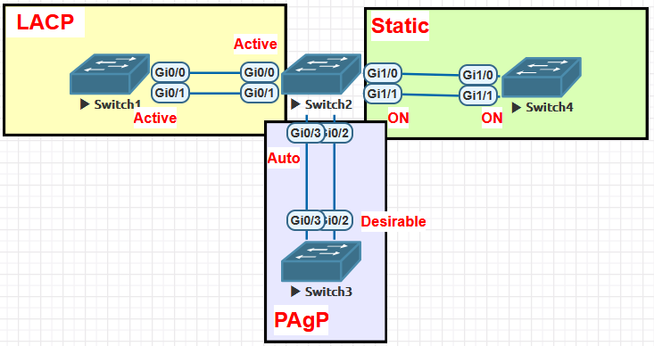
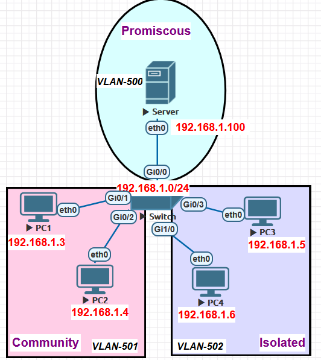
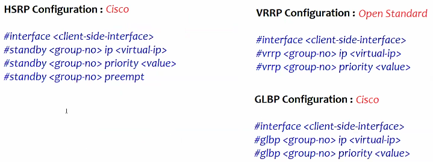
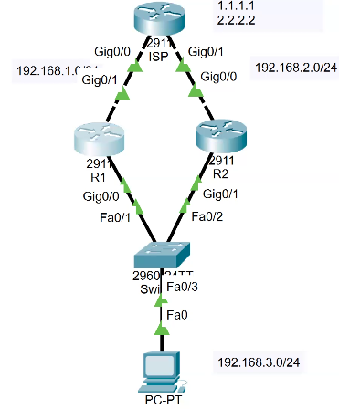
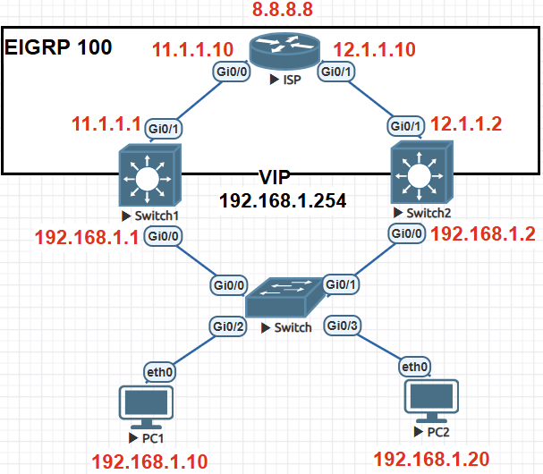

# Etherchannel/ Port Channel

- way of combining multiple physical links into a single logical link
    
- Benefits
    
    - Increased Bandwidth
    - Redundancy
    - Load Balancing
- <ins>Ways to config Etherchannel</ins>
    
    - Static
    - Dynamic
        - **LACP (Link Aggregation Control Protocol)**
        - **<span style="color: rgb(53, 152, 219);">PAgP (Port Aggregation Protocol)</span>**
    - | Static | LACP | PAgP |
        | --- | --- | --- |
        | Manual | Open Standard | Cisco Proprietary |
        | can combine max 8 links | can combine max 16 links | can combine max 8 links |
        | all 8 links active | 8 links active + 8 links standby | all 8 links active |
        | Modes- on | Modes- Active & Passive | Modes- Auto & Desirable |
        
- ### Modes
    
    - **Both SWs- ON mode = Ethernchannel UP**
        
    - **Passive**\- enable LACP only if LACP device detected **/ Auto- e**nable PAgP only if PAgP device detected
        
    - **Active**\- enable LACP unconditionally / **Desirable**\- enable PAgP unconditionally
        
    - | SW-1 mode | SW-2 mode | Etherchannel |
        | --- | --- | --- |
        | Active | Active | Yes |
        | Active | Passive | Yes |
        | Passive | Passive | No  |
        
    - | SW-1 mode | SW-2 mode | Etherchannel |
        | --- | --- | --- |
        | Auto | Auto | No  |
        | Auto | Desirable | Yes |
        | Desirable | Desirable | Yes |
        
    - after making etherchannel it shows multiple int as Po1 with Root- `sh spanning-tree`
        
- ### Etherchannel Criteria
    
    - Links Speed must be same
    - all Links Duplex / all links half-duplex
    - Native VLAN config must match
    - Switchport operational Mode must match (Access/Trunk)
- ### Config
    
    - `int range <int-range>`
    - `channel-protocol <lacp/pagp>`\- (optional) only for dynamic
    - `channel-group <grp-no.> mode <on/active/passive/auto/desirable>`\- grp no. can be diff in SWs
    - to delete etherchannel- `no int port-channel <no.>` or `default int r <int-r>`
- ### Load Balancing Methods
    
    - `port-channel load balance <mode>` | check current load balancing method-`sh etherchannel load-balance`
    
    1.  **dst-ip**
    2.  **dst-mac**
    3.  **src-dst-ip**\- By default src-dest-ip load balancing is enabled
    4.  **src-dst-mac**
    5.  **src-ip**
    6.  **src-mac**
- `sh int port-channel 1`\- check etherchannel combined ports properties
    
- `sh etherchannel summary`, `sh etherchannel` - in eve & cpt it shows maxports links = 4 (actually 8/16)
    
- 
    
    - ```bash
          !!!!SW-2!!!!
          int r g0/0-1
          channel-protocol lacp
          channel-group 1 mode active
          !
          int r g0/2-3
          channel-protocol pagp
          channel-group 2 mode auto
          !
          int r g1/0-1
          channel-group 3 mode on
        ```
        
    - </img>
        - **Po1 (SU)** means- S= Layer2 | U=in use
- ## L3 Etherchannel - use L3 switches
    
    - `ip routing`
    - `int range <int-r>`
    - `no switchport`\- disable L2 characteristics  (blocks STP)
    - `channel-protocol <lacp/pagp>`\- (optional) only for dynamic
    - `channel-group <grp-no.> mode <on/active/passive/auto/desirable>`
    - Here it will be **Po1 (RU)**\- R=Layer3

* * *

# VACL (VLAN Access-List)

- way of filtering traffic within a VLAN
    
- ### Config
    
    - std-`access-list <ACL-no> permit <net>` | ext-`access-list <ACL-no> permit ip host <src-ip> host <dst-ip>` - select traffic
    - `vlan access-map <vmap-name> <seq-no>`\- similar to route-map. define vmap to drop traffic
    - `match ip address <ACL-no>`\- matching acl to drop traffic
    - `action drop`
    - `vlan access-map <vmap-name> <higher_seq-no>`\- permit rest of traffic
    - `vlan filter <vmap-name> vlan-list <vlan-id>`\- define which vlan selected traffic to be filtered. applies vmap to VLAN
- </img>
    - ```bash
          access-list 100 permit ip host 10.1.1.1 host 10.1.1.2
          vlan access-map vmap 10
          match ip address 100
          action drop
          !
          vlan access-map vmap 20
          vlan filter vmap vlan-list 1
        ```
        
    - or
        
        ```bash
        access-list 100 deny ip host 10.1.1.1 host 10.1.1.2
        access-list 100 permit ip any any
        vlan access-map vmap 10
         match ip address 100
         action drop
        vlan access-map vmap 20
         action forward
        !
        vlan filter vmap vlan-list 1
        !
        ```
        

* * *

# PVLAN (Private VLAN)

- used to restrict comm inside a single broadcast domain
- divided into 2 categories
    - ### Primary VLAN / Promiscous Port
        
        - all secondary VLANs can comm with primary VLAN
    - ### Secondary  VLAN
        
        - **Community VLAN-** all nodes in community vlan can comm with each other but not with isolated vlan
        - **Isolated VLAN-** nodes in isolated cannot comm with each other & community vlan
- ==Before config Private-VLAN, SW VTP mode must be changed to VTP transparent==
- </img>
    - ```bash
          vtp mode transparent
          vlan 501
          private-vlan community
          vlan 502
          private-vlan isolated
          vlan 500
          private-vlan primary
          private-vlan association add 501-502
          !
          int r g0/1-2                      !!Community!!
          switchport mode private-vlan host
          switchport private-vlan host-association 500 501
          !
          int r g0/3, g1/0                  !!Isolated!!
          switchport mode private-vlan host
          switchport private-vlan host-association 500 502
          !
          int r g0/0                        !!Promiscous!!
          switchport mode private-vlan promiscuous
          switchport private-vlan mapping 500 501
          switchport private-vlan mapping 500 502
          
        ```
        
    - advantage is we don't need know IP of each device
        

* * *

# FHRP (First Hop Redundancy Protocol)

- allow 2 or multiple routers/ L3 SWs/ Firewalls (config as DG) to share a common virtual IP which end devices(PCs, Servers) use as their DG (default gateway) (eg- if active DG(L3 device) fails, standby takes over)
    
- FHRP provides **Default Gateway level Redundancy** (multiple devices act as DG)
    
- Virtual Router is created to represent DG with virtual MAC & IP shared among participating physical routers.
    
- ==Default Priority Value= 100==
    
- 3 Protocols
    
    - HSRP
    - VRRP
    - GLBP
- `Show standby brief`
    
- <div class="joplin-table-wrapper">
    
    | HSRP (udp-1985) | VRRP (p-112) |
    | --- | --- |
    | Max 16/255 groups (In `standby 1`\- 1= grp no.) | Max 255 grps (In `vrrp 1`\- 1= grp no.) |
    | States- Active, Standby, Listen | States- Master, Backup |
    | Multicast= v1-224.0.0.2 , v2-224.0.0.102 | Multicast- 224.0.0.18 |
    | Hello Timer- ==**3s**== \| Hold Timer- ==**10s**== | Hello Timer- ==**1s**== \| Hold Timer- ==**3s**== |
    | supports MD5 Authentication | Not support Authentication |
    | Preemption disabled by default | Preemption enabled by default |
    | Group virtual MAC- 0000.0C07.ACxx (xx- grpID) | Group virtual MAC- 0000.5E00.01xx (xx- grpID) |
    
    
    
    </div>
- 
    

* * *

# <span style="color: rgb(53, 152, 219);">HSRP (Hot Standby Router Protocol)- *UDP- 1985, IPv6-2029 L7*</span>

- Uses <ins>**Active & Standby**</ins> router model (Listen state- remaining routers) (v2 supports IPv6)
    - Active router- handles traffic (==only 1 Active router allowed==)
    - Standby router- monitors for failover (==only 1 Standby router allowed==)
- **Election to choose Active Router**
    - Highest Priority (default=100)
    - Highest int IP (If priority value is same)
    - It also depends on time of config (once Active doesn't change until failover) (check preemption)
- </img>
    - ISP- loopback 1.1.1.1 & 2.2.2.2
    - R1- `router rip`, `network 192.168.1.0`, `network 192.168.3.0` & `ip route 0.0.0.0 0.0.0.0 192.168.1.2`
    - R2- `router rip`, `network 192.168.2.0`, `network 192.168.3.0` & `ip route 0.0.0.0 0.0.0.0 192.168.2.2`
    - R1&R2 c to PC- `int <client-int>`, `standby <group-no.> ip <virtual_gateway-ip>` (group no. range= 0-4095)
    - PC- ip- 192.168.3.1 & DG- 192.168.3.15 (given in R1&R2)
    - now `tracert 1.1.1.1` (if R1 config 1st- even though R2 has 3.20 IP which is higher than R1, R1 will be Active R)
- **Priority**\- `standby 1 priority 120` (code on R1, enabling preemption to make R1 default)
- **Preemption enabling**\- R2-`standby 1 preempt` (need to enable it to make election when priority/ip changed)
- To track WAN interface is down (R1/R2 c to ISP)
    - `int g0/1`, `standby 1 track g0/1 <decrement-value>` (decrement-value = 30 \[i.e 120-30= 90 which is less than R2=100\] to make R2 Active)
- **HSRP States**
    - **Disabled-** no FHRP
    - **Init-** HSRP just config (not yet aware of neigh)
    - **Listen-** Router listening Hello msgs (knows VIP)
    - **Speak-** election is going on (Router sends hello msgs)
    - **Standby-** Router is backup to Active router (sends Hellos, monitors ActiveR to takeover on failure- after hold time)
    - **Active-** Router forwarding traffic to virtual IP (sends Hellos to maintain its role)

* * *

# VRRP (Virtual Router Redundancy Protocol) *P-112 L3*

- Uses <ins>**Master & Backup**</ins> router model (v3 supports IPv6)
    
    - Master router- handles traffic (==only 1 Master router allowed==)
    - Backup router- monitors for failover (==1 or more Backup router/s allowed==)
- Hello/Advertisement timer- **==1s== |** Master Down timer- **==3xAdv + Skew(256-Priority)/256==**
    
- **==Preemption is enabled by default==**
    
- **Election to choose Master Router**
    
    - Highest Priority (default=100)
    - Highest int IP (If priority value is same)
- **Config (R1)**
    
    - `int <int>`
        
    - `vrrp <Grp no> ip<virtual gateway>`
        
    - `vrrp 1 preempt`
        
    - `vrrp 1 priority 120`
        
    - verify- `show vrrp`
        
    - `int <int>`, `track 1 int <int> line-protocol`\- to configure the track
        
    - `vrrp 1 track 1 decreament 30`\- need to config after track
        
- **VRRP States**
    
    - **Disabled-** no FHRP
    - **Init-** VRRP just config (not yet aware of neigh)
    - **Backup-** Router is backup to Master router (sends Hellos, monitors ActiveR to takeover on failure- after hold time)
    - **Master-** Router forwarding traffic to virtual IP (sends Hellos to maintain its role)
- VRRP also can have all active SW- config diff VLANs assigning diff Active router to each VLAN
    

* * *

# <span style="color: rgb(53, 152, 219);">GLBP (Gateway Load Balancing Protocol)- *UDP-3222 L7*</span>

- Uses <ins>**AVG & AVF**</ins> router model (all routers active)
    
    - ==1 AVG==(Active Virtual Gateway) will control network gateway (handles grps traffic & responsible for assigning virtual MAC to other grp members)
        
    - Upto ==4 AVF==(Active Virtual Forwarder) will pass the traffic. (within AVG, each virtual MAC is assigned to specific gateway, which becomes AVF for that virtual MAC)
        
    - max virtual routers allowed on physical int- 1024
        
- Provides redundancy & also allows load balancing across multiple routers using virtual IP
    
- multicast IP <ins>224.0.0.102</ins>
    
- Group virtual MAC- 0007.B4xx.xxxx (xx- group ID | xxxx- AVF MAC)
    
- Hello Timer- ==**3s**== | Hold Timer- ==**10s**==
    
- **Election to choose AVG Router**
    
    - Highest Priority (default=100)
    - Highest int IP (If priority value is same)
- **Config R1**
    
    - `int <int>`
        
    - `glbp <grp-no> ip <virtual gateway IP>`
        
    - `glbp 1 preempt`
        
    - `glbp 1 priority 120`
        
    - `glbp 1 timer 1 3`
        
- Config- R2 or other routers
    
    - `int <int>`  
        `glbp 1 preempt`  
        `glbp 1 ip<virtual gateway ip>`  
        `glbp 1 timer 1 3`
- States same as HSRP
    

* * *

- 
- **HSRP**
    - no switchport on L3_SWs to assign ip
    - passive-int on L3_SW-1 & L3_SW-2
    - SW- `int r g0/0-3`, `spanning-tree portfast`\- to fast BPDU
    - PC1- `ip 192.168.1.10/24 gateway 192.168.1.254`
    - PV2- `ip 192.168.1.20/24 gateway 192.168.1.254`
    - SW2 & SW3- `int g0/0`, `standby 1 ip 192.168.1.254`\- hsrp on router election- SW3=standby to Active (higher ip) SW2=Speak to Standby state
    - `do sh standby`, `do debug ip packet detail`  | to stop in priv mode- `no debug ip packet`
    - if stop SW-2 after `do write`, trace will sh path from SW-1
    - if SW-2 is again up it will not be Active. if Preemption enabled allows higher-priority router automatically take over as Active Router when it comes back online.
    - to stop hsrp- `default int g0/0`
- **VRRP**
    - `int g0/0`, `vrrp 1 ip 192.168.1.254`
        - SW2= g0/0 Grp 1 state Init -> Backup
        - SW3= g0/0 Grp 1 state Init -> Master
    - `do sh vrrp`
- **GLBP** (both router active- load balancing- round-robin)
    - `int g0/0`, `glbp 1 ip 192.168.1.254`
        - SW2= g0/0 Grp 1 state Init -> Backup
        - SW3= g0/0 Grp 1 state Init -> Master
    - `do sh glbp`