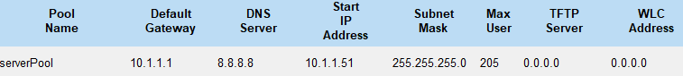
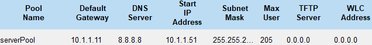
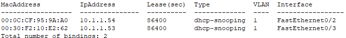
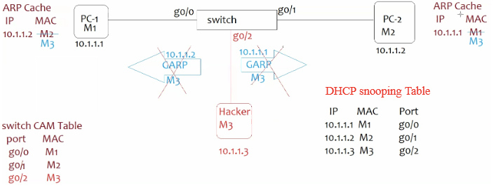
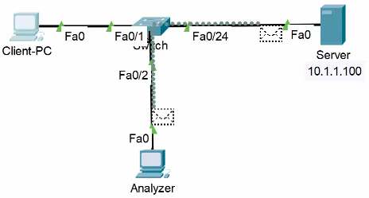

- ## DHCP Relay Agent
    
    - used to facilitate DHCP msg exchange btw DHCP server & client when they are not present in common subnet
    - `int <client-side-int>`
    - `ip helper-address <DHCP-server-ip>`
    - 
    - DHCP
        - DHCP IP- 192.168.1.100/24 | DG-192.168.1.1
        - 
    - Relay Agent- `int g0/0/0`, `ip helper-address 192.168.1.100`
- ## DHCP Snooping
    
    - L2 security feature to avoid Rogue DHCP(spoofing) Attacks in network
    - Rogue Server conn to SW- IP- 10.1.1.52 | DG- 10.1.1.1 | DNS- 8.8.8.8
        - 
    - Once DHCP snooping is enabled, all switchports become untrusted & they do not allow any DHCP Offer msg (config for SW in above eg)
        - `ip dhcp snooping`
        - `ip dhcp snooping vlan <vlan-id>`
    - To allow Authorized DHCP server Offer msg we make  port trusted where Authorized DHCP server is connected
        - `int <int>`
        - `ip dhcp snooping trust`
    - `sh ip dhcp snooping binding`\- snooping binding table
        - 
- ## Dynamic ARP Inspection
    
    - L2 security feature to avoid MITM & ARP spoofing attacks in net
    - Attacker sends GARP with its own MAC & others IP to both sides changing MAC on both targets (MITM- spoof & sniff)
        - 
    - DAI verifies by matching IP, MAC, Int of GARP with DHCP snooping table
    - Once DAI is config all switchports becomes untrusted & ARP is inspected on all switchports
    - To avoid CPU overhead due to this inspection, we can make authorized ports as trusted
        - `ip arp inspection vlan <vlan-id>`
        - `int <int>`
        - `ip arp inspection trust`

* * *

# **Port Security**

- security feature to restrict & manage access to network devices via specific switch ports. way to secure switchports from unauthorized access
    
- <ins>**Violation Actions**</ins>
    
    - **Shutdown(==default==)**\- port is immediately moved to Err-disabled state when a violation is detected. auth & unauth cannot comm (must be manually re-enabled \[`sh`, `no sh`\] by admin or dynamic recovery of switchport to bring up port). Logs generated
        
    - **Restrict**\- When a violation occurs (e.g.- unauthorized MAC tries to connect), switch will drop traffic from violating device but will allow authorized traffic to continue. violation Logs generated (syslog/ SNMP trap)
        
    - **Protect**\- Similar to "Restrict," but Logs are  not generated
        
    - `int <int>`
        
    - `switchport port-security violation <shutdown/restrict/protect>`
        
    - ==recommended- shutdown unused ports== (**loophole**\- *allowed port can have a switch/hub conn with multiple devices)*
        
- <ins>**MAC Address Binding**</ins>
    
    - **Static MAC**
        
        - admins can config switch to allow only specific MACs associated with each port.
            
        - `show port-security int f0/1`
            
        - `int f0/1`, `swithcport mode access`, `switchport port-security`, `switchport port-security mac-address <mac-to-bind/allow>`
            
    - **Dynamic MAC**
        
        - switch can learn MAC dynamically(port will capture 1st MAC that comm). switch binds captured MAC with port. unauth devices not get ip via dhcp
            
        - `int <int>`, `swithcport mode access`, `switchport port-security mac-address sticky`
            
        - **Sticky MAC**\- allows switch to "stick" learned MAC to config, which makes the MAC persistent across reboots. (to be safe- `write`)
            
- <ins>**Port Security Configuration**</ins>
    
    - Admins can define max no. of allowed MACs per port & set the violation action (protect/ restrict/ shutdown). (==default max-1==)
    - `switchport port-security maximum <no.>`
- <ins>**Aging**</ins>
    
    - Here MACs are removed from the table after a set period of time. (environments where devices connect-disconnect frequently)
        
    - `show mac-address-table aging-time` (Default dynamic MAC table entry aging time(if no traffic)- ==300s==)
        
    - `switchport port-security aging time <min>`
        

* * *

## SPAN (Switchport Analyzer)

- used to monitor & analyze traffic of switchport
- We can config SPAN to send a copy of all traffic on a port to another port where analyzer is connected (eg- IDS or Protocol Analyzer (Wireshark) is connected)
    - `monitor session <sess-id> source int <src-int>`
    - `monitor session <sess-id> destination int <dst/analyzer-int>`
- 

* * *

## RSPAN (Remote Switchport Analyzer)

- used to monitor & analyze traffic on a device remotely
- </img>
    - SW2- `int f0/1`, `swithcport mode dynamic desirable`, `vlan 100`, `name rspan`,  `remote-span`
    - SW1- `vlan 100`, `name rspan`, `remote-span`
    - SW2- `monitor session 1 source int f0/24`, `monitor session 1 destination remote vlan 100`
        - f0/24- int to monitor | vlan 100- rspan-vlan
    - SW1- `monitor session 1 source remote vlan 100`, `monitor session 1 destination int f0/2`  (f0/2- Analyzer int)