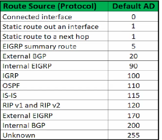
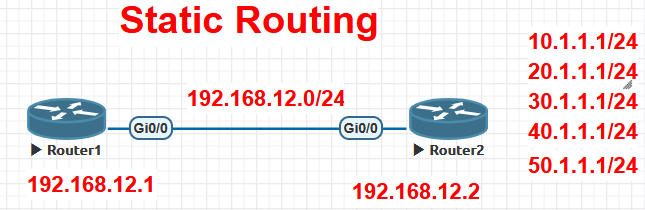
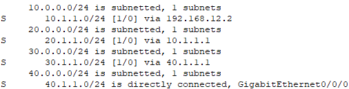
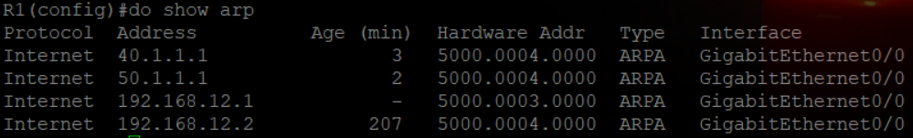
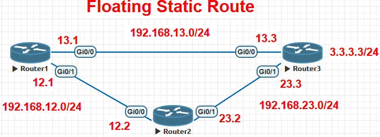
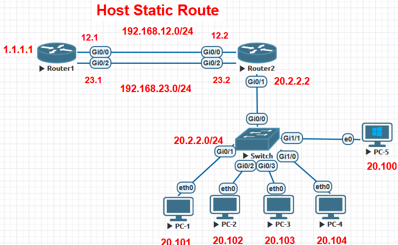
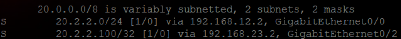

- Router starting info (not sure)
    
    - 
- **Router**
    
    - L3 device to comm btw diff net by finding best physical path for data transmission
    - Stores info of network reachability
    - Uses logical addressing to identify node in a network and make forwarding decisions based on IP
    - Per port Collision & Per port Broadcast domain | Full duplex device
- **Route-** Best path to reach the destination
    
- **Routing-** process of selecting the best path to reach from src to dest
    
- **Routing Table-** Collection of routes (best paths)
    
- **Routed Protocols-** Protocols that carry data from src to dest device (eg- IP, AppleTalk)
    
- **Routing Protocols-** used by routers to discover the best physical path for data transmission (eg- RIP, OSPF, EIGRP, BGP)
    
- (In router) By default routing int are down and ip routing is enabled because it is present in running-config (we can change config) (`#show running-config`)
    
- **AS (Autonomous System)**
    
    - group of connected IP net & L3 devices(routers), configured & managed by single administrative domain with unique ASN (each AS has common routing policy identified by ASN assigned by IANA)
    - <ins>16bit ASN range</ins>\- 1-65535 \[0 & 65535- Reserved\] (Reserved Doc- 64496-64511 | Private- 64512 to 65534)
    - <ins>32bit ASN range</ins>\- 65536 to ~4.3billion (2<sup>32</sup>)
- Best path choosing sequence
    
    1.  **AD (Administrative Distance)**
        - trustworthiness(preference) of a routing protocol. range 0-255. <ins>**prefers least AD**</ins>
        - helps routers to decide best path when multiple path are available for same dest (from diff routing protocols)
        - 
    2.  **Metric**
        - when multiple paths available from same protocol metric of paths compared for best path. <ins>**prefers least Metric**</ins>
    3.  **Longest Prefix Match (CIDR)**
        - router will choose route with **longest prefix length** (eg- /32 preferred over /24)
    4.  **Load Balance**
        - If multiple routes available for same dest with same AD & same Metric, router load balances traffic

* * *

- **Routing**
    - **Static-** Admin has to manually add routes to routing table
        1.  Recursive static route
        2.  Directly Connected static route
        3.  Fully Specified static route
        4.  Floating static route
        5.  Host route
        6.  Null route
        7.  Default route
    - **Dynamic-** Router dynamically learns routes using routing protocols
        - **IGP (Interior Gateway Protocol)**\- provides communication within AS (max hop count- 255 | default- 100)
            - **Distance Vector**\- Focus on distance b/w src & dest. (RIP, IGRP)
            - **Link State-** Focus on Bandwidth (OSPF, ISIS)
            - **Hybrid-** Features of both above (EIGRP)
        - **EGP (Exterior Gateway Protocol)-** provides communication b/w diff AS
            - **Path Vector-** use attributes to decide best path (BGP)
- *Classful Routing Protocols*\- not send subnet mask info in its routing updates & automatically summarizes routes at classful net boundaries. eg- RIPv1, IGRP

* * *

## **Static Routing**

- 
- **R1**
    
    - ```bash
        en
        conf t
        !
        line con 0
        logging sync
        !
        hostname R1
        !
        int g0/0
        ip address 192.168.12.1 255.255.255.0
        no sh
        ```
        
- **R2**
    
    - ```bash
        en
        conf t
        !
        line con 0
        logging sync
        !
        hostname R2
        !
        int g0/0
        ip address 192.168.12.2 255.255.255.0
        no sh
        !
        int l1
        ip address 10.1.1.1 255.255.255.0
        !
        int l2
        ip address 20.1.1.1 255.255.255.0
        !
        int l3
        ip address 30.1.1.1 255.255.255.0
        !
        int l4
        ip address 40.1.1.1 255.255.255.0
        !
        int l5
        ip address 50.1.1.1 255.255.255.0
        ```
        
- 2 types of route in routing table
    
    - **Connected route(C)**\- entire network to which a router's int is directly attached (eg- if int IP- 192.168.1.1/24, then connected route= 192.168.1.0/24)
        - **use**\- forward packets to any host within that subnet
    - **Local route(L)**\- <ins>host route</ins> that represents the router's own IP on specific int (eg- 192.168.1.1/32)
    - <ins>use case scenario</ins> - if `int g0/0` & `ip add 192.168.1.1 255.255.255.0`
        - if packet with dest 192.168.1.38, router will use **C** to send packet from g0/0 **|** If packet with dest 192.168.1.1, router uses **L** to know packet is for itself and processed by IOS
- ==If router does not find an entry in ARP cache for dest IP, it will drop packet due to Encapsulation failure==
    
- If we ping from 12.1 to 12.2- **<ins>1 packet(ICMP) drops  because of ==Encapsulation failure==</ins>**
    
    - ping calls ICMP > tries to encapsulate in L2(Ethernet) > checks ARP cache for ip to dest MAC mapping (but no entry so encapsulation failure for packet 1) | then it resolves MAC by ARP request
    - ==By default Router will have ARP entries for each active physical interface where IP is conf==
        - eg- R1 & R2 ARP entries- 1
        - R2 has only 1 ARP entry because- ==loopback int do not have MAC as they are logical int==
- `ip route 10.1.1.0 255.255.255.0 192.168.12.2`
    
    - ping from R1 to 10.1.1.1- 5/5
- ==If Next-hop is defined in route, router will generate ARP for Next-Hop not for dest IP (use next-hop MAC as dest MAC)==
    
- ***In Switch we have MAC table (which not have IP), ARP cache has IP***
    
- `show arp`\- show arp cache for all protocols (IPv4, IPv6)
    
- `show ip arp`\- show arp cache for only IPv4
    
- Loopback interface used- testing traffic, to avoid breaking of neighborship in BGP (physical int can go down)
    
- We can use recursive route lookup
    
    - `ip route 20.1.1.0 255.255.255.0 10.1.1.1` in R1
        - ping 20.1.1.1- 5/5
- `ip route 30.1.1.0 255.255.255.0 40.1.1.1`\- will not add any route as 40.1.1.1 is not added
    
- `ip route 40.1.1.0 255.255.255.0 g0/0`
    
    - 
    - `show arp` | `clear arp` or `int <int>`, `sh`, `no sh`\- clear router arp
        - 
    - ping 30.1.1.1- 5/5
- `ip route 50.1.1.0 255.255.255.0 g0/0`
    
    - ping 50.1.1.1 - 4/5
    - ==If Next-Hop is not defined in route & exit interface is used, router generate ARP for dest==
- ==When we add route in router with next-hop, router checks reachability to it using ARP request before adding it to routing table==. (if no reachability command accepted by router but route not added)
    
    - <ins>**==..............1:20 - sir has doubt to be explained...................................==**</ins>
- <span>If int g0/0 is down in R2- routes will get deleted</span>
    
    - when g0/0 is up in R2- routes will add again
        
    - To avoid overhead- `ip route 10.1.1.0 255.255.255.0 192.168.12.2 permanent`
        
        - **permanent**\- prevents route from being removed from the RT, even if the next-hop IP / outgoing int becomes unavailable

* * *

1.  **Recursive static route**
    
    - router perform routing table lookup multiple times. CPU overhead (we avoid using this type)
    - uses next hop only & router <ins>generates ARP for next-hop</ins> only
    - uses next-hop MAC as dest MAC (comm with diff network)
    - <ins>not affected by proxy ARP</ins>
    - `ip route <dest-netID> <subnet-mask> <next-hop-ip>`
2.  **Directly connected static route**
    
    - Router not performs multiple lookups in RT. prevents CPU overhead
    - uses exit-int only & router <ins>generates ARP for dest IP</ins> (considers dest net connected on same int/net) (<ins>entry of dest IP in ARP cache</ins>)
        - If multiple dest= mulitple ARP enteries- Memory overhead
    - <ins>depends on proxy ARP</ins>. If proxy ARP disabled on next-hop- no comm (only if dest in diff subnet)
    - ==Proxy ARP used only when int is used- Directly connected static route (rare- non-gateway device & access it via internet)==
    - `ip route <dest-netID> <sub> <exit-int-ip>`
    - practical
        - `ip route 20.1.1.0 255.255.255.0 g0/0`
            - `do show ip route 20.1.1.0 255.255.255.0` - to check distance(AD) = 1 (static route out an int)
            - `ping 20.1.1.1` - 4/5 (encapsulation failure)
        - `show int g0/0`\- to check ARP timeout (==<ins>router-4hrs</ins> | <ins>PC-24hrs/ 15-45seconds - not sure</ins>==)
        - `show ip int g0/0`\- to check Proxy ARP status
        - `no ip proxy-arp`\- to disable Proxy ARP
            - now `ping 20.1.1.1`\- <ins>5/5</ins> (should be <ins>0/5</ins>) \[due to previous ping ARP entry added already\]
        - To clear arp cache - `clear arp` - if doesn't work- int shutdown & up again
3.  **Fully Specified static route**
    
    - <ins>Avoid recursive lookup & proxy ARP dependence</ins> (best type to config static route)
    - uses both next-hop & exit-int & router <ins>generates ARP for next-hop</ins> only
    - uses next-hop MAC as dest MAC (comm with diff network)
    - prevents CPU & Memory overhead
    - `ip route <dest-netID> <sub> <exit-int> <next-hop-ip>`
    - `ip route 30.1.1.0 255.255.255.0 g0/0 192.168.12.2`\- avoids recursive lookup- exit int given
4.  **Floating static route**
    
    - used as backup route (if primary route down, traffic forwarded via it)
        
    - to config it- need to increase AD value (2-255)
        
    - when primary route is down, floating will be added to RT
        
    - when primary is up again, it is removed from RT
        
        - its added and removed- so called- Floating
    - `ip route <dest-netID> <sub> <exit-int> <next-hop-ip> <new-AD>`
        
    - ****
        
    - **R1**
        
        - ```bash
            en
            conf t
            !
            line con 0
            logging sync
            !
            hostname R1
            !
            int g0/0
            ip address 192.168.13.1 255.255.255.0
            no sh
            !
            int g0/1
            ip address 192.168.12.1 255.255.255.0
            no sh
            ```
            
        - `ip route 3.3.3.0 255.255.255.0 g0/0 192.168.13.3`
            
        - `ip route 3.3.3.0 255.255.255.0 g0/1 192.168.12.2 10` - backup route
            
    - **R2**
        
        - ```bash
            en
            conf t
            !
            line con 0
            logging sync
            !
            hostname R2
            !
            int g0/0
            ip address 192.168.12.2 255.255.255.0
            no sh
            !
            int g0/1
            ip address 192.168.23.2 255.255.255.0
            no sh
            !
            ip route 3.3.3.0 255.255.255.0 g0/1 192.168.23.3
            ```
            
    - **R3**
        
        - ```bash
            en
            conf t
            !
            line con 0
            logging sync
            !
            hostname R3
            !
            int g0/0
            ip address 192.168.13.3 255.255.255.0
            no sh
            !
            int g0/1
            ip address 192.168.23.3 255.255.255.0
            no sh
            !
            int l1
            ip address 3.3.3.3 255.255.255.0
            !
            ip route 192.168.12.0 255.255.255.0 g0/1 192.168.23.2
            ```
            
    - **VPC**\- `ip 20.2.2.101 255.255.255.0 gateway 20.2.2.2` - set similar 2.101-2.104
        
    - **Windows**
        
        - firewall off- `netsh advfirewall set allprofiles state off`
        - ip assign- `netsh interface ip set address name="Local Area Connection" static <host-ip> <sub> <gateway>` or <ins>**ncpa.cpl**</ins>
    - `do show running-config | section ip route`\- show ip routes (even not added in RT)
        
    - when we shutdown g0/0- 12.2 route will be added to RT
        
        - </img>
            - ==\[AD/metric\]- \[10/0\]==
5.  **Host route**
    
    - config for individual host
        
    - `ip route <dest_host-ip> 255.255.255.255 <exit-int> <next-hop-ip>`
        
    - 
    - `ip route 20.2.2.0 255.255.255.0 g0/0 192.168.12.2` (on R1)
        
    - `ip route 20.2.2.100 255.255.255.255 g0/2 192.168.23.2` - host route (on R1)
        
        - `sh ip route static`\- 
            - R1 prefers 23.2 over 12.2 for 2.100- choose /32 over /24
    - </img>
        - for 2.100- route is from 23.2 hop
        - for rest 2.101-104- route is from 12.2
6.  **Null Route**
    
    - used to avoid loops
        
    - traffic for particular dest net is pointed towards Null0 int (traffic is discarded)
        
    - `ip route <dest-netID> <sub> Null0`
        
    - </img>
        - If traffic comes from ISP for 172.16.1.2 (It comes to R1-11.1.1.1 then to R2- 172.16.1.2)
        - But if traffic comes for 172.16.10.4- ISP will forward it to R1-11.1.1.1 it will check RT and forward it back to ISP as no route present (0.0.0.0/0- default route- least prefix- chosen as last choice) which will cause loop b/w ISP and R1 - To avoid loop 172.16.0.0/16 sent to Null0 as it is 2nd last choice (/16 prefix > /0)
    - **ISP**
        
        - ```bash
            en
            conf t
            !
            line con 0
            logging sync
            !
            no ip domain lookup
            !
            hostname ISP
            !
            int g0/0
            ip address 11.1.1.10 255.255.255.0
            no sh
            !
            ip route 172.16.0.0 255.255.0.0 g0/0 11.1.1.1
            ```
            
    - **R1**
        
        - ```bash
            en
            conf t
            !
            line con 0
            logging sync
            !
            no ip domain lookup
            !
            hostname R1
            !
            int g0/0
            ip address 11.1.1.1 255.255.255.0
            no sh
            !
            int g0/1
            ip address 172.16.1.1 255.255.255.0
            no sh
            !
            int l1
            ip address 17216.2.1 255.255.255.0
            no sh
            !
            ip route 172.16.3.0 255.255.255.0 g0/1 172.16.1.2
            ip route 0.0.0.0 0.0.0.0 g0/0 11.1.1.10
            ```
            
        - R1(config)# `ip route 172.16.0.0 255.255.0.0 Null0`
            
    - **R2**
        
        - ```bash
            en
            conf t
            !
            line con 0
            logging sync
            !
            no ip domain lookup
            !
            hostname R2
            !
            int g0/1
            ip address 172.16.1.2 255.255.255.0
            no sh
            !
            int l1
            ip address 172.16.3.2 255.255.255.0
            !
            ip route 0.0.0.0 0.0.0.0 g0/1 172.16.1.1
            ```
            
7.  **Default Route**
    
    - least preferred route (CIDR- /0)
    - config to forward all traffic to a particular next-hop (eg- all traffic forward to Internet)
    - used when dest nets are unknown
    - `ip route 0.0.0.0 0.0.0.0 <exit-int> <next-hop-ip>`

* * *

### Advantages of Static Route

- No routing protocols needed (No routing info shared)
- Less Bandwidth consumption
- Less CPU overhead
- More Secure (admin takes routing decisions)

### Disadvantages

- Not scalable (can not be used in large net)
- Admins needs to have full knowledge of net topology
- More administrative overhead (troubleshooting is disaster)
- <ins>Cannot detect <ins>changes in</ins> topology</ins>