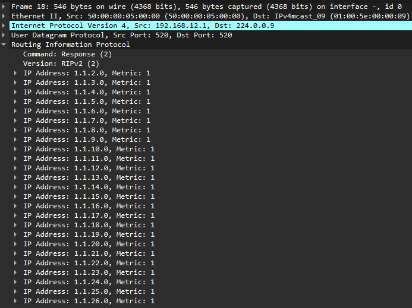
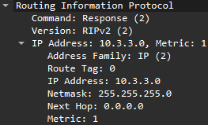
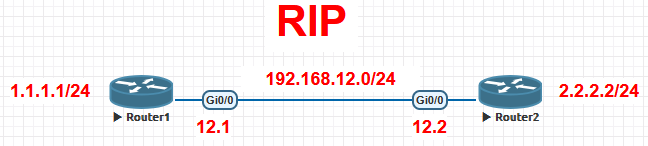
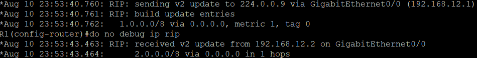
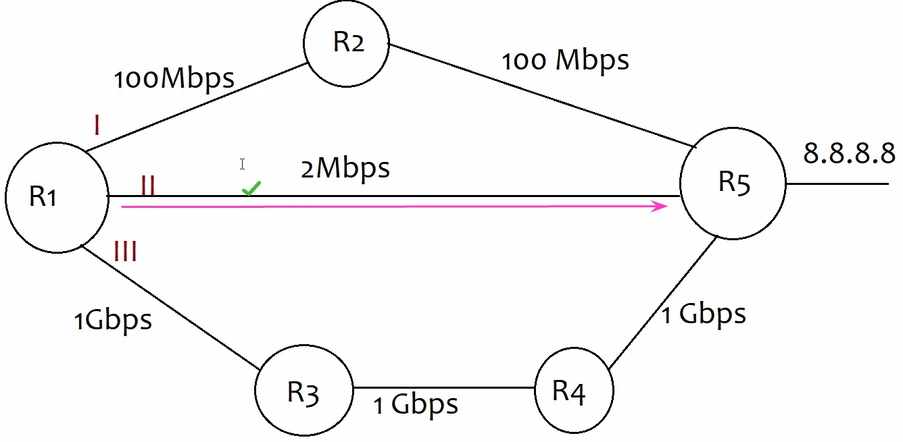
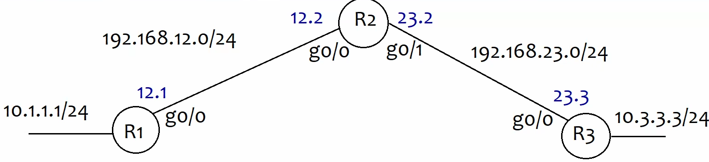

## **RIP (Routing Information Protocol)- *UDP- 520 | L7***

- ==**AD = 120**==
- Distance Vector Protocol that uses ==Hop count metric== to calculate best path) **Bellman-Ford algo**
- Sends Periodic updates (every 30s by default) \[Bandwidth overhead\]
- Max hop count limit is 15
- In 1 routing update Max limit- 25 net (if rip>25 net remaining net in another update)
    - 
    - 
- 3 Versions (**By default send- v1, receive- v1 & v2**)
    - RIP v1
    - RIP v2
    - RIP ng (next generation)- for IPv6

| RIP v1 | RIP v2 |
| --- | --- |
| Classful (not support VLSM/ CIDR) | Classless (supports VLSM/ CIDR) |
| update includes net address & metric | update includes net address, metric & <ins>subnet mask</ins> |
| updates are sent as broadcast (255.255.255.255) | updates are sent as multicast (224.0.0.9) |
| No authentication | supports authentication (simple pass & MD5) |
| Auto-Summarization cannot be Off. (eg- 1.1.1.0/24 summarize to 1.0.0.0/8) | Auto-Summarization can be turned Off |

- `router rip`
- `version <1/2>`
    - `no auto-summary`\- only if v2
    - `int <int>` & `no ip split horizon`\- required mostly for v1
- `network <net-ID>`\- directly connected networks you want to advertise

* * *

- 
- R1
    
    - ```bash
          en
          conf t
          !
          line con 0
          logging sync
          !
          no ip domain lookup
          !
          hostname R1
          !
          int g0/0
          ip address 192.168.12.1 255.255.255.0
          no sh
          !
          int l0
          ip address 1.1.1.1 255.255.255.0
          no sh
          !
        ```
        
    - `router rip`
        
    - `network 192.168.12.0`
        
    - `network 1.1.1.0`
        
    - if typed `version 2`\- send & receive v2 updates only
        
    - `no auto-summary`\- disables auto-summary
        
    - `do show ip route rip`\- shows RIP-learned routes
        
    - `debug ip rip`\- Monitor RIP updates
        
    - `show ip protocol`\- RIP version check, Split horizon check
        
- R2
    
    - ```bash
          en
          conf t
          !
          line con 0
          logging sync
          !
          no ip domain lookup
          !
          hostname R2
          !
          int g0/0
          ip address 192.168.12.2 255.255.255.0
          no sh
          !
          int l0
          ip address 2.2.2.2 255.255.255.0
          no sh
          !
        ```
        
    - `router rip`
        
    - `network 192.168.12.0`
        
    - `network 2.2.2.0`
        
- 
    
    - **2.0.0.0/8**\- net/CIDR
    - **0.0.0.0**\- next hop (route locally originated/ directly connected)
    - metric
- check `show run | sec router rip`
    
- `show ip rip database`\- though v2 is classless, by default auto-summary summarizes net to classful boundaries (eg- 1.1.1.0/24 to 1.0.0.0/8)
    
    - 
- **Split Horizon-** loop prevention mechanism that works by preventing router from advertising a route back out the int from which it was learned
    
    - eg- R1 learns about 192.168.12.0/24 from R2. Due to SH R1 will not adver that route to R1 to avoid loop. (check)
    - `no ip split horizon`
    - to check `show run int <int>`

* * *

### **RIP Timers**

- **Update timer-** (==30s== default) updates are seen
- **Invalid timer-** default ==180s==, reset & begins after route update received (if updates not received, route- invalid & hold-down timer starts)
- **Holddown timer-** default ==180s==, begins after route-invalid (Adv route-unreachable (setting metric to 16\[infinity\])
- **Flushed timer-** default ==240s==, reset & begins after route-update received (If no updates route removed from RT)

* * *

- ==We don't use RIP today because its not efficient as==
    - ==send periodic updates- bandwidth, CPU(process updates), more==
        - ==if net>25- 2 or more updates- bandwidth more==
    - ==it uses hop count method==
        - (In below eg RIP will choose path 2nd but path 3rd is best)
        - 

* * *

### **TASK**

1.  2 or 3 routers
    
    - 1 router 30 networks (loopback) - eg - 1.1.1.1 - 1.1.30.1
        - need v2 for sending updates (still updates ignored)
2.  RIP v1
    
    - </img>
        - comm from R1 to 10.3.3.3 & R3 to 10.1.1.1
        - **==no ping reason-==**
            - ==disable split horizon==
            - ==(its v1- no subnet sharing) enable v2 & no auto-summary==
3.  RIP v1
    
    - </img>
        - comm from R1 to 10.3.3.3 & R3 to 10.1.1.1
            - ping possible due to contagious networks
