- **IGRP (Interior Gateway Routing Protocol)**
    - Classful Protocol
    - Routing Updates- Broadcast msg
    - Metric - Hop Count (default limit- 100 | Max- 255)
    - Slow Convergence

* * *

## **EIGRP (Enhanced Interior Gateway Routing Protocol) *P-88 |* L3**

- Initially Cisco proprietary, 2013 opened for all vendors with limited features (RFC  7868)  |  supports IP, IPx & AppleTalk Routing ==**FASTEST PROTOCOL**==
- **AD- ==90 (internal), 170 (external)==**
- Algo- **DUAL (Diffusion Update Algorithm)** to find best path
- neighborship with adjacent routers within same AS. (can have multiple EIGRP processes on single Router with diff ASN)
    - loop prevention - feasibility condition
    - fast convergence - backup route
    - efficient path selection(5 metric) & dynamic recovery
- Packets sent as **unicast** / **Multicast** (==224.0.0.10==) with **RTP** (Reliable Transfer Protocol)
- Updates- <ins>Triggered</ins> (==New neighborship formed- share full RT== | after- share only change in topology)
- **Metric- K values (Default uses K1, K3 as these are static values) (****can be conf to use all 5 K values****)**
    - **K1= Bandwidth**
    - **K2= Load**
    - **K3= Delay**
    - **K4= Reliability**
    - **K5= MTU**
- ==**Default Hop Count Limit- 100 | Max- 255**==
- ==**supports un-equal cost load balancing**==

* * *

### 7 Packet Types/ Messages (comm with neigh | identified by opcode)

- ****

1.  **Hello** (Opcode-5)
    - After eigrp enabled on router- sends periodic packets (<ins>Default on Fast int- 5s, Slow int- 60s</ins>)
    - <ins>Muticast</ins>\= IPv4- **224.0.0.10** | IPv6- **FF02::A**)
        - <ins>Unicast</ins> packets- if neighbors config statically
    - Identify neighbors, verify config (common sub, AS, K-values, authen), keep alive
    - 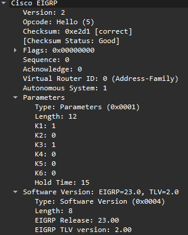
2.  **Acknowledgement** (Opcode-5)
    - used to ack received selected received packets (sent in response to 3-7 msgs)
    - <ins>always unicast</ins>
3.  **Update** (Opcode-1)
    - contain routing info updates
    - <ins>Unicast</ins>\- during new adjacency buildup (btw newly discovered neighbors)
        - if no ack arrival of update packet-> retransmit as unicast
        - P2P int & statically conf neighbors
    - <ins>Multicast</ins>\- multiaccess interfaces (multi-neigh on same int) (eg- DMVPN,  multi-routers on switch)
        - after routers full sync
    - 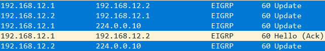
    - 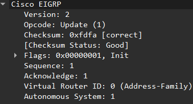
    - 
4.  **Query** (Opcode-3)
    - task neighbors to search best route to dest (ask neigh for alternate path)
    - Query sent to neighbors, received query ack sent back by neigh; then neighbor also sends Reply
    - <ins>Unicast</ins>\- P2P int & statically conf neighbors
    - <ins>Multicast</ins>\- multiaccess int (only dynamic neighbors)
5.  **Reply** (Opcode-4)
    - sent in response to query
    - <ins>always unicast</ins>
6.  **SIA (Stuck in Active) Query**
7.  **SIA Reply**

- Reliable packets(delivered in order)- Update, Query, Reply, SIA Query, SIA Reply
- ==Neighborship is formed using physical/ loopback. **RID** don't participate in neighborship forming (if physical int down -> no neighborship)==

* * *

### **EIGRP Router ID** - &lt;x.x.x.x&gt;

- identifier used in packets (update, query, reply) to uniquely identify the router in an AS (when neighborship formed)(32 bit)
- ==Router ID of router can be same as IP of int(loopback/physical) or completely diff==
- *Recommended- loopback IP as RID over physical as it doesn't go down*
- ==RID once assigned remains same until EIGRP process reset or manual RID assign or if RID=0.0.0.0==
- `no router eigrp 1` & `router eigrp 1` - reset eigrp process
- ==valid RID range- 0.0.0.1 to 255.255.255.254==
- ==RID= **0.0.0.0** only if no manual/ automatic RID assigned==
- **Multiple eigrp processes can have same RID | 2/more routers can have same RID**
- <ins>**Router ID Election Criteria**</ins>\- sequential
    1.  **Manually config**
        - if manually config = RID
        - `router eigrp <ASN>`
        - `eigrp router-id <x.x.x.x>`
    2.  **Highest IP of active loopback int**
        - if no manual config
        - eg- 10.0.0.1, 10.0.0.2=RID (checks from left to right)
    3.  **Highest IP of active physical int**
        - if no manual, no loopback

* * *

### Configuration

- `router eigrp <ASN>`
- `network <net> <wild>`\- advertise network
    - <ins>Once network statement given</ins>
        - EIGRP enabled on int where net config
        - that int will join multicast grp- 224.0.0.10
        - start sending Hello msgs from that int
        - put route in topology table
- 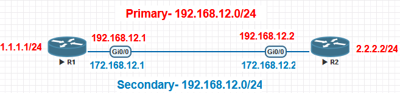
- ==generally max 30 eigrp processes (ASN) simultaneously on router==
- If only config Primary physical int IP in R1 & R2- **R1 RID= 192.168.12.1**
    - `show ip protocols`\- to check RID
    - `show ip eigrp topology`\-check RID, S, FS
- If loopback is also conf- **R1 RID= 1.1.1.1** but if loopback conf after RID selection **R1 RID= 192.168.12.1**

* * *

### Passive Interface

- If int= passive, stop sending Hello msgs on that int (<ins>used in LAN side int</ins>)
- Break all existing neighbor adjacencies formed on that int
- to make all int as passive
    - `router eigrp <ASN>`
    - `passive-int default`
    - `no passive-interface <int>` - exclude from passive int (i.e. form neighborship)
- specific int as passive
    - `router eigrp <ASN>`
    - `passive-interface <int>`

* * *

### Timers

- **Hello Time**\- how frequently hello msgs sent
    - **faster int- 5s**
    - **slow int- 60s**
    - `interface <int>`
    - `ip hello-interval eigrp <ASN> <time(s)>`
- **Hold Time**\- how long router waits for neighbors hello msgs before declaring it as inactive. (default is 3 times hello)
    - **faster int- 15s**
    - **slow int- 180s**
    - `interface <int>`
    - `ip hold-time eigrp <ASN> <time(s)>`
    - `show ip eigrp 1 interface detail` & `show ip eigrp neighbors` - know timers
    - eg- R1 & R2 hello= 5s, hold= 15s, so hold will count from 15 to 10, then back to 15 (if hello packet comes in 5s)
    - ==eg- if R1 & R2 hello=5s | on R1 hold config= 500s -> R2 will wait for R1 hello for 500s (you will see hold=500s in R2)==
        - 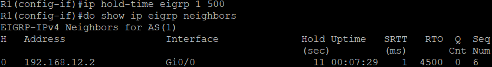
        - 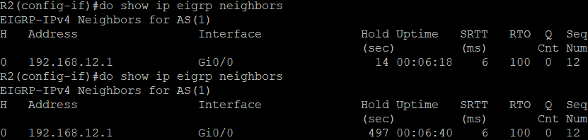

* * *

## 3 Tables

## 1\. **Neighbor Table**\- List of neighboring routers

- EIGRP forms neighbor relationship with adjacent routers in same AS by sending Hello msgs
    
- ==**Neighborship**\- initial state where routers have exchanged Hello msgs==
    
- ==**Adjacency**\- deeper state where routers have full sync topology info==
    
- `show ip eigrp neighbors` or `show ip eigrp <ASN> neighbors`\- verify router has formed EIGRP adjacency with its neighbors
    
- `show ip eigrp interfaces`\- shows which int have eigrp enabled | eg `network 1.1.1.0 0.0.0.255` command enables eigrp on int
    
- <ins>**Neighborship Criteria**</ins>
    
    1.  **ASN must match**
    2.  **primary sub must match**\- Error- %DUAL-6-NBRINFO: EIGRP IPv4 1: Neighbor 172.16.10.2 (GigabitEthernet0/0) is blocked: not on common subnet (192.168.12.1/24)
    3.  **K values must be same**\- Error- %DUAL-5-NBRCHANGE: EIGRP IPv4 1: Neighbor 192.168.12.2 (GigabitEthernet0/0) is down: K-value mismatch
        - `metric weights 0 1 1 1 1 1` (0- type of service | 1- all K values ON)
    4.  **Authentication must match (if config)**
    5.  **Passive int should not be enabled**\- Error- %DUAL-5-NBRCHANGE: EIGRP IPv4 1: Neighbor 192.168.12.1 (GigabitEthernet0/0) is down: interface passive
- int down (no network &lt;int&gt;)(k1-k5= 255)
    
    - 
- </img>
    - **H (Handle)** - Order of neighborship formed
    - **Address** - IP of neighbor
    - **Interface** - int where neighbor discovered
    - **Hold** - Hold Time
    - **Uptime** - how long neighborship has been up
    - **SRTT** - smooth round trip time (time to send & get ack packet from neighbor)
    - **RTO** - Retransmission time out (time router waits before retransmitting for un-ack packet)
    - **Q Cnt (Queue Count)** - how many packets EIGRP is waiting to send
    - **Seq No** = Sequence no. of last acknowledged packet

## 2\. **Topology Table**\- contains Successor and Feasible successors with (<ins>FD/AD</ins> \[AD-advertised distance\])

- **Successor** - best route (found in topology & RT) {<ins>*lowest FD*</ins>}
    
- **Feasible Successor** - second best route (found only in topology) (loop-free <ins>backup route</ins>) {*<ins>AD<Successors FD</ins>*}
    
    - If the successor goes down, FS will take over & start forwarding traffic in less than 1s
- **Feasible Distance-** lowest Metric to reach the dest from local routers perspective (own router metric)
    
- **Reported/Advertised Distance-** Metric to reach dest from neighbors perspective (i.e. <ins>Metric of neighbor</ins>)
    
- ==<ins><ins>**Feasibility Condition = AD of router < FD of successor**</ins></ins>== *(to choose feasible successor route)*
    
- **EIGRP Metric Formula**
    
    - 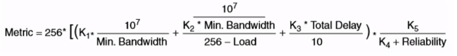
    - By default K1=K3=1, K2=K4=K5=0
    - <ins>RFC 7868 states if K5\=0, then reliability quotient = 1</ins>
    - <ins>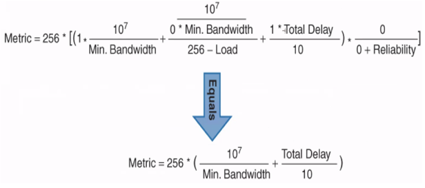</ins>
    - <ins>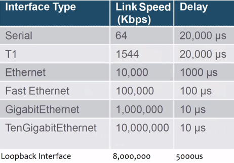</ins>
    - eg1- 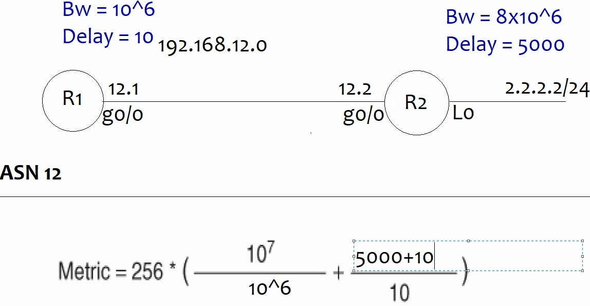
        - R1 to 2.2.2.2- Metric = 256(10+501) = 256x511 = <ins>130816</ins>  (Min.bandwidth= 106)
        - `do show ip route eigrp`\- check Metric
        - 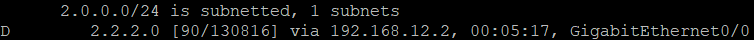
    - eg2- 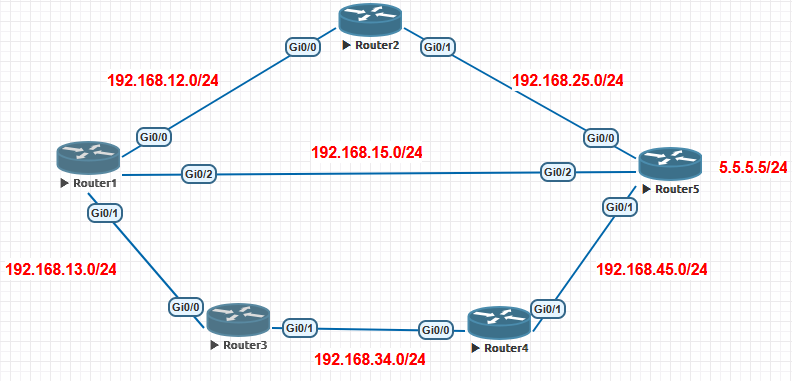
        - R1 to 5.5.5.5 (g0/2 is added to RT= Successor)
            - ==FD=Metric | AD=neighbors Metric==
            - Metric from g0/2-130816, g0/0-131072, g0/1-131328 (<ins>FD of R1= 130816</ins> \[least\])
            - R1s AD from g0/0-130816(R2s Metric), g0/1- 131072(R3s Metric) (<ins>AD of R1= 130816</ins>)
            - Feasibility Condition = AD of router < FD of successor = 130816 <❌ 130816 (g0/0) |  131072 <❌ 130816 (g0/1) \[**No FS in this condition**\]
            - To make R2 as FS -> reduce Delay of R2s g0/1 - `int <int>` & `delay <time/10>` (tens of microseconds= 10\-4s)
    - 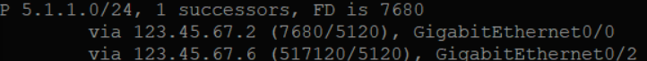</img>
        - Successor- ==**(7680/5120)** = **(FD/AD)**== \[delay-10\]
            - 256\[(107/106)+((100+100)/10)\] = 256\[10+(200/10)\] = 256\[10+20\] = 256x30 = 7680    (here- delay 10x10= 100) {doubt- not included loopback int delay}
        - Feasible Successor (Backup route)- **(517120/5120)** = **(FD/AD)** \[delay- 2000\]

## 3\. **Routing Table**\- List of best routes (AD/FD \[AD-administrative distance\])

* * *

### Unequal-Cost Load Balancing

- allows traffic to be distributed across multiple paths to dest, even if those paths have different metrics / costs
    
- Paths through FS can be installed in RT even when route is in passive state
    
- enabled through **variance multiplier** (how many times worse route through FS can be used for unequal-cost LB) \[eg VM=1 - no unequal-cost LB\]
    
- R forwards less traffic over worse paths & vice versa (**Variance range- 1-128**)
    
- ==R that do not meet FC > not considered FS > not considered in unequal-cost load balancing==
    
- <ins>how many FS, EIGRP will consider for LB.</ins> (if V=2, S has metric(FD)-100 then FS can 1,2,.. metric < 2xV \[i.e.200\])
    
- eg- In above topology, if FS1= 120, FS2= 120, FS3= 220 | FD of S= 200 (so RT will have S, FS1, FS2 \[because they are below 200\])
    
    - 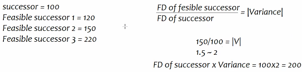
    - 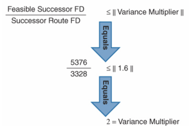
- By default LB- 4 paths (change command- `maximum-paths <no.>`
    
    - max paths= (new R- 32 or more) (old R- 6 routes)
- `router eigrp 1`
    
- `variance <no.>`
    
- `maxmimum-paths <max-path_nos.>`
    

* * *

### Authentication

- way of securely creating neighborships & exchanging updates (Digest value)
- Classic EIGRP supports MD5 authentication
    - `key chain <KC_name>`
    - `key <key-id>`
    - `key-string <pass>`
    - `interface <int>`
    - `ip authentication mode eigrp <ASN> md5`
    - `ip authentication key-chain eigrp <ASN> <KC_name>`

* * *

### Summarization / Route Aggregation

- multiple contiguous net are adv as (aggregated into) single route - used in LPM for path priority
    
- Routes are already adv without summarization, it only send summarized routes update
    
- ==when summary config, router adds summary route in RT towards Null0 int== (to avoid loops) (exception leak map)
    
- ==AD of summary route= 5==
    
- **Benefits**
    
    - Reduced RT size
    - Less Memory consumption
    - Less CPU overhead
    - Less Bandwidth (less routes travelling)
    - Not affected with flapping of routes
- 2 types of summarization
    
    1.  **Auto Summary** - routes auto-summarized to classful boundaries
        - `router eigrp <ASN>`
            
        - `auto-summary` - enable (enable of R1 & check RT on R2)
            
        - `no auto-summary` - disable
            
        - before Cisco IOS 15.x- enabled by default | after disabled
            
        - eg 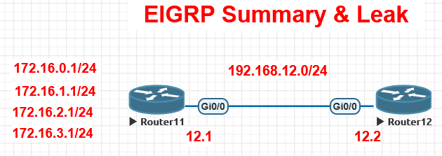
            
            - before
                - 
            - after
                - 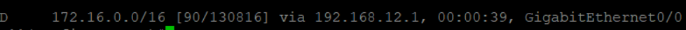
    2.  **Manual Summary**\- routes are manually summarized
        - `interface <int>`
        - `ip summary-address eigrp <ASN> <summary-net>/<CIDR>`
        - eg (above eg manually)
            - 4 networks of /24 = /22 (eg- 2 net of /24 = /23)
            - summarized route (here 4 routes summary)= **172.16.0.0/22** (last 2 bits only change 0.1-3.1 i.e. 0-3)

* * *

### Leak Map

- used to leak a route from summary
- 1 path sending summary to all networks, another path to leak summary of specific net

1.  Create Access-list to select net
    - `access-list <ACL_no> permit <net-id> <wild>`
2.  Create Route-Map
    - `route-map <RMAP_name> permit <seq_no>`
    - `match ip address <ACL_no>`
3.  Attach leak map with summary
    - `int <int>`
    - `ip summary-address eigrp <ASN> <summary-net>/<CIDR> leak-map <RMAP_name>`

- eg
    - `access-list 1 permit 172.16.2.0 0.0.0.255`
    - `route-map rmap permit 10`
    - `match ip address 1`
    - `int g0/0`
    - `ip summary-address eigrp 12 172.16.0.0/22 leak-map rmap`

* * *

### Route Filtering

- used to filter EIGRP routes (command- `distribute-list`)
    
- 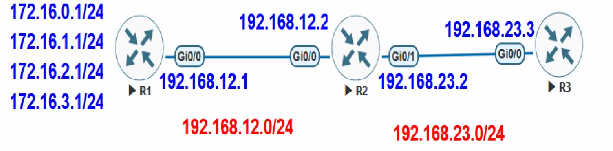
- Methods
    
    1.  **Access-list**
        
        - `access-list <ACL_no> deny <net-ID> <wild>`
        - `access-list <ACL_no> permit any`
        - `router eigrp <ASN>`
        - enables/applies acl-`distribute-list <ACL_no> <in/out>` (if int not mentioned, out- routes not adv to any neigh | in- routes not learnt from any neigh)
        - or `distribute-list <ACL_no> <in/out> <int>` (only mentioned int routes will not be learnt or adv)
        - eg(on R2)- to stop R2 from adv routes to R3 172.16.0.0 & 172.16.1.0
            - `access-list 1 deny 172.16.0.0 0.0.0.255`  
                `access-list 1 deny 172.16.1.0 0.0.0.255`  
                `access-list 1 permit any`  
                `router eigrp 123`  
                `distribute-list 1 out g0/1`
    2.  **Prefix-List**
        
        - `ip prefix-list <PL_name> deny <net-ID>/<CIDR>`
        - `ip prefix-list <PL_name> permit 0.0.0.0/0 les 32`  (les- less than equal to 32- permit all net )
        - `router eigrp <ASN>`
        - enables/applies prefix-list- `distribute-list prefix <PL_name> <in/out> <int>` (int- optional)
        - eg(on R2)- to stop R2 from adv routes to R3 172.16.2.0 & 172.16.3.0
            - `ip prefix-list plist deny 172.16.2.0/24`  
                `ip prefix-list plist deny 172.16.3.0/24`  
                `ip prefix-list plist permit 0.0.0.0/0 le 32`  
                `router eigrp 123`  
                `distribute-list prefix plist out g0/1`
    3.  **Route-Map**
        
        - can use access-list or prefix-list as selector
            
        - <ins>Using Access-list</ins>
            
            - `access-list <ACL_no> permit <net-ID> <wild>`
            - `route-map <RMAP_name> deny <seq_no>`
            - `match ip address <ACL_no>`
            - `route-map <RMAP> permit <seq_no greater than deny seq_no>`
            - `router eigrp <ASN>`
            - `distribute-list <RMAP_name> <in/out> <int>` (int- optional)
            - eg(on R2)- to stop R2 from adv routes to R3 172.16.1.0 & 172.16.3.0
                - `access-list 1 permit 172.16.0.0 0.0.0.255`  
                    `access-list 1 permit 172.16.2.0 0.0.0.255`  
                    `route-map rmap deny 10`  
                    `match ip address 1`  
                    `route-map rmap permit 20`  
                    `router eigrp 123`  
                    `distribute-list rmap out g0/1`
        - <ins>Using Prefix-list</ins>
            
            - <ins>`ip prefix-list <PL_name> permit <net-ID>/<CIDR>`</ins>
            - `route-map <RMAP_name> deny <seq_no>`
            - `match ip address <ins>prefix-list <PL_name></ins>`
            - `route-map <RMAP> permit <seq_no greater than deny seq_no>`
            - `router eigrp <ASN>`
            - `distribute-list <RMAP_name> <in/out> <int>` (int- optional)

* * *

* * *

# EIGRP Named Mode

- introduced after Cisco IOS v15.1 (classic and named mode routers can comm)
- ==problems with classic- AS config (scattered config & unclear scope of commands)==
- **Advantages over Classic**
    - Everything is config globally (one location)
    - Commands are clear in terms of scope of their config.
    - supports multiple address-families like IPv4, IPv6, VRF & current/future features
- **Divided in 3 sub-sections**
    - **Address-family**
        - config IPv4/IPv6/VRF, AS no., net advertisement
    - **Topology Base**
        - config- changing entire metric, redistribution
    - **af-interface**
        - int specific config
- config
    - `router eigrp <name>` - name can be diff on all routers
    - `address-family <ipv4/ipv6> autonomous-system <ASN>` - ASno. needs to match
    - `network <net-id> <wild>`
    - `topology base` - optional
    - `af-interface <int>` - optional

* * *

### **HMAC-SHA auth**

- Named mode supports MD5 & HMAC-SHA (more secure) auth
- config with or without key-chain
- config
    - `router eigrp <name>`
    - `address-family <ipv4/ipv6> autonomous-system <ASN>`
    - `af-interface <int>`
    - `authentication mode hmac-sha-256 <password>`

* * *

### EIGRP Stub

- used to reduce no. of query msgs
- generally config on end/ edge routers
- eg- if branches config with Stub- inform HQ don't send queries (if 1 route down on HQ1 it will only query HQ2, HQ1 send updates to branches, Branches query only HQ2)
- ### ==1:10 - 1:45 pending...............==
    

* * *

### EIGRP Offset List

- way to change metric of route (applied inbound, outbound) \[offset- extra value\]
- config
    - `access-list <ACL_no> permit <net> <wild>`
    - `router eigrp <ASN>`
    - `offset-list <ACL_no> <in/out> <offset_value> <int>`

* * *

- OWN
    
    - **Standard ACL (Numbered)**
        - Checks ACL source address
        - Permits or denies entire protocol suite
        - <ins>Range</ins>\- 1-99, 1300-1999
    - **Extended ACL (**Numbered**)**
        - Checks source and destination address
        - Generally permits or denies specific protocols and applications
            - Source and destination TCP and UDP ports
            - Protocol type (IP, ICMP, UDP, TCP or protocol number)
        - <ins>Range</ins>\- 100-199, 2000-2699