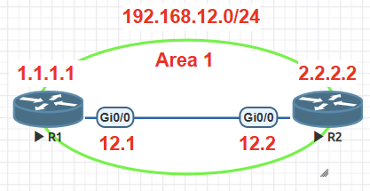
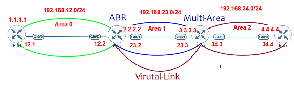
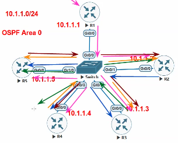

## **OSPF(Open Shortest Path First) *P-89 |* L3**

- Algo- **Dijkstra's Shortest Path First |** OSPFv2- default, OSPFv3- IPv6
    
- **AD**\- ==**110**== (intra, inter, external area routes)
    
- Supports VLSM/CIDR | Link state Routing protocol (adv state of link to adjacent routers)
    
- **Multicast groups**
    
    - **All OSPF Routers(Hello)**\- IPv4-==224.0.0.5== MAC-==0100.5E00.0005== (when ospf enabled on int)
        
    - **DR & BDR**\- IPv4-==224.0.0.6== MAC-==0100.5E00.0006== (DROTHER send LSAs to it, DR/BDR listen to it)
        
- after enabling OSPF
    
- **Metric**\- **Cost** (Bandwidth high = Cost low = prefered) | No Hop Count Limit
    
    - <ins>**Cost = Reference Bw/Int Bw**</ins> (Ref Bw= 100Mbps)
        
        - 10 Gbps, 1Gbps, 100 Mbps = 1 cost
            
        - 10 Mbps = 10 cost
            
- <ins>Updates</ins>\- **Triggered updates** known as **LSAs** (Link State Advertisements). If no change in topology LSAs refreshed every ==30min==. LSAs only include change change not complete RT. LSAs stored in **LSDB**(Link state Database)
    
- can run multiple OSPF processes on router, each will be isolated & maintain a unique LSDB. diff by **Process-ID** (range 1-65535) \[pid not have to be same on all Ro, pid are local to Ro\]
    
- ### Area
    
    - OSPF divides AS into smaller parts called <ins>**Area**</ins> (for faster convergence). All Ro in area have same LSDB & complete map of net (know how to reach entire AS). 2 tier hierarchy
        
        - Area membership is set at <ins>int level</ins> (area-ID included in Hello packet) \[1 Router can can have multiple areas\]
    - **<ins>DisAdv of using single Area</ins>** (if links & routers increases in area)
        
        - All Routers in area takes part in SPT(shortest-path tree) calc (eg- if link flaps)
        - Unmanageable if LSDB size increases. LSDB causes CPU & Memory overhead
        - No summarization of route info
    - <ins>**Adv of using multiple Areas**</ins>\- Segmenting OSPF domain into multiple areas reduces size of LSDB(for each area), making SPT calculations faster & decrease LSDB flooding when a link flaps
        
    - Internal topology of 1 area is invisible from outside that area. 2 areas will not comm(exchange routes) with each other unless conn with Area-0 physically/virtually
        
    - <ins>**Preventing Loops**</ins>\- All areas inject routing info into ***Area-0(backbone)***. Area-0 adv routes into other non-backbone areas.
        
    - **Area-ID(32bit)**\- can be decimal(0-4.3billion) or dotted decimal(0.0.0.0-255.255.255.255). OSPD adv area-id in OSPF packets. Can form adjacency if decimal format used on 1 Ro & dotted on other Ro
        
    - **ABRs(Area Border Routers)**\- Router with int in multiple areas & at least1 int in Area-0. ABRs adv routes from 1 area & inject them into diff area. ABRs compute SPT for every area they participate
        
- ### OSPF Config (2 ways)
    
    - <ins>Global config</ins>
        - `router ospf <process-id>`
        - `router-id <x.x.x.x>` (optional for manual)
        - `network <net-id> <wild> area <area-id>`
    - <ins>Int config</ins> (no need to define net- net where its enabled its already adv)
        - `int <int>`
        - `ip ospf <process-id> area <area-id>` (process-id is local to router)
- ### OSPF Router-ID/ Neighbor-ID (32bit)
    
    - must be unique for each OSPF process in OSPF domain(AS)
    - must be unique btw multi-OSPF processes on 1 router
    - RID dynamically allocated by default (as soon as OSPF process initializes, only changes after process restart- `clear ip ospf <process-id>`\- reset all ospf processes)
        - **highest IP of up loopback**
        - **highest IP of active up physical int**
    - setting static RID(manual) helps with troubleshooting, reduces LSAs when RID changes
- **Neighborship**\- initial state where routers have discovered each other by OSPF Hello msgs
    
- **Adjacency**\- deeper state where routers have fully synchronized LSDB
    
- ## OSPF Packet Types- to exchange routing info
    
    1.  **Hello-** sent periodically(all OSPF int) to discover neighbors, bring neigh relationship to 2-way state & monitor neigh continuous liveliness
        
        - | Data Field | Description |
            | --- | --- |
            | Router ID (RID) | unique 32-bit ID within an OSPF domain. |
            | Authentication Options | allows secure comm btw OSPF routers. Options are none, plaintext, MD5 |
            | Area ID | OSPF area OSPF int belongs to. 32-bit |
            | Interface Address Mask | net mask for primary IP for int out which hello is sent. |
            | Interface Priority | router int priority for DR elections. |
            | Hello Interval (==10s==) | time(s) router sends out hello packets on int `ip ospf hello-interval <1-65535>` |
            | Dead Interval (default-4xhello) | time(s) router waits to hear hello from neigh router before declaring it down.`ip ospf dead-interval <1-65535>` |
            | Designated Router, Backup Designated Router | IP of DR, BDR for that network link. |
            | Active Neighbor | IPs of OSPF neigh seen on that network segment (int) |
            
    2.  **DBD/DDP(Database Description)-** used to exchange LSA headers during initial topology exchange(when adjacency first formed) \[so Ro knows list of neigh LSAs including their version\]
        
    3.  **LSR(Link-State Request)-** router request part of neigh LSDB when Ro thinks its LSDB is outdated(if new DBD, LSA version found)
        
    4.  **LSU(Link-State Update)-** explicit LSA for a specific network link, normally sent in direct response to LSR.
        
    5.  **Link-state Acknowledgment-** sent to confirm receipt of LSU/flooding of LSAs (reliability)
        
- **<ins>Neighbors</ins>\-** router that share common OSPF-enabled net link. Ro discover other neigh through Hello msgs. Each process maintains table for adjacent neigh & state of each Ro. **`debug ip ospf adj`**\- see neighborship state
    
    - | State | Description |
        | --- | --- |
        | Down | initial state of neighbor relationship. indicates router has not received any OSPF hello packets. |
        | Attempt | ==state is relevant to  NB (NBMA, P2M-NB) net type only== & require explicit(manual) neigh config. indicates that no recent info is received, but Ro is still attempting comm |
        | Init | hello packet is received from another Ro (but no bidirectional comm) |
        | 2-Way | bidirectional comm established. If DR/BDR is needed, election occurs during this state. (all net not have DR/BDR) |
        | ExStart | first state in forming adjacency. Ro identify Master/slave(election- master starts exchange) by DBD for LSDB synch (MTU match) |
        | Exchange | Ro are exchanging link states by using DBD packets(actual LSDB info exchange) |
        | Loading | LSR packets are sent to neigh, asking for more recent LSAs that have been discovered (but not received) in Exchange state. |
        | Full | state in which neighboring routers are fully adjacent. |
        
- ## OSPF Network Type
    
    - `sh ip ospf int <int>`\- check ospf net type
    - `int <int>`, `ip ospf net <type>`\- change net type
    - ==DR/BDR election takes place in BMA & NBMA types only==
    
    1.  **BMA (Broadcast Multi-Access) <ins>default</ins>**\-
    2.  **NBMA (Non Broadcast Multi-Access)**\-
    3.  **P2P (Point to Point)**\-
    4.  **P2M-B (Point to Multipoint Broadcast)**\-
    5.  **P2M-NB (Point to Multipoint Non Broadcast)**\-
    
    - | Network Type | DR/BDR (election) | Hello interval | Dead Interval | Neighborship |
        | --- | --- | --- | --- | --- |
        | BMA | Yes | 10s | 40s | Dynamic |
        | NBMA | Yes | 30s | 120s | Manual |
        | P2P | No  | 10s | 40s | Dynamic |
        | P2M-B | No  | 30s | 120s | Dynamic |
        | P2M-NB | No  | 30s | 120s | Manual |
        
- ### Neighbor Adjacency Requirements
    
    - RID must be unique for entire OSPF domain
    - int must share common primary IP subnet. (when sending Hello msgs)
    - int MTU must match (==OSPF not support fragmentation==) `int <int>`, `mtu <value>`
    - area-ID must match
    - Net Type must match (need for DR)
    - Hello & Dead timers must match
    - Authentication Type & credentials must match
    - Area type flags must be identical (stub, NSSA)
    - Passive int not enabled
- Eg- 
    
    - R1 is DR(R1 came online first) & Slave(lower RID). if R1,R2 come online at same time R2=DR & Master
    - process-ids are local to router (not need to be same)
    - `sh ip ospf neigh`, `sh ip ospf neigh detail`, `sh ip ospf int g0/0`, `sh ip ospf database`\- net LSA generated by DR
- ### OSPF Virtual Link
    
    - 2 non-backbone areas cannot comm/exchange routes by default. To facilitate comm they have to physically/virtually conn to Area-0. Physical conn is not scalable
    - Virtual link is config btw ABR & MAR(Multi-Area router). VL has to be config in both directions (ABR-to-MAR, MAR-to-ABR)
    - `router ospf <process-id>`
    - `area <transit-area-id> virtual-link <neigh-RID>`
        - transit-area- area present btw ABR & MAR
    - </img>
        - ABR(R2)- `router ospf 1`, `area 1 virtual-link 3.3.3.3`
        - MAR(R3)- `router ospf 1`, `area 1 virtual-link 2.2.2.2`
        - if R5 is attached to R4 and Area 3 is created btw them R3 will be ABR(R2 Area-0 VL is conn to R3 i.e. R3 is in Area0) & R4 will be MAR. VL created btw R3-R4
- ## DR(Designated Router) & BDR(Backup Designated Router)
    
    - DR & BDR used in OSPF to reduce no. of full mesh adjacencies. This reduces flooding of LSAs
        
        - no. of full mesh Adjacencies formed= ==**n(n-1)/2**== (n= no. of routers) \[Full mesh adjacencies increase= LSA flooding increase\]
        - </img>
            - Reason- If change in R1 sends update to all Ro. R2 sends to all except R1. R3 sends to all except sender. similarly R4, R5. (this is excessive LSA flooding- CPU, Bandwidth overhead)
            - R5=DR, R4=BDR, R1=R2=R3=DROTHER
            - **Adjacencies**\- DR-BDR=Full | DR/BDR-DROTHER=Full | DROTHER-DROTHER=2-way (just hello msgs exchange no LSDB exchange, DROTHER able to send info to DR/BDR)
            - After DR/BDR election. DROTHER(R1) sends update to only DR(R5) & BDR(R4)\[224.0.0.6\]. Then DR adv it to all\[224.0.0.5\] {but SW sends multicast msg as broadcast}
    - ### DR election criteria
        
        1.  highest OSPF priority(default=1) `ip ospf priority <value>`
        2.  highest RID (if same RID no neigh at all)
    - **BDR election criteria**
        
        1.  2nd highest priority
        2.  2nd highest RID
    - ==OSPF priority range 0-255. Default priority=1. If Priority=0 manually, that router not take part in DR/BDR election (Ro will be DROTHER)==
        
    - ==Once DR/BDR elected & new Ro joins/ old Ro priority changed to highest, they will not become DR until OSPF process restarts on current DR (exception priority=0 manually changes to DROTHER)==
        
    - ==As long as DR is up, BDR not advertises DROTHER updates to net, it just updates its local LSDB==
        
    - ==If DR is down, BDR takes over role & new BDR is elected==
        
- ## OSPF Authentication
    
    - **Null-** default auth. no password configured
    - **Simple Password/ Clear text-**  password travels in clear text. prone to sniffing & MITM
        - global- `router ospf <process-id>`, `area <area-id> authentication`\- need to go to int further
        - or int- `int <int>`, `ip ospf authentication`, `ip ospf authentication-key <pass>`
    - **MD5-** password converted into hash value
        - global- `router ospf <process-id>`, `area <area-id> authentication message-digest`
        - or int- `int <int>`, `ip ospf authentication message-digest`, `ip ospf message-digest-key <key-id> md5 <pass>`
    - **HMAC-SHA-** pass converted into hash using HMAC-SHA algo. secure than MD5
        - `key chain <KC_name>`
        - `key <key-id>`
        - `key-string <pass>`
        - `cryptographic-algorithm hmac-sha-512` (diff versions here- 384, 256,1)
        - `int <int>`
        - `ip ospf authentication key-chain <KC_name>`
- ## OSPF LSA Types (11)
    
    - | LSA Type | Common Name | Description |
        | --- | --- | --- |
        | 1   | Router | Each router creates its own Type-1 LSA to represent itself for each area to which it connects. LSDB for one area contains one Type-1 LSA per router per area, listing RID & all int IPs on that router that are in that area. Represents stub networks as well. |
        | 2   | Network | One per transit net. Created by DR on subnet, represents subnet & router int conn to subnet. |
        | 3   | Net Summary | Created by ABRs to represent subnets listed in one area’s Type-1 & 2 LSAs when being adv into another area. Defines links (subnets) in origin area, cost, but no topology data. |
        | 4   | ASBR Summary | Like a Type-3 LSA, instead of all adv subnets, (except) it adv a host route(similar to default route) used to reach an ASBR. |
        | 5   | AS External | Created by ASBRs for external routes injected(redistributing) into OSPF. |
        | 6   | Group Membership | Defined for Multicast OSPF; not supported by Cisco IOS. |
        | 7   | NSSA External | Created by ASBRs inside an NSSA area, instead of a Type-5 LSA. (In stub Type-4, Type-5 blocked instead of Type-5 its generated) |
        | 8   | Link LSAs | Type-8 LSAs only exist on local link, used by Ro to adv its link-local address to all other Ro on same link. Type-8 LSAs provide to Ro on that link a listing of all IPv6 associated with link. |
        | 9   | Intra-Area Prefix LSAs | Can send info about IPv6 networks (including stub networks) attached to a router (similar to Type-1 LSA for IPv4). Type-9 LSAs can send info about transit IPv6 network segments within an area (similar to Type-2 LSA for IPv4 networks). |
        | 10,11 | Opaque | Used as generic for future use. Type-10 adapted for MPLs traffic engineering. (Type-10 flooded within area, Type-11 flooded in AS) |
        
    - **Single-Area**\- only Type-1 & 2 LSAs | **Multi-Area**\- Type-3,4,5,6,7
    - **ASBR (Autonomous System Border Router)-** Router with more than 1 protocol config

* * *

## PENDING...............