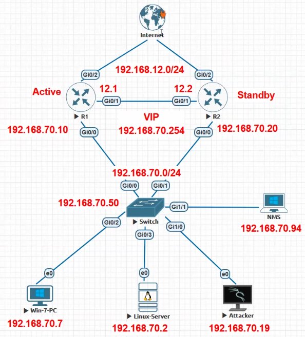
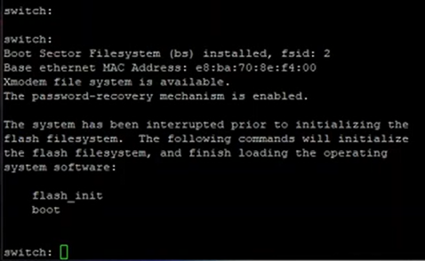

# SNMP (Simple Network Management Protocol) *UDP- 161, 162 | L-7*

- **UDP 161-** used for general SNMP communication
    
- **UDP 162-** used for SNMP traps (asynchronous notifications sent from agents to managers)
    
- used for managing & monitoring (stats of node) Network Devices (switches, routers, firewalls, printers, CCTV, Windows, Linux) centrally (v3 used due to encryption, auth)
    
- agent based architecture to send SNMP TRAP msg in case of event (SNMP Agent- requires program installed on all monitored devices)
    
- send all data to SNMP manager, installed centrally on a node (**NMS**\- Network Management Station) in network (<ins>NMS software eg- PRTG</ins>) (alert to admin)
    
- SNMP Components- .............................................
    
- SNMPv1 vs SNMPv2c (error detection) vs SNMP3- .......................................
    
- **Management Information Base (MIB**)- database that has structure of SNMP data
    
- **Functions**
    
    - **Device Monitoring-** monitor status & performance of network devices (e.g., routers, switches, servers, printers) by retrieving real-time data.
        
        - Metrics such as CPU usage, memory utilization, disk usage, and interface status can be collected (ensure expected parameters)
            
        - Metrics- bandwidth usage, packet loss, and latency help identify bottlenecks and optimize resource allocation.
            
    - **Fault Detection and Alerts-** e.g.- a failed interface or high traffic on a link.
        
    - **Configuration Management-** eg- Enable/ disable specific ports on a switch. Adjust QoS on a router, update firmware
        
    - **Inventory Management-** SNMP can provide details about connected devices (hardware specs, software versions, installed modules) asset tracking and lifecycle  management.
        
- 
- **SNMP**
    
    - **Router1**
        
        - ```bash
                      en
                      conf t
                      !
                      hostname R1
                      !
                      line con 0
                      logging sync
                      !
                      no ip domain lookup
                      !
                      int g0/0
                      ip nat inside
                      ip address 192.168.70.10 255.255.255.0
                      standby1 ip 192.168.70.254
                      standby 1 priority 110
                      standby 1 preempt
                      no sh
                      !
                      int g0/1
                      ip nat inside
                      ip address 192.168.12.1 255.255.255.0
                      no sh
                      !
                      int g0/2
                      ip nat outside	
                      ip address dhcp
                      no sh
                      !
                      ip route 0.0.0.0 0.0.0.0 g0/2 172.16.1.1	
                      ip route 192.168.70.0 255.255.255.0 g0/1 192.168.12.2	
                      !
                      access-list 1 permit 192.168.70.0 0.0.0.255
                      !
                      ip nat inside source list 1 interface g0/2	
                      !
                      ip domain-name cisco.com
                      !
                      cry key gen rsa mod 1024	
                      !
                      username admin pri 15 pass cisco
                      !
                      line vty 0 4
                      login local
                      tr in ssh
                      !
            ```
            
    - **Router2**
        
        - ```bash
                      en
                      conf t
                      !
                      hostname R2
                      !
                      line con 0
                      logging sync
                      !
                      no ip domain lookup
                      !
                      int g0/0
                      ip nat inside
                      ip address 192.168.70.20 255.255.255.0
                      standby1 ip 192.168.70.254
                      standby 1 priority 90
                      no sh
                      !
                      int g0/1
                      ip nat inside
                      ip address 192.168.12.2 255.255.255.0
                      no sh
                      !
                      int g0/2
                      ip nat outside	
                      ip address dhcp
                      no sh
                      !
                      ip route 0.0.0.0 0.0.0.0 g0/2 172.16.1.1	
                      ip route 192.168.70.0 255.255.255.0 g0/1 192.168.12.1	
                      !
                      access-list 1 permit 192.168.70.0 0.0.0.255
                      !
                      ip nat inside source list 1 interface g0/2	
                      !
                      ip domain-name cisco.com
                      !
                      cry key gen rsa mod 1024	
                      !
                      username admin pri 15 pass cisco
                      !
                      line vty 0 4
                      login local
                      tr in ssh
                      !
            ```
            
    - **Switch**
        
        - ```bash
                      en
                      conf t
                      !
                      hostname Switch
                      !
                      line con 0
                      logging sync
                      !
                      no ip domain lookup
                      !
                      int r g0/0-3, g1/0-1
                      spanning-tree portfast
                      !
                      interface vlan 1
                      ip address 192.168.70.50 255.255.255.0
                      no sh
                      !
                      ip domain-name cisco.com
                      !
                      cry key gen rsa mod 1024	
                      !
                      username admin pri 15 pass cisco
                      !
                      line vty 0 4
                      login local
                      tr in ssh
                      !
            ```
            
    - <span>**line con 0**\-</span>
        
    - <span>**logging sync**\- log should not interfere with typing commands (if log in btw command move to next line)</span>
        
    - <span>**no ip domain lookup**\- wrong commands do not initiate domain lookup (dns resolution)</span>
        
    - <span>standby1 ip 192.168.70.254 (HSRP Virtual IP is 70.254)</span>
        
    - <span>standby 1 priority 110 (priority to make router Active)</span>
        
    - <span>standby 1 preempt (preemption- R1 goes down & comes back R1=active)</span>
        
    - <span>ip nat outside (nat enabled for IP translation)</span>
        
    - <span>ip address dhcp (ISP IP allocation= DHCP)</span>
        
    - <span>ip route 0.0.0.0 0.0.0.0 g0/2 172.16.1.1 (Default route to internet)</span>
        
    - <span>ip route 192.168.70.0 255.255.255.0 g0/1 192.168.12.2 (static route for internal directly connected network- when link failure still primary ISP should be used)</span>
        

* * *

# Syslog (System Logs) (default UDP- 514 | default TCP- 514) -*L7*

- Log is a record of an event that happens in a system
    
- provides a centralized way for network devices and servers to send, collect, and store event notification messages & system logs from various devices (routers, switches, firewalls, and servers) for debugging, troubleshooting & auditing.
    
- **Working**
    
    - **Log Generation-** e.g.- an interface going down, an authentication attempt, or a software crash
        
    - **Log Forwarding-** Logs are sent to a Syslog server/ stored locally.
        
    - **Log Processing**\- Syslog server processes, categorizes & stores logs. Adv Syslog servers can filter logs, trigger alerts, generate reports.
        
    - **Log Analysis**\- identify issues, monitor performance
        
- **Syslog msg contains**\- Timestamp, host IP, facility (kernel, mail, local), Severity level (0-7), Msg description
    
- **by default logging enabled- level 7 (for all 8 levels)**
    
    - | Level Code | Severity | Description |
        | --- | --- | --- |
        | 0   | Emergency | System is unusable |
        | 1   | Alert | Immediate action required |
        | 2   | Critical | Critical conditions |
        | 3   | Error | Error conditions |
        | 4   | Warning | Warning conditions |
        | 5   | Notice | Normal but significant conditions |
        | 6   | Informational | Informational messages |
        | 7   | Debug | Debug-level messages for troubleshooting |
        
- To forward logs from Cisco Devices to Syslog server
    
    - `#logging trap <level>`
    - `#logging host <syslog server-ip>`
        - Eg- `#logging trap debugging`
        - `#logging host 192.168.70.94`
    - <ins>Software Eg- Kiwi Syslog, Splunk</ins>

* * *

- **startup-config**\- (storage- NVRAM on Router / flash memory on SW) baseline configuration loaded when a device boots. Loaded when device boots/reboots
    
- **running-config**\- (storage- RAM) active configuration that device uses for current operation. Lost when device reboots or power off
    
- **Backup & Recover-** startup-config, running-config, OS
    

## FTP & TFTP - *L7*

- <ins>Software Eg- Solar Winds free TFTP server</ins>
    
    - | Feature | **FTP (File Transfer Protocol)** | **TFTP (Trivial File Transfer Protocol)** |
        | --- | --- | --- |
        | **Port Number** | 21 (control), 20 (data transfer) | 69  |
        | **Protocol Type** | TCP (connection-oriented) Slower | UDP (connectionless) Faster |
        | **Security** | Supports authentication (username/password) | No authentication |
        | **Functionality** | Full-featured (directory listing, file management) | Basic file transfer only |
        | **Use Cases** | General file transfer over networks | Backups, router configs, boot files |
        
- running-config will be copied to <ins>C:\\TFTP-Root</ins> folder  
    \- `copy running-config tftp`  
    \- `<server-ip>`  
    \- `<dest-file_name>`  
    \- same above for ftp (if want to set usrn & pass)  
    \- `ip ftp username <usrn>`  
    \- `ip ftp password <pass>`
    
- **Router OS backup**
    
    - `show flash:`  (shows router OS)
    - `copy flash tftp`
    - `<OS_file_name>`
    - `<server-ip>`
    - `<dest_file-name>`
- **Restore Startup-config**
    
    - `copy tftp startup-config`
    - `<server-ip>`
    - `<source_file-name>`
    - `<dest_file-name>`
    - `show start`    (shows startup-config)
- ### **FTP (File Transfer Protocol) - *<ins>TCP - 20, 21</ins> | L-7***
    
    - Two Modes of Operation:
        
        - **Active Mode**: client opens a random port & sends request server (then server connects to client's random port)
            
        - **Passive Mode**: server opens a random port for data transfer and client connects to that port (used to bypass firewalls or NAT)
            
    - **Channels**
        
        - **Port 20 -** data transfer
            
        - **Port 21 (active mode)-** use- control (commands like USER, PASS, STOR, etc.) and responses (like 200 OK or 550 File not found)
            
    - Secure variants- FTPS (FTP Secure over SSL/TLS) and SFTP (SSH File Transfer Protocol)
        
    - <ins>Functions</ins>
        
        - Uploading, downloading, renaming, deleting, listing dir
            
        - Used to transfer- configuration files, logs, software packages
            
        - allows multiple users to log in and access files with specific permissions
            

### **TFTP (Trivial File Transfer Protocol) - *<ins>UDP - 69</ins> | L-7***

- <ins>uses</ins>\- transferring configuration files, IOS, firmware, load boot files into mem, basic error checking

* * *

### **NTP (Network Time Protocol) - *<ins>UDP - 123</ins>| L-7***

- synchronize the clocks of computers and network devices over a network (few milliseconds accuracy)
    
- Accurate, hierarchical timekeeping is critical for log timestamps, security protocols (Kerberos, SSL/TLS), forensic analysis, distributed systems (databases, cloud services- sync), finance
    
- operates in a layered hierarchy, called **stratum levels**
    
    - **Stratum 0**: High-precision time sources (atomic, GPS, radio clocks)
        
    - **Stratum 1**: Devices directly connected to stratum 0 source (NTP servers)
        
    - **Stratum 2** and **lower**: Devices that synchronize time from stratum 1 servers and propagate it further down the hierarchy (NTP, ISP, corporate servers)
        
    - Stratum levels increase as the distance from the reference clock grows, ensuring a structured time dissemination. (Client PCs)
        
- <ins>supports multiple time sources</ins> & select the best source based on factors like latency and stratum level
    
- <ins>Fault tolerance</ins> - detects unreliable time sources and avoids using them
    
- <ins>Security</ins>\- symmetric keys or public-key cryptography
    
- **Working-** client sends request to NTP server and receives response with 4 timestamps
    
    - T1 (Originate Timestamp): When the client sent the request.
        
    - T2 (Receive Timestamp): When the server received the request.
        
    - T3 (Transmit Timestamp): When the server sent the response.
        
    - T4 (Destination Timestamp): When the client received the response.
        
- Using these timestamps, NTP calculates
    
    - **Offset**\- difference between the client's clock and the server's clock.
        
    - **Delay**\- total round-trip time of the request and response
        
- NTP modes
    
    - **NTP server mode-** provides time sync to others by listening client requests. It can be connected to GPS/ stratum 1 NTP server/ <ins>own internal clock.</ins>
        
    - **NTP client mode-** Device requests time sync from NTP server. Adjusts its clock based on servers response.
        

* * *

### Reset Router password (not sure)

- <ins>**config register 0x2102 behaviour**</ins>\- When Router starts- loads IOS from Flash mem to RAM, loads config from NVRAM to RAM
- <ins>**config register 0x2142 behaviour**</ins>\- When Router starts- loads IOS from Flash mem to RAM, no NVRAM config
- Password set (unknown to us)
    - `enable password <pass>` &/or
        - `username <usrn> privilege <level> secret <pass>` or with password (level mostly - 15)
        - `line con 0`
        - `login local` or `password <pass>` , `login`
    - `do write`
    - `show version`\- check config register no.
        - 
- To Reset- restart router
    - rommon mode- while restarting press <ins>**Ctrl+C**</ins>
        - `confreg 2142` (configure register- to bypass NVRAM)
            - whenever router boots- checks for config in NVRAM and loads it to RAM
            - password stored in NVRAM > startup-config
        - `reset`\- to restart router
    - `en`
    - `show start` - pass will be shown
    - `copy startup-config running-config`\- filename pop
    - yes
    - `conf t`
    - `no enable password` or `enable password <pass>`
    - `do write`
    - restart router (still register no changed- NVRAM still bypass) Ctrl+ C
    - `en`
    - `copy startup-config running-config`
    - `conf t`
    - `config-register 2102` - checks NVRAM and load config to RAM
    - `do write`
    - restart router

* * *

### Switch Password Reset

- Connect with console cable (disconnect all other cables)
- Power Off switch
- Hold Mode button (15-20s)
    - 
- `flash_init`
    - 
- `dir flash:/`
- `rename flash:config.text flash:config.old` or `delete flash:config.text`
- `boot`