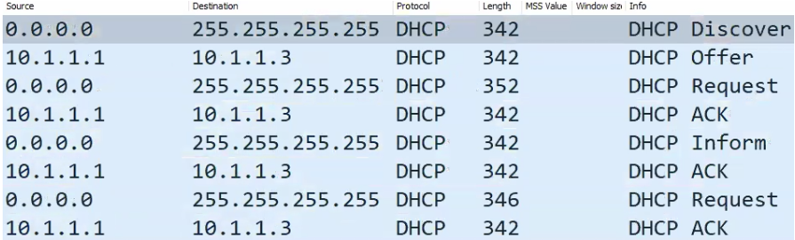
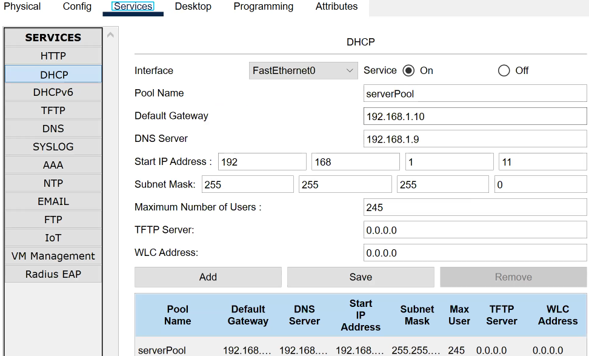

### **Telnet- *<ins>TCP- 23</ins>***

- protocol used for remote access to management of devices such as servers, routers, switches.
    
- allows users to execute commands on a remote device as if they were accessing it locally.
    
- **No Encryption**\- Data including usrn & pass is transmitted in plaintext. vulnerable to interception & eavesdropping.
    
- ==telnet requires either <ins>username & password / enable password</ins>==
    
- **Modes**
    
    - **Character mode-** Each character is sent immediately to remote host(server), server reacts. Server handles editing(backspace, delete)
    - **Line mode(default)**\- Data is sent one line at a time. Client handles editing. Line sent only when you press <ins>Enter</ins>
    - **not sure- Echo Mode-** Local Echo: Client displays what you type | Remote Echo: Server sends characters back to be displayed
- **Config** (eg- Router)
    
    - `line vty 0 4`\-  Enter virtual terminal line config mode. 0 4- 5(*<ins>**==default==**</ins>*) simultaneous Telnet sessions (==max simultaneous telnet sessions- <ins>**16**</ins> - line vty 0 15 | in some case **924**==)
        
    - `password <password>` - Set a password for Telnet access all users (exec mode)
        
    - `login` - Enable login authentication (prompt for password) | or  `login local`\-  use local user DB for login (==allows to have multiple users==)
        
    - `transport input telnet` - Allow Telnet connections
        
    - `exit`
        
    - `enable password <password>` - Set an enable password (for privileged mode) <ins>optional</ins>
        
    - or `username <usr> privilege 15 password <pass>`\- create admin(15) user with password \[if used, no need of above password cmd; login local\]
        
    - `service password-encryption` - Encrypt all passwords in the configuration (no one can see pass through run-config) <ins>optional</ins>
        
    - no sure to study- <ins>enable secret ENCRYPTED_PASSWORD</ins>
        

* * *

### **SSH- *<ins>TCP- 22</ins>***

- cryptographic network protocol, provides secure way to access & manage devices such as servers, routers, switches over an unsecured network. used for remote login & command execution.
    
- <ins>**Key Features**</ins>
    
    - **Encryption**\- SSH encrypts all data (usrn, pass, commands)
        
    - **Authentication**\-
        
        - Password-based Authentication- Requires a usrn & pass
            
        - Key-based Authentication- Uses public & private key pairs for stronger security.
            
    - **File Transfer**\- Facilitates secure file transfers using SCP (Secure Copy Protocol) or SFTP (SSH File Transfer Protocol).
        
- <ins>**How SSH Works**</ins>
    
    - **Connection Establishment**
        
        - client initiates a connection to server.
            
        - server responds with its public key for authentication.
            
    - **Authentication**
        
        - client auth using a pass/ private key.
            
        - server verifies credentials/ cryptographic key.
            
    - **Session Encryption**
        
        - Once authenticated, a secure session is established & all comm is encrypted
- **Config**
    
    - `hostname Router1` - Set the device hostname (<ins>mandatory</ins>)
        
    - `ip domain-name example.com` - Set the domain name
        
    - `crypto key generate rsa` - generate RSA(encryption algo) keys (Choose key length- 1024 & higher)
        
    - `ip ssh version 2` - Enable SSH version 2 (v1- CRC 32, vul to MITM, v2- HMAC, secure)
        
    - `username <usr> privilege 15 secret <pass>` - Create local user (privileged mode pass) with all rights(15) & hashed pass(secret)
        
    - `line vty 0 4` - Enter VTY line configuration mode
        
    - `login local` - Use local user authentication (for login- asks only pass | for login local- asks usrn & pass)
        
    - `transport input ssh` - Allow only SSH connections
        
    - PC- `ssh -l <username> <ip>` & enter pass
        

* * *

### **DHCP (Dynamic Host Configuration Protocol) - *<ins>UDP - 67, 68</ins> | L-7***

- Assign IP & other parameters automatically from DHCP server to client devices (First come First get). Better IP management & reduced admin overhead
    
- ==**BootP- Bootsrap Protocol used to auto assign IP to devices (old protocol-still available in router/servers used when booting)**==
    
    - ==**non-config Router when started- ports are up, sending DHCP discover.**==
    - ==**when "enter init config dialog"-<ins>no</ins> command sent on terminal, Router checks config in NVRAM, if its empty- router uses its default/pre-config(pre-config has- shutdown) = all ports are down again.**==
- ==We can make Router, L2/L3 Switch as DHCP server.== (Router int down by default as startup-config has code)
    
- When DHCP fails APIPA (Automatic Private IP Addressing) takes over (Range- 169.254.0.0-169.254.255.255)
    
- At layer 4 port no.
    
    - Server (send & receive) - 67
        
    - Client (send & receive) - 68
        
- **Assigning Multiple Secondary IPs on 1 Router int**
    
    - `int <int>`, `ip address <sec-ip>  secondary`
    - `do sh ip int <int>`\- check sec IP (used when multiple net conn to SW conn to R & want to access Router)
    - ==**PC int can also have multiple IPs on single int**== (use- comm with multi-net with single int)
        - not sure- `netsh interface ip add address "Wi-Fi" 192.168.1.10 255.255.255.0`
- ### <ins>**DORA (Message types)**</ins>
    
    1.  **<ins>Discover</ins> -** sent by DHCP client(68) to DHCP server(67) **<ins>Broadcast</ins>** (used to locate DHCP server)
        
        - msg type (discover)
        - Client IP
        - Next server IP
        - Relay agent IP
        - Client MAC
        - Client Identifier
        - Parameter Request List
    2.  **<ins>Offer</ins> -** msg sent by DHCP server to client offering IP & other parameters (reserving IP to client) (**Windows/Linux/VPC**\- ***Unicast** &* **Cisco client- <ins>*Broadcast*</ins>**)
        
        - msg type (offer)
            
        - Offered IP
            
        - DHCP Server Identifier
            
        - Lease time (==default 24hrs- 86400s==)
            
        - Subnet Mask
            
        - Gateway (IP)
            
        - DNS server (IP)
            
    3.  **<ins>Request</ins>\-** sent by client, requesting offered IP. **<ins>Broadcast</ins>** (from chosen DHCP server)
        
        - msg type (request)
            
        - Client identifier
            
        - IP requested by client
            
        - Server Identifiers (IP of server client chooses)
            
    4.  **<ins>Acknowledge</ins> -** sent by server to client (inform requested IP is assigned, it can use ip) (**Windows/Linux/VPC**\- *<ins>**Unicast**</ins> &* **Cisco client- <ins>*Broadcast*</ins>**)
        
        - contains- Server id, Lease time, Assigned IP, Subnet, DNS, Gateway
    5.  <ins>**NAK(Negative Ack)**</ins>\- msg generated when IP requested by client is not available. <ins>**Broadcast**</ins>
        
        - msg type (NAK )
        - DHCP Server Identifier
    6.  <ins>**Decline**</ins>\- msg sent by DHCP client. generated when IP offered by DHCP server is already in use (very rare) <ins>**Unicast**</ins>
        
    7.  <ins>**Release**</ins>**\-** msg generated when client voluntarily releases IP before lease time expiry (eg- win- `ipconfig /release`) <ins>**Unicast**</ins>
        
        - msg type (Release)
        - DHCP Server Identifier
        - DHCP Client Identifier
    8.  <ins>**Inform**</ins>\- msg gen by client to request additional parameters from server <ins>**Broadcast**</ins>
        
- ==**GARP generates after Acknowledge msg in DHCP**==
    
- Server maintains **DHCP Binding Table**\- mapping MAC- IP, Lease Time, Binding Type(DHCP/static), VLAN(client c), Int info (port to which client connected)
    
- win- 
- <ins>**Config**</ins>
    
    - `int <int>`, `ip address <ip> `, `no sh` (eg- 10.1.1.1)
        
    - `ip dhcp pool <name>`
        
    - `network <net-id> `\- dhcp enabled (eg- 10.1.1.0)
        
    - `default-router <gateway-ip>` (eg- 10.1.1.1)
        
    - `dns-server <ip>`\- 1 or multiple ip
        
    - (optional)
        
        - `int <int>`, `ip address dhcp`, `no sh`\- enable dhcp on that int (only for Cisco devices- eg ==taking dhcp ip for router==)
            
        - `lease 5` or `lease 7 12 30` - 7days, 12hrs, 30min
            
        - `ip dhcp exclude-address <ip>` - 1 or more IPs
            
        - `ip helper-address <dhcp_server-ip>`\- If you have clients on diff subnets & want to relay DHCP requests to DHCP server, you can configure DHCP relay on router that connects diff sub
            
- Server- 
    
- optional to save config- `copy running-config startup-config` - not sure
    

* * *

### **DNS (Domain Name System) - *<ins>UDP/TCP- 53</ins> | L-7***

- resolve human readable domain-names (google.com) into IP (10.1.1.1)
    
- UDP 53 (default), TCP 53 (zone transfer, DNS packets larger than 512B).
    
- **Process**
    
    - Client to local cache
        
    - If not found- ISP, <ins>root</ins> DNS server- directs to <ins>TLD</ins>(.com, .org)- directs to <ins>authoritative</ins>(example.com) then IP returned back
        
- **DNS Components-**
    
    - **DNS Server-** Stores domain-to-IP mappings.
        
    - **DNS Client -** Queries the DNS server.
        
- **DNS Records-**
    
    - **A** **Record**\- Maps domain to IPv4.
        
    - **AAAA** **Record**\- Maps domain to IPv6.
        
    - **CNAME (Canonical name)-** Alias for another domain (eg- cname-google.com to www.google.com)
        
    - **MX Record-** Mail exchange server.
        
- Types of DNS Query
    
    - Recursive DNS Query
        - asks DNS server to return a final, complete answer (or an error), not a referral. server must do all querying on behalf of client.
        - used by client
    - Iterative DNS Query
        - allows DNS server to return best answer it has, usually a referral to another DNS server. requester continues process by querying next server
        - used by Resolver (for Root/TLD/Authoritative)
- Command to Enable DHCP relay agent (router/firewall) on LAN interface- to take DHCP from other network - `ip helper-address <ip>`
    
- <ins>**Config**</ins>
    
    - R1- `ip dns server` - act as dns sever
        
    - `ip host facebook.com 1.1.1.1`\- give IPs mappings
        
    - `ip name-server 8.8.8.8` - DNS server R1 will query if  requested record isn't in the host table
        
    - `ip domain lookup` - enables R1 to perform dns queries
        
- **Commands**
    
    - `nslookup9p`
        
    - `ipconfig/diplaydns` ---> DNS Resolver Saves DNS cache
        
    - `ipconfig/flushdns` ---> to flush out the DNS cach
        

* * *

### **CDP (Cisco Discovery Protocol)-** ***<ins>P-0x02</ins> | L-2***

- (untagged) to find neighbor information like IP, VLAN, Version, Device identity (hostname, model), Capabilities (e.g., switch, router), Duplex etc.
    
- used for troubleshooting of network issues.
    
- **Multicast**\- **0100.0CCC.CCCC** to send CDP messages/Packets.
    
- CDPv2 messages are sent by default (enabled by default)
    
- **Timers-** detect neighbor alive or link failure
    
    - **Hello -** 60s (issues- neighbor down, misconfig, firewall, ACL, duplex mismatch, packet loss)
        
    - **Hold -** 180s (removes neigh from CDP neighbor table)
        
- used in- Cisco Routers, Switches, Firewalls, WAPs, IP Phones (==enabled by default==)
    
- `sh cdp`, `show cdp neighbors`
    
- `no cdp run`\- disable cdp
    

### **LLDP (Link Layer Discovery Protocol)- *<ins>P-0x88cc</ins> | L-2***

- (untagged) Same as CDP and used for troubleshooting network issues
    
- **Multicast**\- **0100.0CCC.CCCC** to send LLDP messages/Packets.
    
- **Timers**
    
    - **Hello -** 30s
        
    - **Hold -** 120s
        
- `lldp run` - enable lldp
    
- `sh lldp`, `show lldp neighbors`