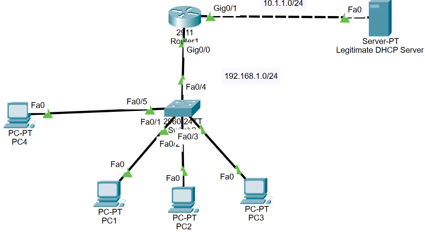

## AAA

- implemented together in network systems to ensure secure accountable resource usage.

1.  ### Authentication
    
    - process of verifying the identity of a user, device or system attempting to access resources.
        
    - **Purpose**: To ensure that the entity is who or what it claims to be.
        
    - <ins>Methods</ins>:
        
        - Passwords
            
        - Biometrics (e.g., fingerprints, facial recognition)
            
        - Tokens (e.g., smart cards, OTPs)
            
        - Certificates or digital keys
            
    - Examples:
        
        - Logging into a computer with a username and password.
            
        - Using a fingerprint scanner to unlock a device.
            
2.  ### Authorization
    
    - what actions/ resources a user/ system is allowed to access after authentication.
        
    - **Purpose**: To define & enforce access permissions & privileges.
        
    - <ins>Granularity</ins>:
        
        - Role-based access control (RBAC)
            
        - Attribute-based access control (ABAC)
            
        - Time- or location-based policies
            
    - Examples:
        
        - A user can access email but cannot access administrative tools.
    - A junior employee can read files but cannot modify or delete them.
        
3.  ### Accounting
    
    - process of tracking & logging activities performed by users, devices, or systems for monitoring, auditing, reporting purposes.
        
    - **Purpose**: To maintain an audit trail of resource usage for compliance, troubleshooting, billing.
        
    - <ins>Activities Tracked:</ins>
        
        - Login and logout times
            
        - Commands executed
            
        - Data accessed or modified
            
    - Examples:
        
        - Logging a user’s login time, duration of access, and the resources used.
            
        - Storing records of changes made to sensitive files for forensic analysis.
            

* * *

## Cisco Wireless Architecture

1.  Cisco wireless solutions provide scalable & robust architectures for wireless net deployments. enables org to design net based on their specific requirements.

* * *

1.  ### Centralized Wireless Architecture
    
    - wireless net are centrally managed by a Wireless LAN Controller (WLC).
        
    - <ins>Key Components:</ins>
        
    - **Wireless LAN Controller (WLC):**
        
        - Manages all access points (APs) centrally.
            
        - Handles tasks like authentication, roaming, radio frequency (RF) management.
            
    - **Lightweight Access Points (LAPs):**
        
        - Operate in a lightweight mode & rely on the WLC for config & management.
            
        - Establish a CAPWAP (Control and Provisioning of Wireless Access Points) tunnel to the WLC for communication.
            
    - <ins>**Advantages:**</ins>
        
        - Simplified management through centralized control.
            
        - Consistent policies and configuration across all APs.
            
        - Advanced features like RF optimization, seamless Layer 3 roaming.
            
    - **Use Cases**\- Large campuses or enterprises where centralized management is critical.
        
2.  ### Distributed Wireless Architecture
    
    - AP operate independently without requiring constant communication with WLC.
        
    - <ins>Key Components:</ins>
        
    - **Autonomous Access Points:**
        
        - Function as standalone devices, running their own configurations and managing wireless clients independently.
    - <ins>**Advantages:**</ins>
        
        - No dependency on a central controller.
            
        - Ideal for small or remote deployments where centralized management is unnecessary.
            
    - **Use Cases:** Small offices or branch locations with minimal AP requirements.
        
3.  ### Cloud-Managed Wireless Architecture
    
    - AP are managed via a cloud-based controller, eliminating need for on-premises WLCs.
        
    - <ins>Key Components:</ins>
        
    - **Cloud Dashboard:**
        
        - A centralized platform hosted in the cloud for managing and monitoring APs.
    - **Cloud-Managed Access Points:**
        
        - Communicate directly with the cloud controller for management and updates.
    - <ins>**Advantages:**</ins>
        
        - Easy scalability and deployment.
            
        - Reduced hardware and maintenance costs.
            
        - Centralized management for geographically dispersed networks.
            
    - **Use Cases:** Multi-site organizations like retail chains or educational institutions.
        
4.  ### Controller-Less Wireless Architecture
    
    - Cisco also offers solutions like Mobility Express, where one AP acts as a virtual controller.
        
    - <ins>Key Components:</ins>
        
    - **Master Access Point:** Acts as the controller for managing other access points.
        
    - **Subordinate Access Points:** Operate under the master AP's control.
        
    - <ins>**Advantages:**</ins>
        
        - Cost-effective solution for small to medium networks.
            
        - Simplified deployment without dedicated WLCs.
            
    - **Use Cases:** Small to medium-sized businesses or branch offices.
        

* * *

## Cisco AP Modes

- Cisco APs can operate in various modes depending on the deployment scenario.

1.  Local Mode
    
    - The default mode for lightweight APs.
    - Handles client traffic locally but forwards control traffic to the WLC.
    - Use Case: Campus deployments with centralized management.
2.  FlexConnect Mode
    
    - Enables APs to switch client traffic locally when the WLC is unavailable.
        
    - Ideal for remote sites with intermittent WAN connectivity to the WLC.
        
    - Use Case: Branch offices with WAN latency or outages.
        
3.  Monitor Mode
    
    - APs do not serve clients but monitor the RF environment for interference, rogue APs, and other anomalies.
        
    - Use Case: Wireless security and spectrum analysis.
        
4.  Sniffer Mode
    
    - APs capture wireless packets and send them to a network analyzer like Wireshark.
        
    - Use Case: Troubleshooting and analyzing wireless traffic.
        
5.  Rogue Detector Mode
    
    - Focuses on detecting rogue devices by monitoring wired and wireless traffic.
        
    - Use Case: Enhancing wireless security in environments prone to rogue devices.
        
6.  Bridge Mode
    
    - APs operate as wireless bridges, connecting two physically separate LANs.
        
    - Use Case: Connecting remote buildings or extending the network over wireless.
        
7.  Mesh Mode
    
    - APs form a wireless mesh network, with one or more root APs connected to the wired network and others acting as mesh nodes.
        
    - Use Case: Outdoor environments or locations where cabling is impractical.
        

* * *

## L2 Security

1.  ### DHCP Spoofing
    
    - network attack where a malicious actor sets up a rogue DHCP server to provide incorrect IP config to clients.
        
    - **How It Works:**
        
        - The attacker connects a rogue DHCP server to the network.
            
        - The rogue server responds (Offer) to DHCP requests (Discover) from clients faster than the legitimate server.
            
        - The attacker provides incorrect IP configuration, such as:
            
            - Default gateway: Directs traffic to a malicious device.
                
            - DNS server: Redirects traffic to phishing websites.
                
            - IP address conflicts: Disrupts normal operations.
                
    - **Impact of DHCP Spoofing:**
        
        - Man-in-the-Middle (MITM) Attacks: Intercept and manipulate traffic.
            
        - Denial of Service (DoS): Disrupt legitimate network operations by providing invalid configurations.
            
        - Phishing: Redirect users to malicious sites using fake DNS servers.
            
    - ### DHCP Snooping (mitigation)
        
        - security feature that prevents DHCP spoofing attacks by acting as a filter between DHCP clients & servers.
            
        - How It Works:
            
            - Trust and Untrust Classification:
                
                - Trusted Ports: Allow DHCP msgs from legitimate servers.
                    
                - Untrusted Ports: Block rogue DHCP msgs from unauth devices.
                    
            - switch inspects DHCP traffic & filters out malicious msgs based on the port's trust level.
                
            - Key Features:
                
                - Maintains a DHCP Snooping Binding Table:
                    
                - Tracks legitimate DHCP leases (IP-MAC-port bindings).
                    
                - Filters DHCP messages like DHCP- OFFER & ACK on untrusted ports.
                    
2.  ### ARP Poisoning/ ARP Spoofing:
    
    - attacker sends falsified ARP messages onto a  
        local area network. goal is to ==associate attacker's MAC with the IP  of another device (default gateway)== to intercept, modify, disrupt network traffic.
        
    - How It Works:
        
        - ARP is used to map an IP to MAC within LAN.
            
        - attacker sends forged ARP msgs to devices in the net, redirecting their traffic to attacker.
            
    - Consequences: MITM, Data Theft, DoS, Session Hijacking
        
    - Prevention:
        
        - Use Dynamic ARP Inspection (DAI).
            
        - Use secure protocols (e.g., HTTPS, SSH).
            
        - Monitor and log ARP activity to detect anomalies.
            
    - ### Dynamic ARP Inspection (mitigation)
        
        - implemented on network switches to protect against ARP poisoning attacks.
            
        - works by validating ARP packets within network based on a trusted database of IP-to-MAC address mappings (DHCP snooping). Drops invalid/ malicious ARP packets.
            

* * *

### DAI Configuration:

- DAI is enabled on untrusted ports (e.g., those connected to user devices).
    
- Trusted ports (e.g., uplinks/ server connections) bypass ARP inspection.
    
- Benefits:
    
    - Prevents ARP spoofing and poisoning.
        
    - Protects the integrity of network traffic.
        
- Limitations: Requires proper config & maintenance of DHCP snooping.
    
- **Dynamic ARP inspection configuration:**
    
    - `ip arp inspection vlan 10`
    - `int <int>`
    - `ip arp inspection trust`
    - 
- **DHCP Snooping config (eg- on switch)**
    
    - `ip dhcp snooping`
        
    - `ip dhcp snooping vlan 10`
        
    - `int <int>`
        
    - `ip dhcp snooping trust`
        

* * *

## Key Security Concepts

- **Threat-** Potential danger that can exploit vulnerability to cause harm/ damage to an asset (eg- data, system, or network)
- **Vulnerability**\- weakness/ flaw in system/ network that can be exploited by a threat to gain unauthorized access or cause harm.
- **Exploit**\- specific technique/ code that takes advantage of a vulnerability to carry out an attack/ achieve unauthorized results.
- <int>Mitigation techniques</int>
    - Patching & Updates
        
    - Access Control (MFA)
        
    - Firewalls & IDS/IPS
        
        - | **Feature** | **IDS** | **IPS** |
            | --- | --- | --- |
            | **Primary Function** | Detects and alerts on threats. | Detects and actively prevents threats. |
            | **Action Taken** | Alerts only, no automatic blocking. | Actively blocks malicious traffic. Risk of blocking legitimate traffic. |
            | **Response Time** | Depends on manual intervention. | Automated, real-time response. |
            
    - Encryption
        
    - Network Segmentation
    - Backup & Recovery (ransomware/ data loss)
    - Incident Response Plan
    - User Training (Phishing)

* * *

### Network Device Management Access

- **Telnet** - TCP 23
- **SSH** - TCP 22
- **HTTP/s**\- TCP 80/ 443
- **Console** \- serial/ usb cable
- **TACACS+** (Terminal Access Controller Access-Control System Plus) - for AAA | TCP 49
- **RADIUS** (Remote Authentication Dial-In User Service) - UDP 1812, 1813
- **Cloud-Managed**\- eg- Cisco Meraki Dashboard, Aruba Central

* * *

### Virtualization

1.  process of creating virtual versions of physical resources (such as servers, networks, storage), allowing multiple instances/  
    environments to run on a single physical hardware system. <ins>It increases resource utilization, flexibility, and scalability.</ins>
    
2.  **Server Virtualization**
    
    - partitioning physical server into multiple virtual servers, each running its own OS & applications.
        
    - **Hypervisor:** software layer that enables server virtualization by abstracting the hardware.
        
        - Type 1 (Bare-metal): Runs directly on the physical hardware (e.g., VMware ESXi, Microsoft Hyper-V, Xen).
            
        - Type 2 (Hosted): Runs on a host OS (e.g., VMware Workstation, Oracle VirtualBox).
            
    - **Virtual Machines (VMs):** Independent OS instances that run on a virtualized environment. (own CPU, memory, storage, and network interface)
        
    - <ins>Benefits</ins>\- Efficient Resource Utilization, Isolation, Scalability
    - <ins>Use</ins>\- Data center consolidation, Testing & development environments, Disaster recovery solutions.
        
        
        
3.  **Containers**
    
    - lightweight and portable units that encapsulate an application and its dependencies, allowing it to run consistently across environments.
        
        
        
    - **Container Engine:** Software that manages containers (e.g., Docker, Podman).
        
    - **Container Orchestration:** Tools for managing large-scale container deployments (e.g., Kubernetes, Docker Swarm).
        
    - VMs vs Container
        
        - Containers share host OS kernel, unlike VMs that require a separate OS.
            
        - Containers are smaller & faster to start than VMs.
            
    - <ins>**Benefits:**</ins>
        
        - Portability: Applications in containers can run on any environment with a compatible container runtime.
            
        - Efficiency: Minimal overhead compared to VMs since they share the host OS kernel.
            
        - Consistency: Reduces "it works on my machine" problems by bundling dependencies with the app.
            
    - **<ins>Use-</ins>** Microservices architectures, DevOps pipelines (CI/CD), Cloud-native applications.
        
        
        
4.  **Virtual Routing and Forwarding (VRF)**
    
    - technology that allows multiple routing tables to exist simultaneously on the same physical router/ Layer 3 switch, enabling logical network segmentation.
        
        
        
    - **Routing Instances:** Each VRF has its own independent routing table.
        
    - **Isolation:** Packets in one VRF cannot be routed to another VRF unless explicitly configured (e.g., using route leaking).
        
    - <ins>**Benefits-**</ins>
        
        - Segmentation: Ideal for isolating different customers, departments, or services in a shared infrastructure.
            
        - Overlapping IPs: Supports overlapping IP address spaces without conflict.
            
        - Security: Logical separation of network traffic.
            
    - <ins>**Use-**</ins>
        
        - Multi-tenant environments (e.g., service providers hosting multiple clients).
            
        - Segmenting traffic in enterprise networks (e.g., separating production and development).
            
        - Secure routing for VPNs.
            
            
            

* * *

## VPN

- technology that establishes a secure, encrypted connection over a less secure network, such as the internet. It ensures privacy, security, and anonymity for users and organizations by creating a virtual, private communication channel.