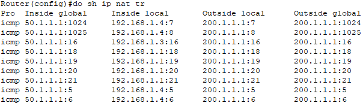

## Network Address Translation

- modification of IP info in packet headers as they traverse a router/firewall. enables devices on a private net to comm with external net (like the internet) using single/ pool of public IP.
    
- **Why NAT is Needed**
    
    - **IPv4 Shortage solution**
        
    - **Network Security-** NAT hides internal IP, making it harder for external attackers to directly target internal devices.
        
    - **Simplified Routing-** NAT allows multiple devices to share a single/pool of IP, simplifying routing & administration.
        

* * *

### Types of NAT

1.  ### **Static NAT**
    
    - **One-to-One Mapping**\- Each private IP(inside local) is mapped to single, specific public IP(inside local)
        
    - Eg- 192.168.1.10 (private) ↔ 203.0.113.10 (public)
        
    - **Permanent Mapping**\- mapping is static, meaning it is manually configured & remains constant until explicitly changed.
        
    - **Bidirectional Communication-** External devices can initiate comm with internal device using public IP, making it <ins>suitable for hosting servers</ins> (e.g., web, email, or FTP servers).
        
    - <ins>Static NAT Working</ins>
        
        - **Outbound Traffic**\- Internal device sends data.
            
            - NAT changes source IP (192.168.1.10) to mapped public IP (203.0.113.10) before forwarding it to internet. (NAT Table)
        - **Inbound Traffic**\- External device sends data to the public IP (203.0.113.10).
            
            - NAT translates dest IP back to private IP (192.168.1.10)  & forwards it to internal device
    - <ins>**Static NAT config**</ins>
        
        - `int <int>`
            
        - `ip nat inside`
            
        - `int <int>`
            
        - `ip nat outside`
            
        - `ip nat inside source static <inside_local_ip> <inside_global_ip>`
            
        - verify NAT- `show ip nat translations`, `show ip nat statistics`
            
2.  ### Dynamic NAT
    
    - method of translating private IP to a pool of public IP dynamically.
        
    - **Dynamic Assignment-** Private IPs are assigned to public IPs on demand from a pool of available addresses. Once a session ends, assigned public IP becomes available for other private IPs.
        
    - **Many-to-Many Mapping-** Allows multiple private IPs to map to a range of public IPs, but the number of concurrent translations is limited by the size of the pool.
        
    - **Non-Persistent-** Mappings are not fixed; they last only for the duration of a session.
        
    - <ins>Dynamic NAT Working</ins>
        
        - **Outbound Traffic-** When an internal device sends a packet to an external network, NAT assigns it an available public IP from the pool and updates the NAT table.
            
        - **Inbound Traffic-** Responses to the original outbound request are matched against the NAT table and routed back to the correct private IP.
            
        - **IP Reuse-** Once the session ends, the public IP is released back to the pool for reuse.
            
    - <ins>**Dynamic NAT config**</ins>
        
        - Defining Inside and Outside interfaces
            
            - `int <int>`
                
            - `ip nat inside`
                
            - `int <int>`
                
            - `ip nat outside`
                
        - Configuring NAT pool
            
            - `ip nat pool <pool_name> <start_public_ip> <end_public_ip> netmask <sub>`
        - Define ACL
            
            - `access-list <ACL_no.> permit <src_net> <wild>`
        - Associating NAT pool with ACL
            
            - `ip nat inside source list <ACL_no.> pool <pool_name>`
3.  ### PAT (Port Address Translation) / NAT Overload
    
    - type of NAT that allows multiple devices on private network to share a single public IP. PAT achieves this by using unique port no. to differentiate each device's comm.
        
    - **Port-Based Translation-** Each internal device is identified by a combination of its private IP & port number (unique src port to every connection)
        
    - **One-to-Many Mapping-** Multiple private IP are mapped to a single public IP
        
    - <ins>PAT Working</ins>
        
        - **Outbound Traffic-** private device sends data to an external network. router replaces private IP & port number with public IP and a unique port number. (translation is recorded in the NAT table)
            
        - **Inbound Traffic-** external network responds to public IP & port. router checks NAT table (identifies corresponding private IP & port) & forwards packet to the correct internal device.
            
    - <ins>**PAT configuration**</ins>
        
        - Defining inside and Outside interfaces
            
            - `int <int>`
                
            - `ip nat inside`
                
            - `int <int>`
                
            - `ip nat outside`
                
        - Create an ACL
            
            - `access-list <ACL_no.> permit <src_net> <wild>`
        - Create NAT pool
            
            - `ip nat pool <pool_name> <start_public_ip> <end_public_ip> netmask <sub>`
        - Configuring PAT using NAT pool
            
            - `ip nat inside source list <ACL_no.> pool <pool_name> overload`\- overload- allows many devices to use limited IPs
        - PAT configuration
            
            - `ip nat inside source list <ACL_no.> interface <outside_int> overload`

* * *

### Practical

- </img>
    - <ins>**Static NAT**</ins>
        
    - ```bash
          !!!!!!!!!R1!!!!!!!!!!!!!!
          int g0/0/1
          ip address 192.168.1.10 255.255.255.0
          ip nat inside
          no sh
          !
          int g0/0/0
          ip address 100.1.1.1 255.255.255.0
          ip nat outside
          no sh
          !
          ip route 0.0.0.0 0.0.0.0 100.1.1.2
          !
          ! static
          ip nat inside source static 192.168.1.1 50.1.1.1
          ip nat inside source static 192.168.1.2 50.1.1.2
          ip nat inside source static 192.168.1.3 50.1.1.3
              
        ```
        
    - ```bash
          !!!!!!!!!!R2!!!!!!!!
          int g0/0/0
          ip address 100.1.1.2 255.255.255.0
          no sh
          !
          int g0/0/1
          ip address 200.1.1.10 255.255.255.0
          no sh
          !
          ip route 50.1.1.0 255.255.255.0 100.1.1.1
        ```
        
    - NAT egress (R1)- ICMP src IP is 50.1.1.2 (for 192.168.1.2 PC) but at ARP (L2) level src IP 100.1.1.1) 
        
    - NAT ingress (R1)- 
        
    - <ins>**Dynamic NAT (on R1)**</ins>
        
        - `ip nat pool cisco 50.1.1.1 50.1.1.3 netmask 255.255.255.0`\- any available public ip range (here .1 - .3)
            
        - `access-list 10 permit 192.168.1.0 0.0.0.255`
            
        - `ip nat inside source list 10 pool cisco`
            
    - <ins>**PAT (R1)**</ins>
        
        - `ip nat pool cisco 50.1.1.1 50.1.1.1 netmask 255.255.255.0`
            
        - `access-list 10 permit 192.168.1.0 0.0.0.255`
            
        - `ip nat inside source list 10 pool cisco overload`
            
        - 
            

* * *

- TERMS
    - **Inside local address(IL)**— private IP assigned to a host on the *inside* network. (cam assign IP other than private space)
    - **Inside global address(IG)**—routable IP assigned by NIC/ service provider (that represents one/more inside local IP addresses to outside world)
    - **Outside local address(OL)**—IP of an outside host as it appears to the inside network. (Not necessarily a legitimate address, it is allocated from an address space routable on inside)
    - **Outside global address(OG)**—routable IP assigned to a host on outside network by the host owner. (address is allocated from a globally routable address/ network space)